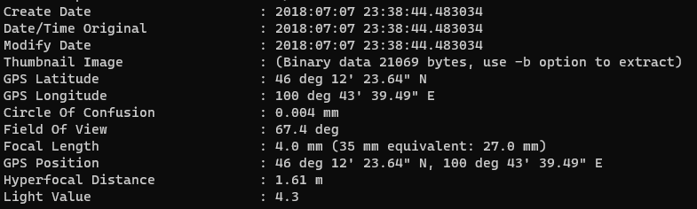
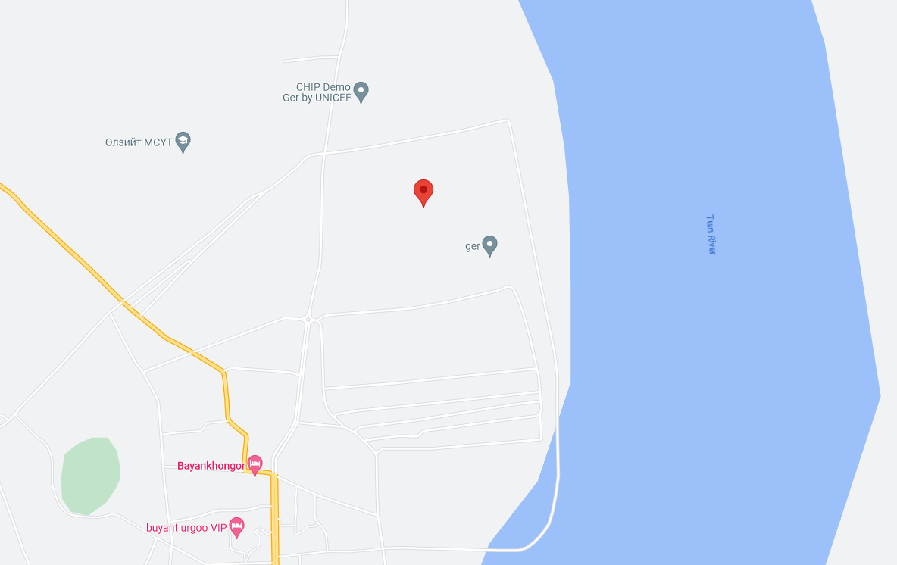

# QR code

Visiting the QR code is a dead-end, going to <ceair.com>.

The image has GPS coordinates from the creation and can be found with exiftool.

```bash
exiftool Aeroflot.jpg
```



Looking in [Google Maps](https://www.google.hu/maps/place/46%C2%B012'23.6%22N+100%C2%B043'39.5%22E): `46° 12' 23.64" N 100° 43' 39.49" E`.



The coordinate are right next to a river, Tuin.

# Flag
`Tuin`
