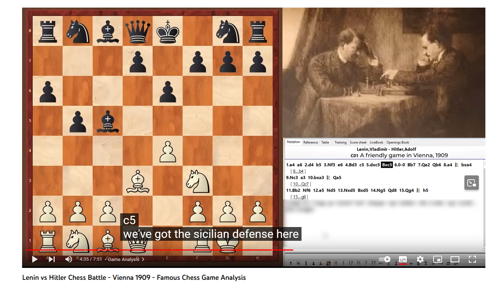

# Domain enumeration

Checking the subdomains on Security Trails: 
<https://securitytrails.com/list/apex_domain/ecsc.hu>

 - ecsc.hu
 - ctfd.ecsc.hu
 - ctf.ecsc.hu
 - www.mail.ecsc.hu
 - mail.ecsc.hu
 - vedekezes.ecsc.hu

# Visiting the domains

Under the <https://vedekezes.ecsc.hu/> there is a webserver with a question.

```Milyen védekezést alkalmazott Hitler a Leninnel való híres összecsapása elején?```

Translated to.

```What kind of defense was used by Hitler against Lenin in their famous battle?```

# Google search

Searching the [hitler lenin battle](https://www.google.com/search?q=hitler+lenin+battle) phrase reveals a video about a chess game: <https://youtu.be/AuY1mG4C_eg?t=275>. 



With the name of the defense. `Sicilian`, `Szicíliai` in Hungarian.

# Flag
`Szicíliai`
