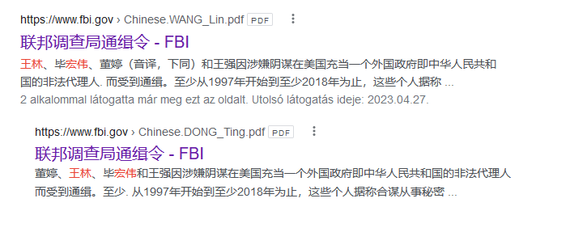

# Original text
```
A	宏伟?
B	嗯
A	这是王林
B	非安全通道，少说信息
A	好
B	我们需要缺少那部分
A	周一9点，在布达佩斯Z地点
B	最后确认，谁在问?
```

# Google translate

Google translate produces this translation:

```
A	grand?
B	Um
A	This is Wang Lin
B	Non-secure channel, less information
A	good
B	we need that missing part
A	Monday at 9:00 am at Z location in Budapest
B	Final confirmation, who's asking?
```

The `王林` is a name, Wang Lin. The part that was translated to `grand` is also part of a name, `宏伟` Hongwei.

# Google search

Searching the names [王林 宏伟](https://www.google.com/search?q=王林+宏伟) on Google finds an FBI wanted list.



The answer to the challenge question. Who is asking, the 3rd person in the wanted list `董婷` (Dong Ting).

# Flag
`董婷`

