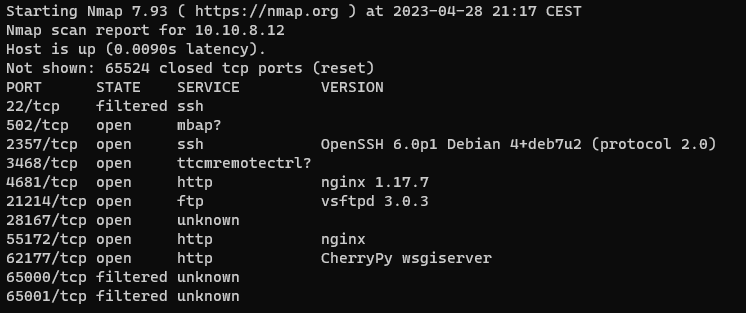
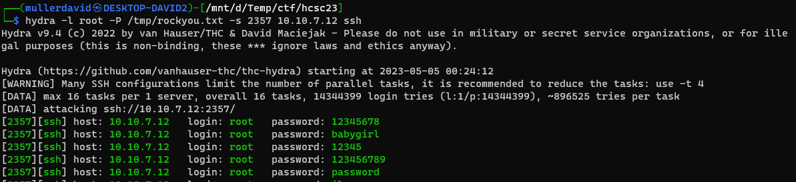

# Scan

All the pentest challenges are on the servers whose address ends with `.12`. The exact challenge mapping is unknown from the channel descriptions.

Nmap finds the following open tcp ports.

The ports `55172` and `28167` are known to be used by the `Hit the Road Jack` challenges.

The lefover ports have the following:
 - `502` Modbus
 - `2357` SSH
 - `3468` Telnet
 - `4681` qBittorrent Web UI
 - `21214` FTP
 - `62177` Webserver with authentication

# Honeypot

The SSH and Telnet servers let you in with anything but a few passwords. See hydra example.

The server `srv04`, the user `phil` is always the same and a lot of commands do behave "strange".

This is a suspected honeypot. Searching for [honeypot srv04 phil](https://www.google.com/search?q=honeypot+srv04+phil) returns a possible match: <https://github.com/cowrie/cowrie> honeypot.

Checking the default `cowrie` config and runtime it behaves exactly like that. These ports can be disregarded.

# Honeypot 2

The `qBittorrent` is running on an nginx server, which is not normal. This is either a reverse proxy or an another honeypot. This can be ignored as well, unless stuck elsewhere.
