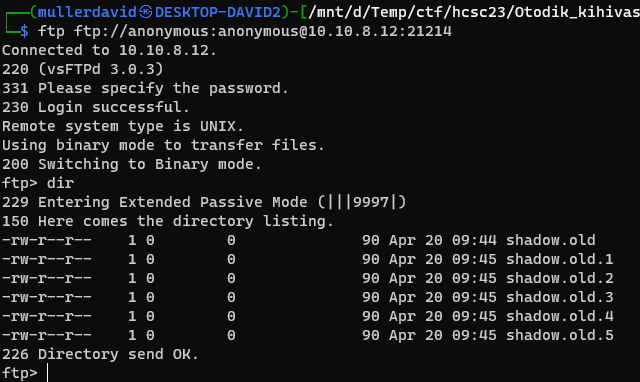
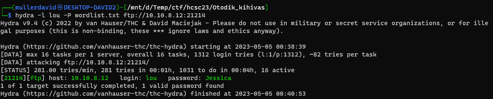
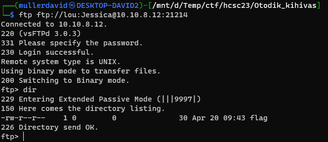
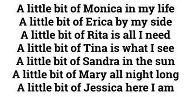

# FTP

On port `21214` there is an FTP server. Anonymous login is allowed. There are some [shadow](https://linux.die.net/man/5/shadow) file backups.



# Password hashes

Downloading the file reveal different hashes. These are not salted and can be reverted easily by looking up public databases. All belongs to the user `lou`.

| shadow | password |
|---|---|
| `lou:$1$e39e74fb4e80ba656f773669ed50315a:18777:0:99999:7:::` | Mary |
| `lou:$1$d41219060e0c16c228ed4682cade6379:18777:0:99999:7:::` | Sandra |
| `lou:$1$28d34f2e053dee2c0e9399a7924cd978:18777:0:99999:7:::` | Tina |
| `lou:$1$be1ae2eeeca8fb8302aed56fb0a6019d:18777:0:99999:7:::` | Rita |
| `lou:$1$5501462a4c13dd55a6b236ef4550e3e4:18777:0:99999:7:::` | Erica |
| `lou:$1$09084cc0cda34fd80bfa3cc0ae8fe3dc:18777:0:99999:7:::` | Monica |

# Current password 

Based on the filenames, it is probable that these are older variants of the shadow file. All the passwords are female names. A [wordlist.txt](workdir/wordlist.txt) of female names can be created/downloaded. 

Hydra can be used with the wordlist to check the passwords.

```bash
hydra -l lou P wordlist.txt ftp://10.10.8.12:21214
```



Using `lou:Jessica` works. Using the credentials reveal a [flag](workdir/flag) file. 



Downloading it has the flag.

# Flag
`HCSC2023{L4t's_t0uch_th4_sky}`

# Notes
Searching for the names, the `Coca-Cola Mambo No.5` can be found. Only `Jessica` is missing from the original list.

