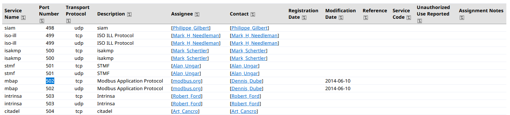
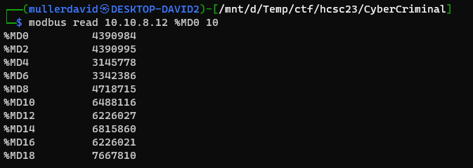
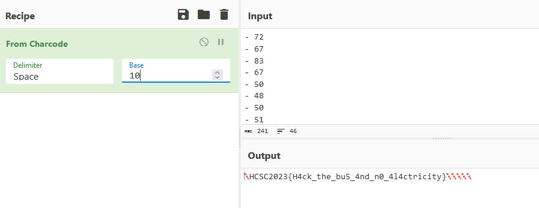

# Modbus

The port `502` runs something. Nmap recognizing it as `mbap`, Modbus Application Protocol.

Based on the port numbers, it is also the [iana assigned](https://www.iana.org/assignments/service-names-port-numbers/service-names-port-numbers.xhtml?&page=10) port.



The challenge name can also hint the BlackEnergy APT, where ICS systems were involved, loosely involving modbus.

# Memory

Using the [modbus-cli](https://github.com/tallakt/modbus-cli) the server is answering to the requests. The `%MD0` is a modbus memory address, `10` is the size.

```bash
modbus read 10.10.8.12 %MD0 10
```



With the following commands, bigger memory can be dumped.

```bash
modbus read --output datacapture.txt --word 10.10.8.12 1 50000
modbus read --output datacapture2.txt 10.10.8.12 %MD0 100000
```

The files contain the memory content as decimal numbers. Looking for `- 72\n- 67` (H C ascii codes), there is a hit at the start of the file. Converting this to text reveals the flag.



# Flag
HCSC2023{H4ck_the_bu5_4nd_n0_4l4ctricity}