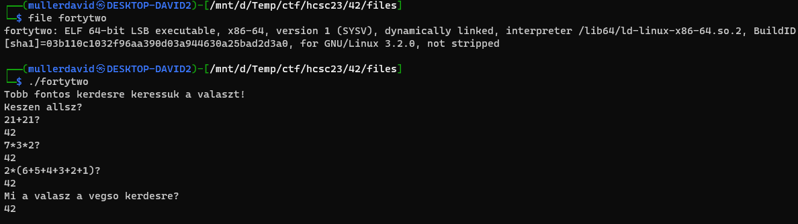
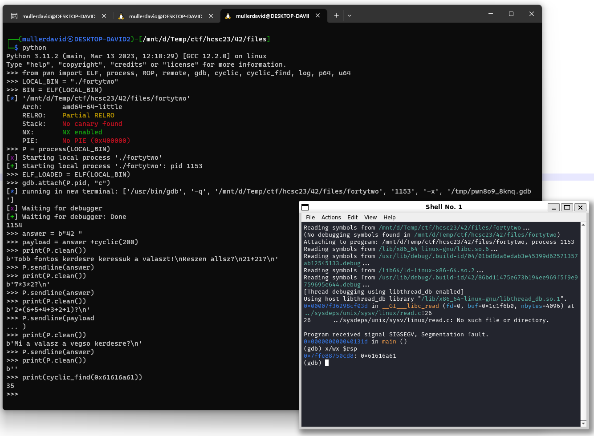
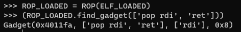
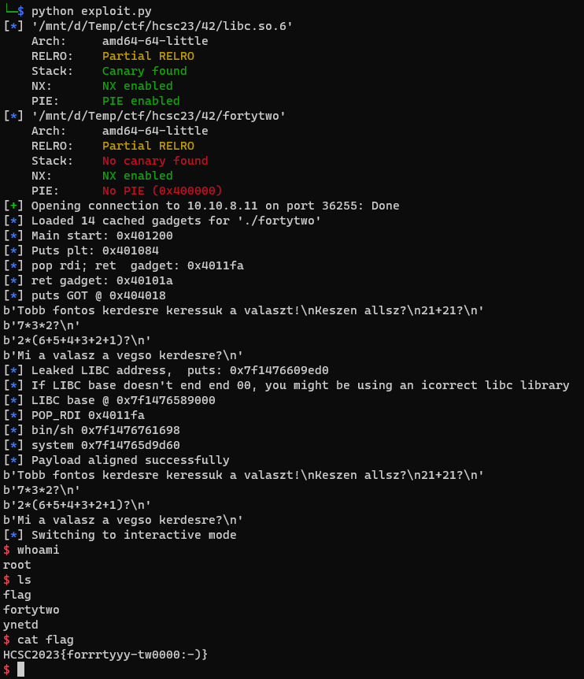

# Running the binary

The file is a binary, running it 42 is the answer to everything.



# Decompile

Decompiling it with Ghidra is good enough, no need to work in assembly. The program is reading 0x100 bytes into a buffer sized 0x10. [fortytwo.c](workdir/fortytwo.c)

```c
void doCheck(char *param_1)
{
  int iVar1;
  
  iVar1 = atoi(param_1);
  if (iVar1 == 0x2a) {
    fflush(stdout);
    return;
  }
                    // WARNING: Subroutine does not return
  exit(1);
}

void main(void)
{
  char local_26 [10];
  char local_1c [10];
  char local_12 [10];
  
  puts("Tobb fontos kerdesre keressuk a valaszt!");
  puts("Keszen allsz?");
  puts("21+21?");
  fflush(stdout);
  fgets(local_12,0x10,stdin);
  doCheck(local_12);
  puts("7*3*2?");
  fflush(stdout);
  fgets(local_1c,0x10,stdin);
  doCheck(local_1c);
  puts("2*(6+5+4+3+2+1)?");
  fflush(stdout);
  fgets(local_26,0x100,stdin);
  doCheck(local_26);
  puts("Mi a valasz a vegso kerdesre?");
  fflush(stdout);
  fgets(local_12,0x10,stdin);
  return;
}
```

The used [atoi](https://cplusplus.com/reference/cstdlib/atoi/) is ignoring the extra characters, not affecting them.

# Offset

The offset of rip is calculatable, but using pwntools it is easy with some cyclic string.



The libc address is changing from run to run, a leak is necessary.

# ROP chain

Ropper can find all the rop gadgets to use them as building blocks.

```bash
ropper --file ./fortytwo --nocolor > rop.txt
ropper --file ./libc.so.6 --nocolor > rop-libc.txt
```

Pwntools is also capable to find some of the simpler gadgets.



Based on the gadgets and requirements, 2 ROP chains were creaed. It is calling libc [system](https://cplusplus.com/reference/cstdlib/system/) at the end. 

In the first iteration it is leaking a libc address. Based on this the address of `system` can be calculated, and can be executed at the second step. Fun fact, there is a `/bin/bash` string in libc already, so no issue generating it. The following gadgets were used.

Leak:
 - rdi <-- puts got
 - puts() (rdi is the first parameter, which should be the executable)
 - main()
 
Exploit:
 - rdi <-- address of /bin/sh
 - system()

The completed script is in [exploit.py](workdir/exploit.py).



# Flag
HCSC2023{forrrtyyy-tw0000:-)}
