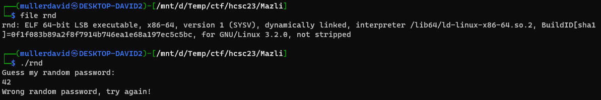
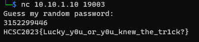

# File

The file is a binary, running it is asking for a guess.



# Disassembling

Opening in GDB or any disassembler we get the following.

```
0x00000000004011d7 <+0>:     push   %rbp
0x00000000004011d8 <+1>:     mov    %rsp,%rbp
0x00000000004011db <+4>:     sub    $0x20,%rsp
0x00000000004011df <+8>:     mov    %edi,-0x14(%rbp)
0x00000000004011e2 <+11>:    mov    %rsi,-0x20(%rbp)
0x00000000004011e6 <+15>:    mov    $0x0,%eax
0x00000000004011eb <+20>:    call   0x401176 <init_buffering>
0x00000000004011f0 <+25>:    mov    $0x0,%eax
0x00000000004011f5 <+30>:    call   0x401080 <rand@plt>
0x00000000004011fa <+35>:    mov    %eax,-0x4(%rbp)
0x00000000004011fd <+38>:    movl   $0x0,-0x8(%rbp)
0x0000000000401204 <+45>:    lea    0xdfd(%rip),%rax        # 0x402008
0x000000000040120b <+52>:    mov    %rax,%rdi
0x000000000040120e <+55>:    call   0x401040 <puts@plt>
0x0000000000401213 <+60>:    lea    -0x8(%rbp),%rax
0x0000000000401217 <+64>:    mov    %rax,%rsi
0x000000000040121a <+67>:    lea    0xe01(%rip),%rax        # 0x402022
0x0000000000401221 <+74>:    mov    %rax,%rdi
0x0000000000401224 <+77>:    mov    $0x0,%eax
0x0000000000401229 <+82>:    call   0x401070 <__isoc99_scanf@plt>
0x000000000040122e <+87>:    mov    -0x8(%rbp),%eax
0x0000000000401231 <+90>:    xor    -0x4(%rbp),%eax
0x0000000000401234 <+93>:    cmp    $0xd06f00d1,%eax
0x0000000000401239 <+98>:    jne    0x401259 <main+130>
0x000000000040123b <+100>:   lea    0xde3(%rip),%rax        # 0x402025
0x0000000000401242 <+107>:   mov    %rax,%rdi
0x0000000000401245 <+110>:   mov    $0x0,%eax
0x000000000040124a <+115>:   call   0x401050 <system@plt>
0x000000000040124f <+120>:   mov    $0x0,%edi
0x0000000000401254 <+125>:   call   0x401030 <_exit@plt>
0x0000000000401259 <+130>:   lea    0xdd0(%rip),%rax        # 0x402030
0x0000000000401260 <+137>:   mov    %rax,%rdi
0x0000000000401263 <+140>:   call   0x401040 <puts@plt>
0x0000000000401268 <+145>:   mov    $0x0,%edi
0x000000000040126d <+150>:   call   0x401030 <_exit@plt>
```

Note the following: 
 - `4011f5:` rand function without seed, result goes to `%eax` and moved to `-0x4(%rbp)`.
   - stopping here can read the random from `%eax`. which is `0x6b8b4567` every time.
 - 401229: scanf, rhis is reading our input into `%eax`
 - 401231: XORing `%eax` with the random number at `-0x4(%rbp)`.
 - 401234: comparing `%eax` with `$0xd06f00d1` constant. If true, printing the flag.


Based on this, the solution is `0xd06f00d1 XOR 0x6b8b4567 = 3152299446 (dec)`, this should be given as input. The server is returning the flag after.



# Flag
HCSC2023{Lucky_y0u_or_y0u_knew_the_tr1ck?}
