# Visiting the site

Visiting the site has the following interface.

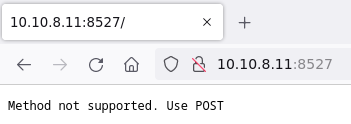

Checking with http `OPTIONS` method, it can be also seen that it is expecting a `POST` request.

Experimenting with `POST` and checking the error messages, it is expecting some `multipart/form-data`.

Sending such have the error message that it excepts a file.

Uploading a file results in `Invalid file`.

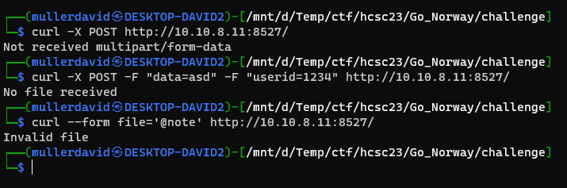

# The binary

The note files are encrypted. The [reverse](workdir/challenge/reverse) file is a binary, running it with the files can decode the encrypted notes, after quite a long time.

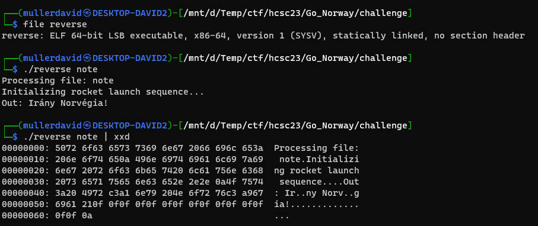

# Encryption

At the end of the files, the PKCS padding can be seen. It is also visible, that the block size is 16. Blocks can be deleted as well without losing anything else from the plaintext but that part. The plaintext is always 16 bytes smaller than the file. Based on the file size and the plaintext size it is also probable that the first block is the IV.

Based on these observations, it is highly likely that it is AES 128.

Running the [note_3](workdir/challenge/note_3) file, the `GIVE ME THE FLAG` plaintext has to be uploaded in an encrypted form.

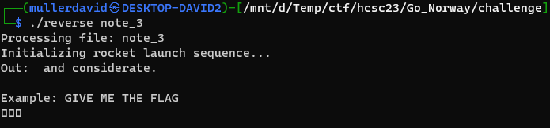

It can be also noted that the filename is used in some way as key. The exact same file, [note_3_copy](workdir/challenge/note_3_copy) is returning garbage.

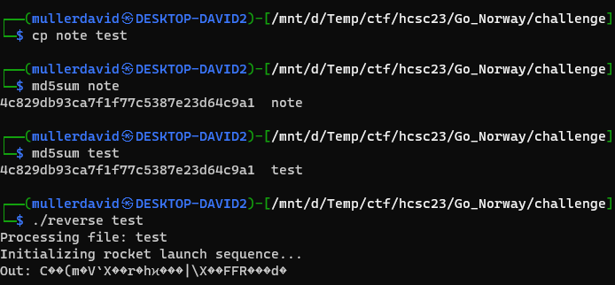

# Packer

Because of a packer, Ghidra is not decompiling or showing useful info.

With [Detect It Easy](https://github.com/horsicq/Detect-It-Easy) the packer can be identified. It is `UPX (modified)`, which can be also seen with strings.

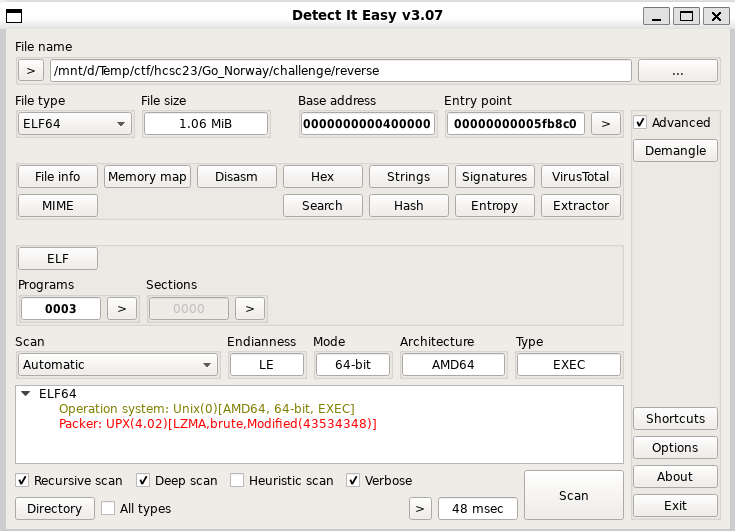

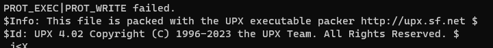

The file can be attempted to be unpacked with upx (newer, version 4.02 or later is required), but it is throwing an error. As suggested by Detect It Easy, something was modified from the standard UPX.

Normally, UPX section looks like this at the end of the file.

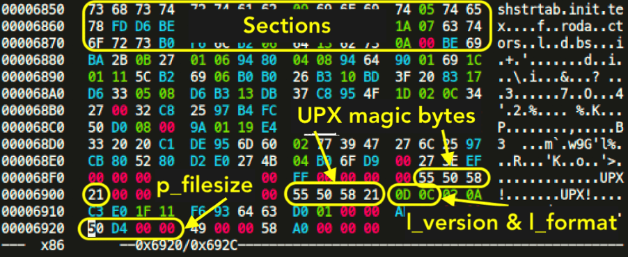

In the challenge, it is `HCSC` where it should be `UPX!`.

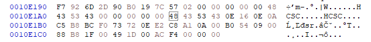

Fixing the values in [reverse_fixed](workdir/challenge/reverse_fixed) allows unpacking the binary. 

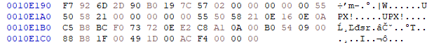

Unpacking the binary to [reverse_unpacked](workdir/challenge/reverse_unpacked).

```bash
./upx -k -d reverse_fixed
```
# Debugging Go

After unpacking it can be seen as a Go binary, with debug information.

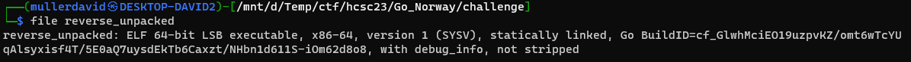

Debugging with gdb is fairly good after this. <https://go.dev/doc/gdb>

```
gdb reverse_unpacked
br main.main
r note
disas
```

There is a sleep. This is why the binary is slow.

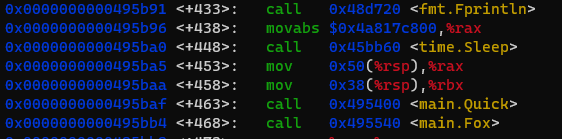

This can be patched by changing the 5 bytes of the opcode to nops. Significantly speeding up the experimentation.

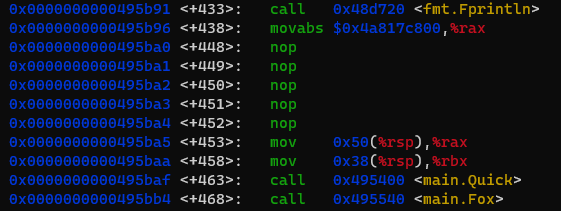

Earlier AES 128 was assumed. In Go, the AES key is passed in `crypto/aes.NewCipher`. Stopping there we can grab the actual key.

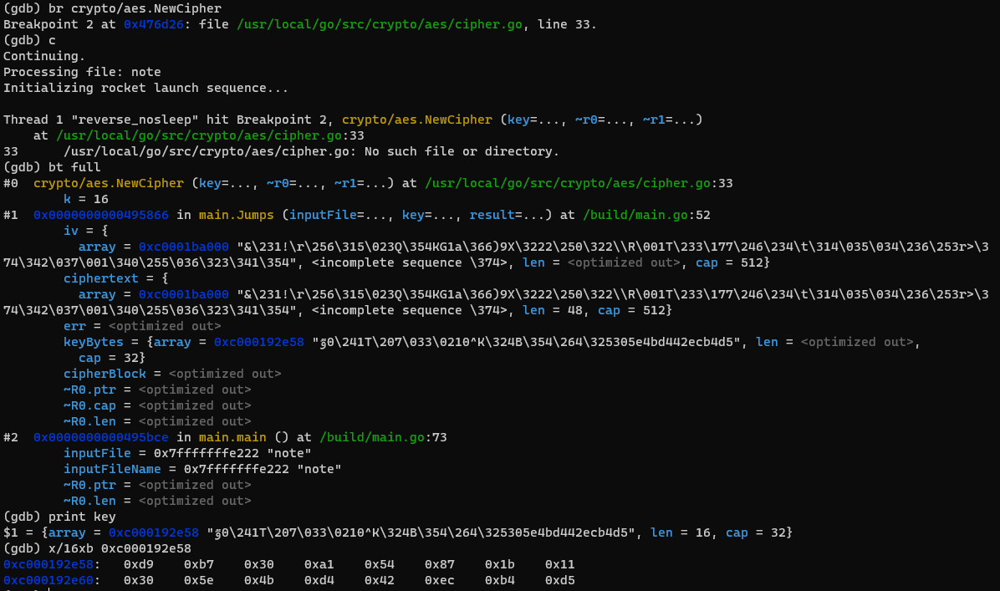

```
note: d9 b7 30 a1 54 87 1b 11 30 5e 4b d4 42 ec b4 d5
```

Manually checking the `note` file.


Based on this one, we can create our own `note` file with arbitrary content. Don't forget to include the chosen iv at the start.

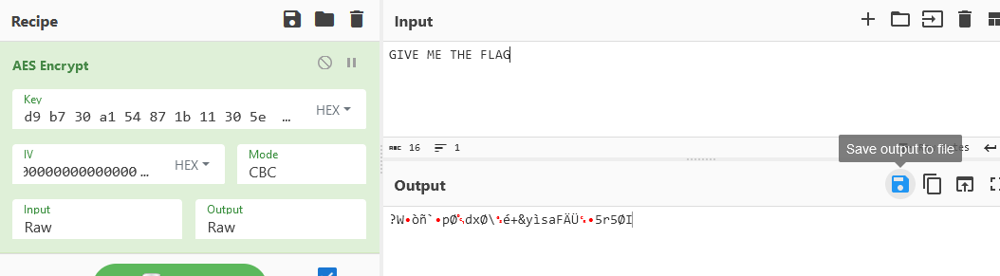

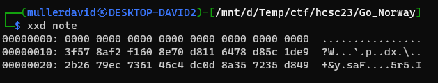

# Using the new note

Uploading the modified `note` to the server reveals the flag.

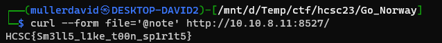

# Flag
HCSC{Sm3ll5_l1ke_t00n_sp1r1t5}

# Filename key generation

For completeness, the filename to key generation can be reversed as well.

Notes:
```
md5("note") = aad653ca3ee669635f2938b73098b6d7
key("note") = d9b730a154871b11305e4bd442ecb4d5
```

The logic can be checked by stepping in the functions.

In `main.Fox`, there are 3 interesting local variables: `keyBytes`, `inputBytes`, `resultBytes`.

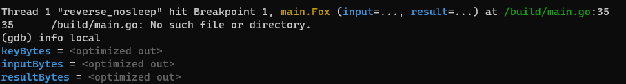

Halfway through the function, the md5 of the note can be seen in `inputBytes`.

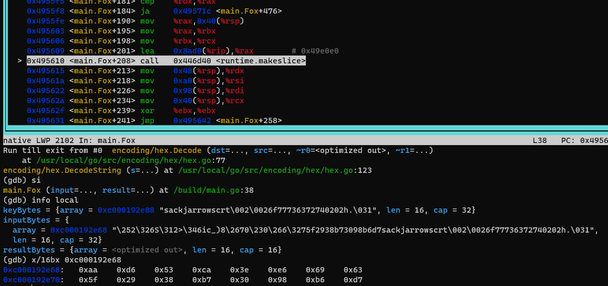

There is also a XOR later.

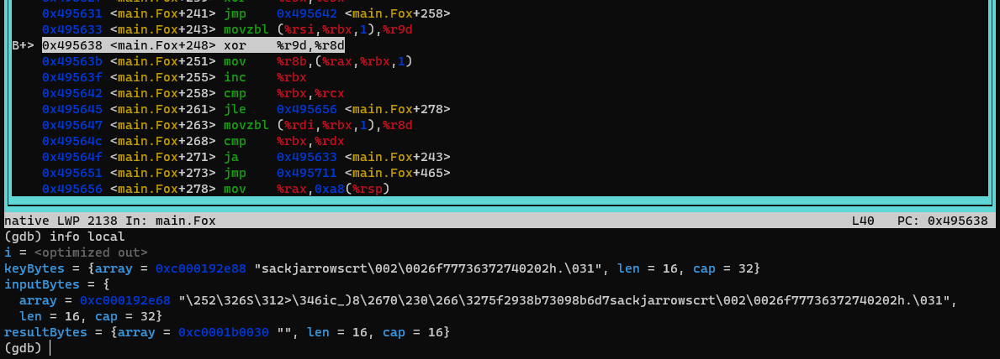

After the XOR or at the return, the `resultBytes` can be seen with the key as well.

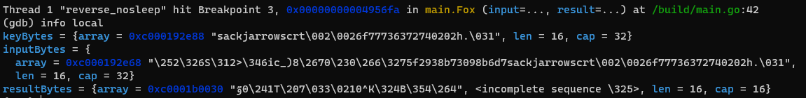

At the XOR, it can be seen that the `inputBytes` is xored with `keyBytes`. This is how the key is generated from the filename.

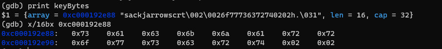

```
xorkey = "sackjarrowscrt\002\002" = 7361636b6a6172726f77736372740202
key = md5(filename) xor xorkey
```

Based on the algorithm, custom filename can be generated.

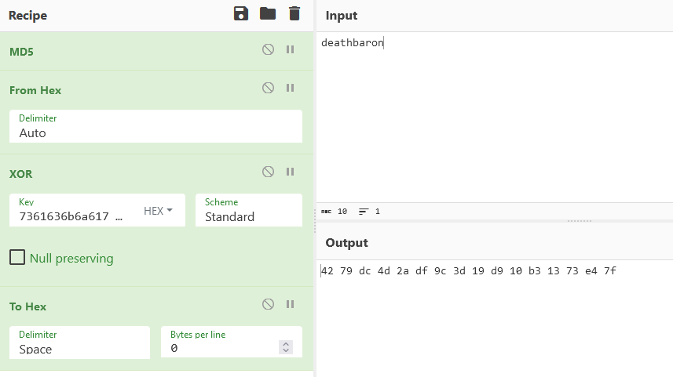

And filling it with the file content.

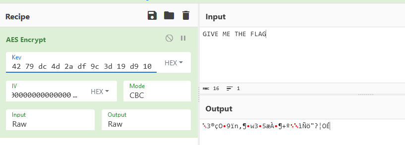

Uploading it to the server is sending back the flag.

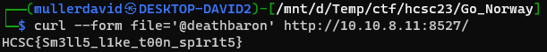
