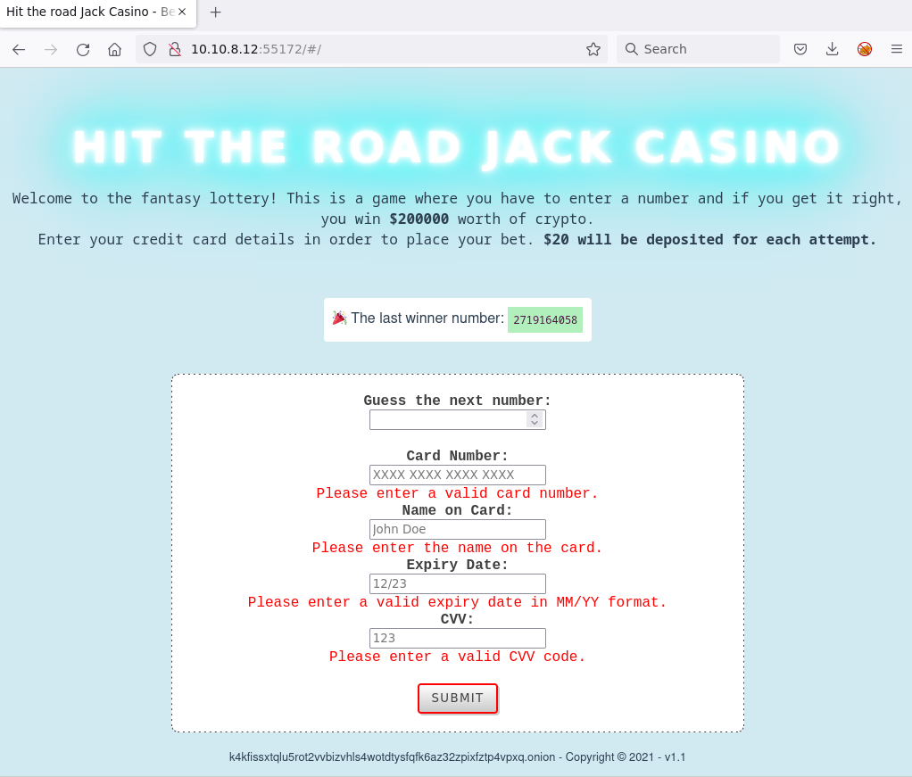
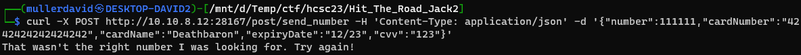
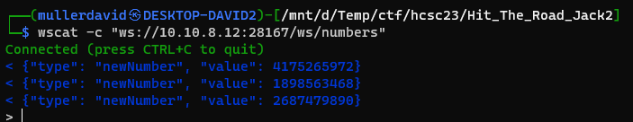
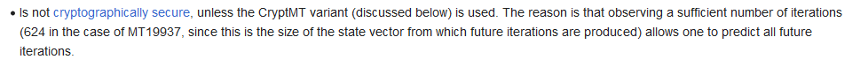
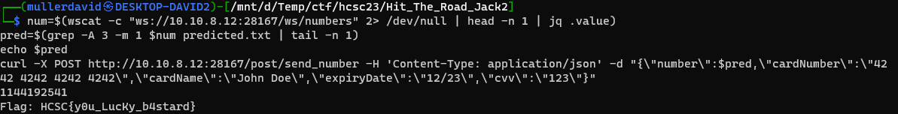

# Scan

Scanning similarly to `Hit The Road Jack #1` the host reveals the website on port `55172`.



# Logic

The website looks similar, just using different ports. The frontend logic is the same. The main difference is that it is returning all kind of random numbers and not just 6 digit ones.

Checking the source code, the form is sending the guess to `http:/10.10.8.12:28167/post/send_number` as JSON. The past random numbers are coming from websocket `ws://10.10.8.12:28167/ws/numbers`.

The API works similarly as `#1`. Stripe test card data can be used.



The websocket is sending new number every 5 seconds, similarly to `#1`, disconnecting after 5 minutes. It is returning the new number if someone guessed something, so sending guesses in parallel can speed up the generation.



# Random

Based on the python documentation, the [random](https://docs.python.org/3/library/random.html) generator is using Mersenne Twister with a period of 19937. This is the [MT19937](https://en.wikipedia.org/wiki/Mersenne_Twister). It is not cryptogrphically secure, the internal state can be recovered after 624 iteration and the next numbers predicted.



There are off-the-shelp predictors, for example <https://github.com/kmyk/mersenne-twister-predictor>. Giving 624 past numbers can generate every future number. 

New numbers can be generated actively or waiting ~1 hour passively can gather the required amount.

```bash
(while true; do wscat -c "ws://10.10.8.12:28167/ws/numbers"; done) | jq .value | head -n 624 | tee numbers.txt
cat numbers.txt | mt19937predict  | head -n 1000000 > predicted.txt
```

The [prediction.txt](workdir/predicted.zip) contains such a generation.

# Exploit

The only thing left is to search the next number in the predicted list and sending it.

```bash
num=$(wscat -c "ws://10.10.8.12:28167/ws/numbers" 2> /dev/null | head -n 1 | jq .value)
pred=$(grep -A 3 -m 1 $num predicted.txt | tail -n 1)
echo $pred
curl -X POST http://10.10.8.12:28167/post/send_number -H 'Content-Type: application/json' -d "{\"number\":$pred,\"cardNumber\":\"4242 4242 4242 4242\",\"cardName\":\"John Doe\",\"expiryDate\":\"12/23\",\"cvv\":\"123\"}"
```



In case someone is actively generating new numbers, there is not enough time between ticks to guess this way. An attempt to solve this is in [run.py](workdir/run.py).

# Flag
HCSC{y0u_LucKy_b4stard}