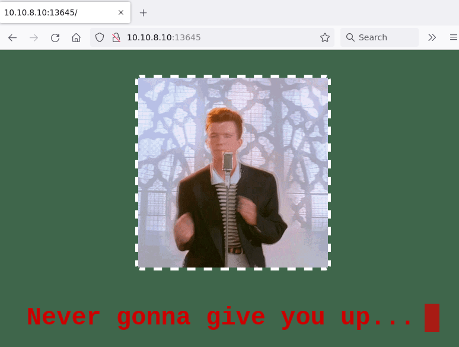
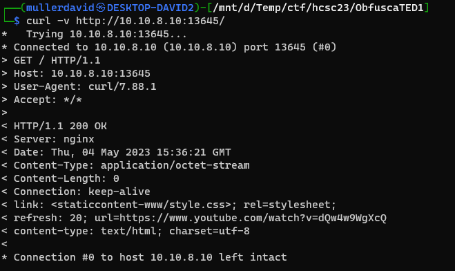
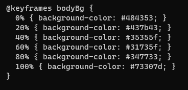

# Checking the site

Visiting the site shows a rickroll gif and redirects to the youtube variant after a few seconds.



# Source code

Checking the site has "no source". Checking what happens, the browser receives a css in the `link` header and the redirect in the `refresh` header.



Checking the css has the flag hidden. <http://10.10.8.10:13645/staticcontent-www/style.css>.

# CSS

It is encoded in the changing background color. 
 - 0x48 -> H
 - 0x43 -> C
 - 0x53 -> S
 - etc.

```
484353437b4335355f31735f34773373307d
```




# Flag
`HCSC{C55_1s_4w3s0}`