# Continuing

The css file in ObfuscaTED #1 challenge is inside a directory with directory listing enabled.

<http://10.10.8.10:13645/staticcontent-www/>

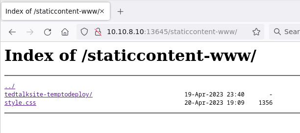

Opening a subdirectory, the content is loading.

<http://10.10.8.10:13645/staticcontent-www/tedtalksite-temptodeploy/>

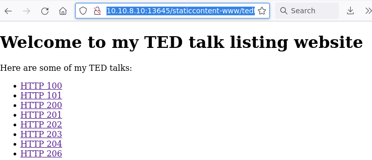

# Source code

Checking the source code reveals a javascript file with the logic that loads the content.

<http://10.10.8.10:13645/staticcontent-www/tedtalksite-temptodeploy/contentprotection.js>

In the network communication, the file that loads is visible, but unreadable.

<http://10.10.8.10:13645/tedtalk/index.html>

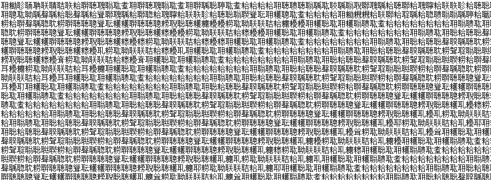

The JS file needs to be reversed, but it is obfuscated.

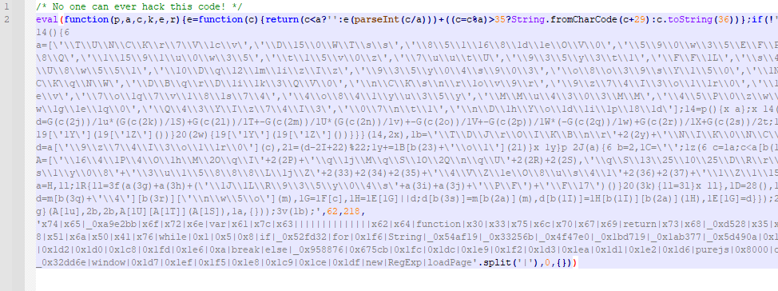

# Deobfuscation

Changing `eval` to `console.log` reveals the first layer.

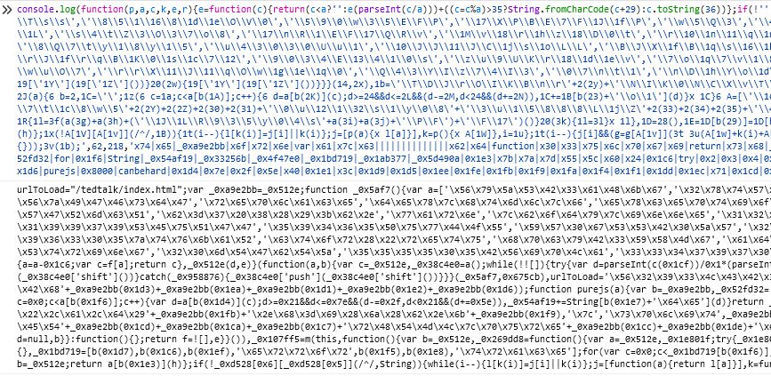

Using a beautifier, it is somewhat readable.

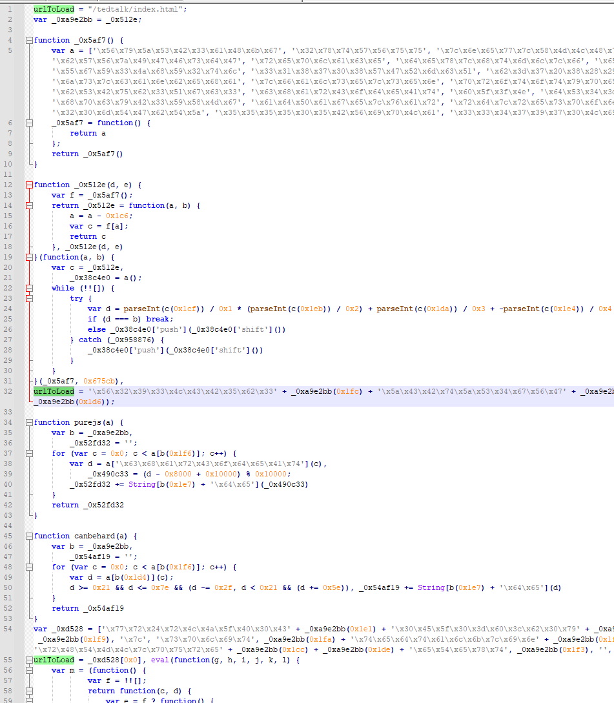

The variable `urlToLoad` is overwritten a few times without usage. Breaking on them reveal some information.

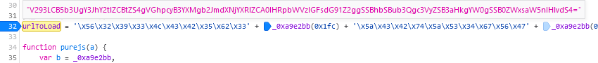

```
V293LCB5b3UgY3JhY2tlZCBtZS4gVGhpcyB3YXMgb2JmdXNjYXRlZCA0IHRpbWVzIGFsdG91Z2ggSSBhbSBub3Qgc3VyZSB3aHkgYW0gSSB0ZWxsaW5nIHlvdS4=
base64: Wow, you cracked me. This was obfuscated 4 times altough I am not sure why am I telling you.
```

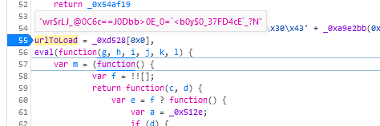

The decryption of this string is unknown, but the next step overwrites the variable again, to the original url. ``wr$rLJ_@0C6c==J0Dbb>0E_0=`<b0y$0_37FD4cE`_?N``.

The `purejs` and `canbehard` functions are known from earlier, after a little beautify, they can be somewhat readable as well.

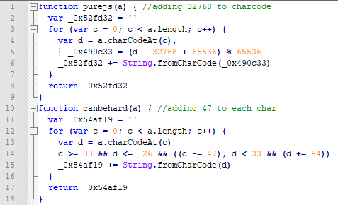

Changing `eval` to `console.log` again reveals the rest of the logic.


# Unknown 

Reusing the `canbehard` from html decoding logic the unknown string can be decrypted to the flag.

```js
urlToLoad="wr$rLJ_@0C6c==J0Dbb>0E_0=`<b0y$0_37FD4cE`_?N" 
canbehard(urlToLoad)
```

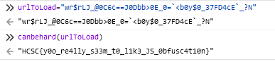

Or reusing the whole logic twice, as the first iteration generated some text that was similar to the encrypted original site.

```js
urlToLoad="wr$rLJ_@0C6c==J0Dbb>0E_0=`<b0y$0_37FD4cE`_?N" 
purejs(canbehard(urlToLoad))
purejs(canbehard(purejs(canbehard(urlToLoad))))
```

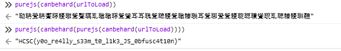

# Flag
HCSC{y0o_re4lly_s33m_t0_l1k3_JS_0bfusc4t10n}