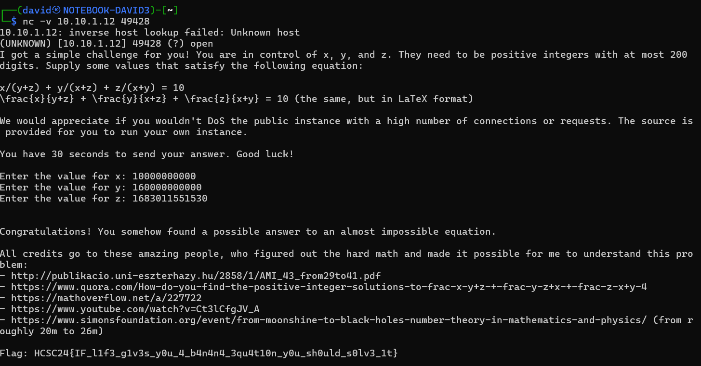

# Service discovery

[Scanning](../Scans/WRITEUP.md) the 10.10.x.12 machines reveals a TCP service at port 49428 with some math question.

Using netcat is enough to access the service.

```bash
nc -v 10.10.1.12 49428
```


# Math

We need positive integers `x`, `y`, `z` to satisfy the `x/(y+z) + y/(x+z) + z/(x+y) = 10` equation.

Notice that multiplying all the numbers with the same number (eg 10) doesn't change the left side.

# Source

Checking the [main.go](workdir/main.go) source reveals that there is a shortcut. 

```go
four := new(big.Float).SetFloat64(10)
tolerance := new(big.Float).SetFloat64(1e-10) // that's 0.0000000001, so should be okay
diff := new(big.Float).Sub(sum, four)
absDiff := new(big.Float).Abs(diff)
if absDiff.Cmp(tolerance) < 0 {
    fmt.Fprint(conn, flagText)
} else {
    resultStr := sum.Text('f', 15)
    fmt.Fprintf(conn, "Nope, that was not the correct answer. The correct answer was 10, but you supplied ~%s\n", resultStr)
    log.Printf("Incorrect answer: %s", resultStr)
}
```

The left side being close enough to 10 can satisfy the check, instead being exactly 10.

```
abs(x/(y+z) + y/(x+z) + z/(x+y) - 10) < 0.0000000001
```

# WolframAlpha

Using [Wolfram|Alpha](https://www.wolframalpha.com/) to solve the problem. We can fix 2 of the variables, just make sure they are not equal to make it easier. `x=1, y=16` was chosen.

```
abs(x/(y+z) + y/(x+z) + z/(x+y) - 10), x=1, y=16
```


Clicking on the bottom right format also making some plots, where `z` is visibly touching `0`.

```
abs(-10 + z/17 + 16/(1 + z) + 1/(16 + z))
```


Upon closer inspection for the minimum point and using the plain text as next step.

```
abs(-10 + z/17 + 16/(1 + z) + 1/(16 + z)) minimum where z in [165,175]
```


The first digits of our number can be extracted.

```
50 digits of {z -> 51 + (2 (222462 + (5 I) Sqrt[122253963])^(1/3))/3^(2/3) + 5194/(3 (222462 + (5 I) Sqrt[122253963]))^(1/3)}
```


```
{z->168.30115515314342741576785106824772455417473325055 + 0.×10^-47 i}
```

# Giving the numbers

Using the `z` calculated with the fixed `x` and `y` reveals the flag with some extra credit. All we need to do is multiply them, so they are integers and not floats. Multiplying them with 10000000000 satisfies the condition.

```
Enter the value for x: 10000000000
Enter the value for y: 160000000000
Enter the value for z: 1683011551530
```



```
Congratulations! You somehow found a possible answer to an almost impossible equation.

All credits go to these amazing people, who figured out the hard math and made it possible for me to understand this problem:
- http://publikacio.uni-eszterhazy.hu/2858/1/AMI_43_from29to41.pdf
- https://www.quora.com/How-do-you-find-the-positive-integer-solutions-to-frac-x-y+z-+-frac-y-z+x-+-frac-z-x+y-4
- https://mathoverflow.net/a/227722
- https://www.youtube.com/watch?v=Ct3lCfgJV_A
- https://www.simonsfoundation.org/event/from-moonshine-to-black-holes-number-theory-in-mathematics-and-physics/ (from roughly 20m to 26m)

```

# Flag
`HCSC24{IF_l1f3_g1v3s_y0u_4_b4n4n4_3qu4t10n_y0u_sh0uld_s0lv3_1t}`


# Alternative solution 1

The math problem can be found on stackexchange with solutions.

https://math.stackexchange.com/questions/402537/find-integer-in-the-form-fracabc-fracbca-fraccab/409450#409450

```
n=10:

a=221855981602380704196804518854316541759883857932028285581812549404634844243737502744011549757448453135493556098964216532950604590733853450272184987603430882682754171300742698179931849310347;

b=269103113846520710198086599018316928810831097261381335767926880507079911347095440987749703663156874995907158014866846058485318408629957749519665987782327830143454337518378955846463785600977;

c=4862378745380642626737318101484977637219057323564658907686653339599714454790559130946320953938197181210525554039710122136086190642013402927952831079021210585653078786813279351784906397934209.
```

# Alternative solution 2

Using [sage](https://www.sagemath.org/) to solve the equation. Credits for this goes to Alex.

```
sage: R.<x,y,z> = QQ[]
sage: F = x^3 + y^3 + z^3 - 9*x^2*(y+z) - 9*y^2*(z+x) - 9*z^2*(x+y) - 17*x*y*z //kézzel nullára rendezem az egyenletet
sage: E = EllipticCurve_from_cubic(F, morphism=True)
sage: P = E([-7, 19, 9]) // random számhármas ami nem feltétlenül pozitív, de megoldása az egyenletnek és relatív prímek
sage: E.inverse()(P)
... kézzel próbálom szorozni ameddig nem lesz minden egyes koordináta pozitív
sage: E.inverse()(P*13) // jó megoldás
(4862378745380642626737318101484977637219057323564658907686653339599714454790559130946320953938197181210525554039710122136086190642013402927952831079021210585653078786813279351784906397934209/269103113846520710198086599018316928810831097261381335767926880507079911347095440987749703663156874995907158014866846058485318408629957749519665987782327830143454337518378955846463785600977 : 221855981602380704196804518854316541759883857932028285581812549404634844243737502744011549757448453135493556098964216532950604590733853450272184987603430882682754171300742698179931849310347/269103113846520710198086599018316928810831097261381335767926880507079911347095440987749703663156874995907158014866846058485318408629957749519665987782327830143454337518378955846463785600977 : 1)
beszorozzuk a 3 koordinátát 269103113846520710198086599018316928810831097261381335767926880507079911347095440987749703663156874995907158014866846058485318408629957749519665987782327830143454337518378955846463785600977-al
és kijön a megoldás
```