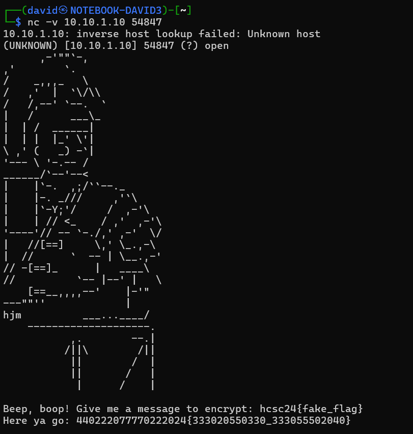
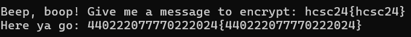
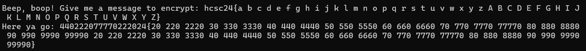
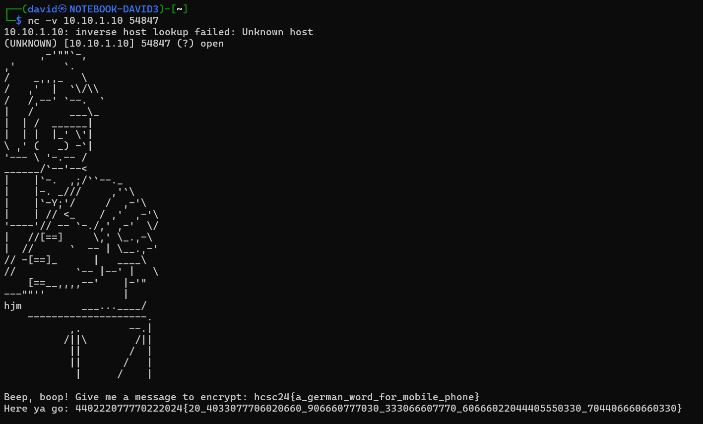

# Service discovery

[Scanning](../Scans/WRITEUP.md) the 10.10.x.10 machines reveals a TCP service at port 54847 with a message `message to encrypt`.

Using netcat is enough to access the service.

```bash
nc -v 10.10.1.10 54847
```



# Known plaintext

Sending flag-like known plaintext reveals a lot.

The `hcsc24{fake_flag}` starts with the same prefix (`440222077770222024{`) that we are looking to decipher.



The `hcsc24{hcsc24}` reveals that the same substrings are encoded with the same cyphertext.


The `hcsc24{a b c d e f g h i j k l m n o p q r s t u v w x y z A B C D E F G H I J K L M N O P Q R S T U V W X Y Z}` contains all the letters. As the challenge description, there are no difference between upper and lowercase. The special characters are not encoded either.

```
440222077770222024{20 220 2220 30 330 3330 40 440 4440 50 550 5550 60 660 6660 70 770 7770 77770 80 880 8880 90 990 9990 99990 20 220 2220 30 330 3330 40 440 4440 50 550 5550 60 660 6660 70 770 7770 77770 80 880 8880 90 990 9990 99990}
```



Looks like some T9 encoding to input sms on older featurephones, but the above string can be used as a simple substitution cypher.

# Decrypt

Replacing the numbers with the letters from the know plaintext in the `440222077770222024{20_4033077706020660_906660777030_333066607770_60666022044405550330_704406660660330}` string reveals the flag.

Encrypting again can check the result.



# Flag
`hcsc24{a_german_word_for_mobile_phone}`
