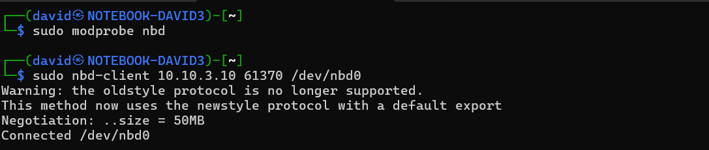

# Service discovery

[Scanning](../Scans/WRITEUP.md) the 10.10.x.10 machines reveals a NBD service at port 61370, which is an acronym for the challenge name.

# NBD

Using the [nbd-client](https://manpages.debian.org/testing/nbd-client/nbd-client.8.en.html), we can connect to the service and use the remote block device. 

```bash
# sudo apt install nbd-client libnbd-bin libnbd0
sudo modprobe nbd
sudo nbd-client 10.10.3.10 61370 /dev/nbd0
```




It contains a single `ext4` partition (no partition table). Mounting it as read only is possible (rw fails).

```bash
file /dev/nbd0
sudo fdisk -l /dev/nbd0
sudo fdisk /dev/nbd0
sudo mount /dev/nbd0 /tmp/mnt
sudo mount -o ro /dev/nbd0 /tmp/mnt
```


# File recovery

Checking the files has no sign for the flag, only cats.


As the channel description suggests, the flag disappeared, so the related files are probably deleted.

Making a full copy of the block device with `dd` to work on the local copy ([nbd0.raw](workdir/nbd0.raw.zip)).

```bash
sudo dcfldd if=/dev/nbd0 of=nbd0.raw
```


As the filesystem is ext4, deleted files can be recovered with [ext4magic](https://ext4magic.sourceforge.net/ext4magic_en.html).

```bash
sudo ext4magic nbd0.raw -m -d recovered
```


The recovered files are in [recovered.zip](workdir/recovered.zip)

# Files

Checking the files, they are all linux ELF binaries. Running them each prints a different index and a character.

```bash
recovered/MAGIC-2/application/x-sharedlib\\012-/I_0000012949.unknown
61: }
```

Running all of them recovers the flag. Ext4magic couldn't recover a few files, but they are all in the HCSC24 prefix, so they can be guessed easily.

```bash
find recovered -type f -exec {} \; | sort -n
find recovered -type f -exec {} \; | sort -n | cut -d ' ' -f 2 | tr -d "\n"
```

# Flag
`HCSC24{nbd_1s_4_SiCK_SyS4dm1n_t00l_f0r_r3m0t3_0s_1n57all4t10n}`
