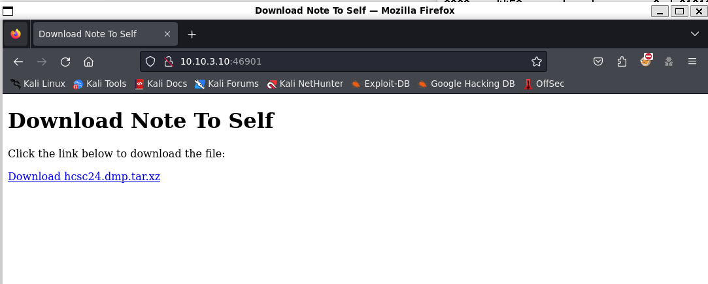
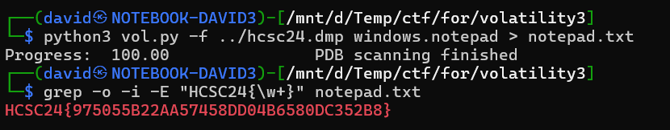

# Service discovery

[Scanning](../Scans/WRITEUP.md) the 10.10.x.10 machines reveals a HTTP server at port 46901, with the Note To Self on the page.



It has a `tar.xz` downloadable file. The `hcsc24.dmp.tar.xz` file is big and hosted here instead [SharedFiles](../../SharedFiles.md) in the hcsc24 subfolder. It has an md5sum of `bbbd0c32b680bfbe81ae238baf76c1f4`.

# Volatility

Unpacking the file is a dmp file. 

```bash
tar -xf hcsc24.dmp.tar.xz
```

While it has an elf header, upon closer look and from the size, it is a memory image. Volatility 3 can be used to analyze it. Volatility 2 can be used as well, but it is slow loading this particular image.

```bash
python3 vol.py -f ../hcsc24.dmp windows.pslist
python3 vol.py -f ../hcsc24.dmp windows.pstree.PsTree > ../pstree.txt
python3 vol.py -f ../hcsc24.dmp windows.psscan
python3 vol.py -f ../hcsc24.dmp windows.cmdline
```

# Notepad

There is a notepad process running. Based on the challenge description it looks like a target.

```
PID     PPID    ImageFileName   Offset(V)       Threads Handles SessionId       Wow64   CreateTime      ExitTime       File output
3800    4456    notepad.exe     0xde01318e7080  4       -       2       False   2024-03-26 23:02:24.000000      N/A    Disabled
```

There are some plugins that help extracting information from the notepad processes. It can be done manually by following the Virtual Address Descriptors, but this plugin is easier.
<https://github.com/spitfirerxf/vol3-plugins> was used.

Looking for the flag format has a match.

```bash
python3 vol.py -f ../hcsc24.dmp windows.notepad > notepad.txt
grep -o -i -E "HCSC24{\w+}" notepad.txt
```



# Flag

`HCSC24{975055B22AA57458DD04B6580DC352B8}`

# Alternative solution

There is an easier solution using strings with the correct endianness.

```bash
strings -e l hcsc24.dmp | grep -o -i -E "HCSC24{\w+}"
```