# Setup

The virtual machine was imported. Before booting it, the disk was mounted and everything under `c:\Windows\System32\winevt\Logs\` was saved, so no event logs would be lost. A snapshot was also created for reverting the machine to pristine state.

The given `player:Hcsc2024` credentials were used and various tools installed.

# Old logs

There are older logs in the `C:\MOK_DATA`. The [MOCK_application_security.csv](workdir/MOK_DATA/MOCK_application_security.csv) contains some older credentials, security questions and login IP addresses. 

According to the challenge description, there was an older attack from 246.10.27.233 on 2021.11.05. Checking the file for the IP address, it has a single matching row, with user `traggitt36`.

```
user_id,username,password,access_level,last_login,ip_address,login_attempts,security_question,security_answer,two_factor_auth
115,traggitt36,pE1'CKNg{ljwL'Js,admin,11/5/2021,246.10.27.233,10,What is your mother's maiden name?,non ligula pellentesque ultrices phasellus id sapien in sapien iaculis congue vivamus metus arcu adipiscing molestie hendrerit at,false
```

# Flag 1

`hcsc{What is your mother's maiden name?}`

# Suspicious files

The challenge description requests the files from the desktop of the administrator. `C:\Users\Administrator\Desktop\` has a file [evidence.7z](workdir/evidence.7z) and the password `suspected` next to it.

The archive contains an exe file and a pfx certificate.

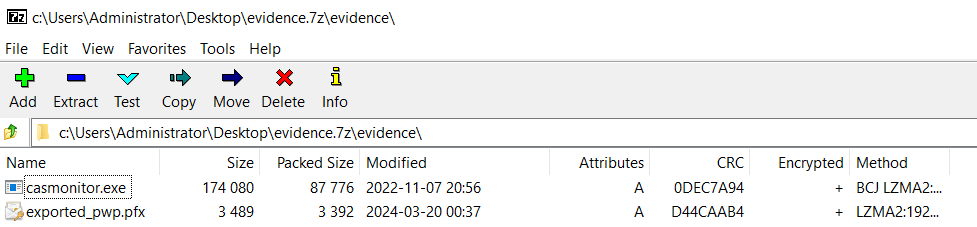

The pfx has a file modification date in the 7zip metadata, just in a different timezone. The correct one is `2024.03.09 23:37:23`.

Checking the exe file, the original filename is `Certify.exe`. 

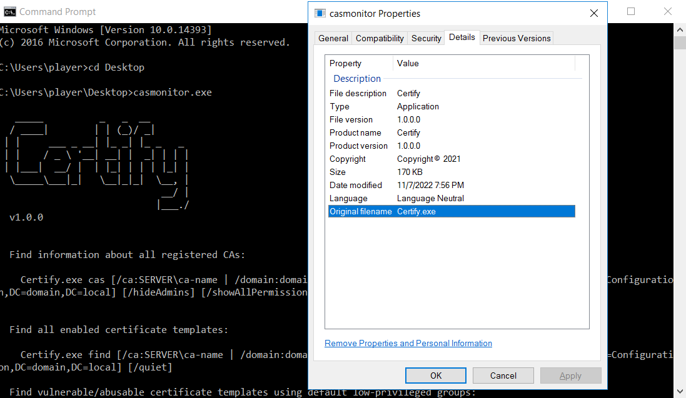

# Flag 2

`hcsc{Certify.exe_19/03/2024_23:37:23}`

# Sysmon logs

The administor also had the sysmon executables on the desktop. Checking the event logs confirms a running sysmon.

# Vulnerable certificate template

The `Certify` tool can be reused to check for the same issues with the certificates.

```batch
casmonitor.exe find
```

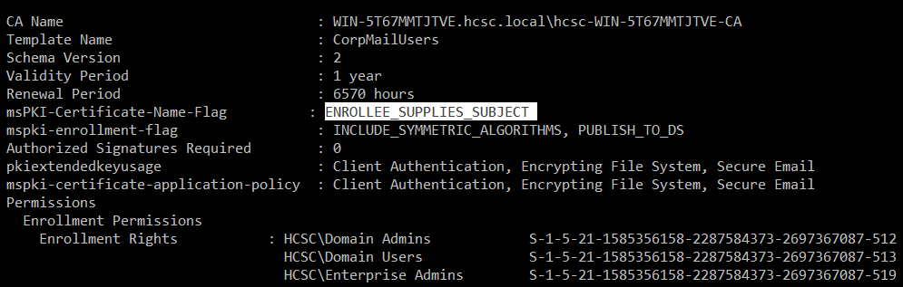

The Domain Users group can enroll for a certificate with the `CorpMailUsers` template. This has the `msPKI-Certificate-Name-Flag: ENROLLEE_SUPPLIES_SUBJECT` attribute-value pair.

The issue is that the requestor can request a certificate for a different user this way (Subject Alternative Name), leading to privilege escalation. See details at [From Misconfigured Certificate Template to Domain Admin](https://www.ired.team/offensive-security-experiments/active-directory-kerberos-abuse/from-misconfigured-certificate-template-to-domain-admin) for example.

# Flag 3

`hcsc{CorpMailUsers_msPKI-Certificate-Name-Flag_ENROLLEE_SUPPLIES_SUBJECT}`

# Issued Certificate

The list of issued certificates can be checked with the `Certificate Authority` tool. It has a request with ID 16 from `jibenhamin` with the SAN changed to `Principal Name=jachan`, allowing the privesc.

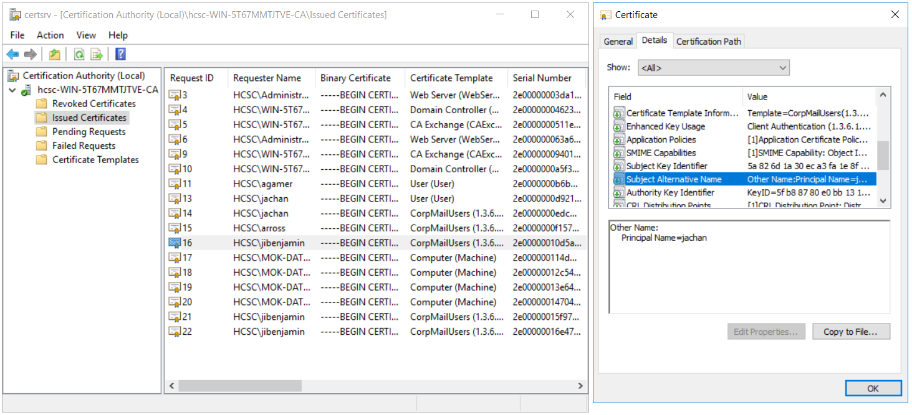

The thumbrint of the certificate is `99 a1 1a 8a ba 44 ec a8 5d 75 b1 bc 8e 2e 32 fd 1b bf 30 36`.

# Flag 5
`hcsc{99 a1 1a 8a ba 44 ec a8 5d 75 b1 bc 8e 2e 32 fd 1b bf 30 36}`

# Disabling UAC

The sysmon logs contains a log for UAC bypass (`technique_name=Bypass UserAccess Control`) with the user `jachan`. More info at [How to disable UAC remote restrictions](https://learn.microsoft.com/en-us/troubleshoot/windows-server/windows-security/user-account-control-and-remote-restriction#how-to-disable-uac-remote-restrictions) .

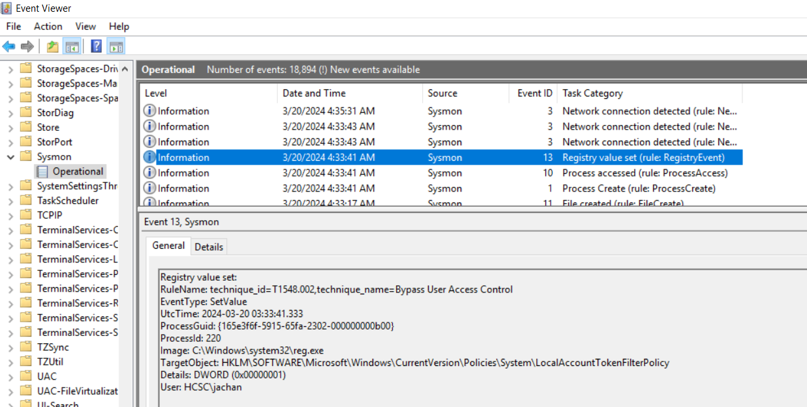

# Flag 4

`hcsc{HKLM\SOFTWARE\Microsoft\Windows\CurrentVersion\Policies\System\LocalAccountTokenFilterPolicy_jachan}`

# WinRM

Following the sysmon logs, there are incoming WinRM connections (`technique_name=Remote Services`) from the IP `192.168.238.132`. The port [5985](https://www.speedguide.net/port.php?port=5985) belongs to WinRM. There are multiple such logs.

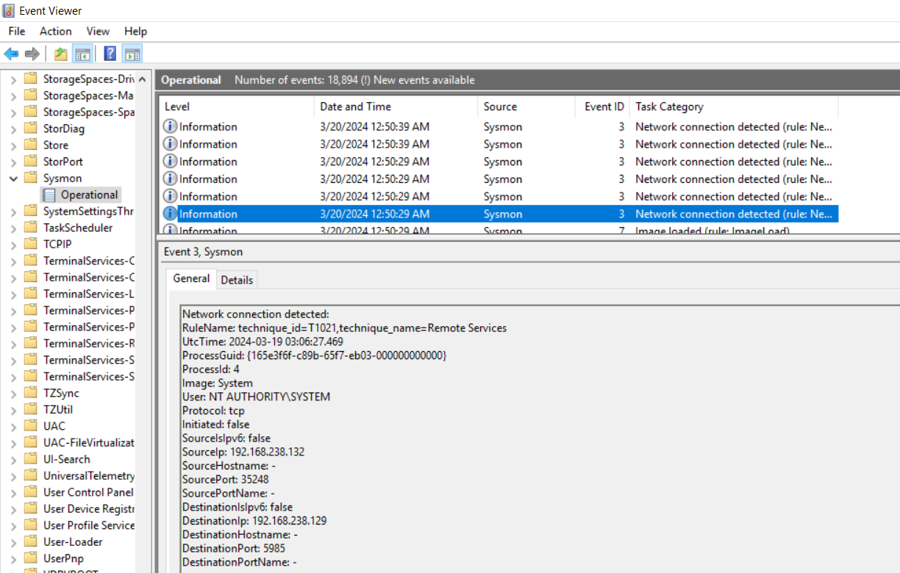


# Flag 6

`hcsc{WinRM_5985_192.168.238.132}`

# Loader

There are only a few modified files around the attack (2024.03.20). There is a suspicious exe file at `C:\Users\Public\GamingMonitor.exe`, with the original filename `MahSmallApp1.dll`.

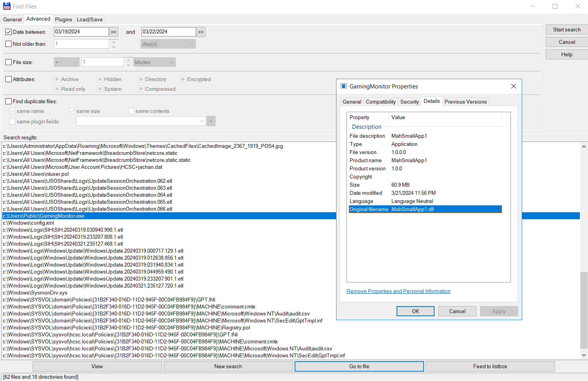

# Flag 7

`hcsc{c:\Users\Public\GamingMonitor.exe_MahSmallApp1.dll}`

# Persistency

Following the sysmon breadcrumbs, there is a registry key modification that can be abused for persistency, loading a dll when loading the .NET framework. The log also contains the value in the details.

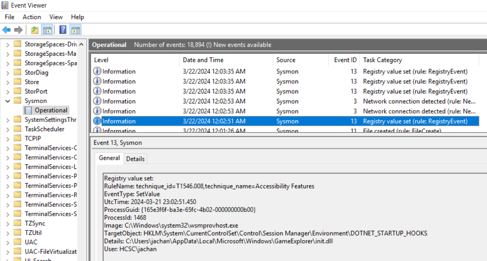

# Flag 8

`hcsc{HKLM\System\CurrentControlSet\Control\Session Manag-er\Environment\DOTNET_STARTUP_HOOKS_C:\Users\jachan\AppData\Local\Microsoft\Windows\GameExplorer\init.dll}`

# Reverse

Opening the `C:\Users\jachan\AppData\Local\Microsoft\Windows\GameExplorer\init.dll` with [dotPeek](https://www.jetbrains.com/decompiler/) reveals the decompiled version [init.dll.cs](workdir/init.dll.cs), which is well readable.

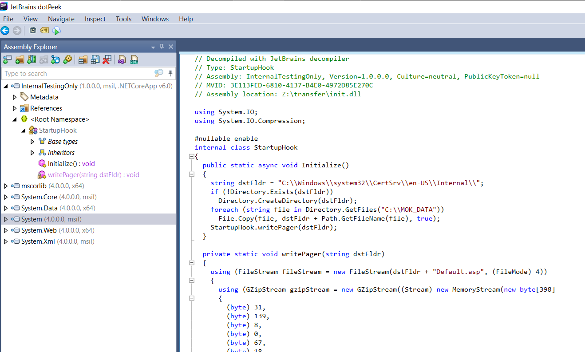

This would copy the `MOK_DATA` folder internally and decompress [Default.asp](workdir/Default.asp) into `C:\Windows\system32\CertSrv\en-US\Internal\`, allowing downloading the sensitive files through the IIS server running on the DC.

# Flag 9

`hcsc{meghoztam_a_parizert_letettem_az_asztalra}`

# IIS logs

Checking the IIS logs in `C:\inetpub\logs\LogFiles\W3SVC1\`, there are a few files downloaded in [u_ex240322.log](workdir/W3SVC1/u_ex240322.log) with the time and IP address of the attacker. 

```
date time s-ip cs-method cs-uri-stem cs-uri-query s-port cs-username c-ip cs(User-Agent) cs(Referer) sc-status sc-substatus sc-win32-status time-taken
2024-03-22 00:53:28 192.168.238.129 GET /certsrv/Internal/MOCK_application_security.csv - 80 hcsc\jachan 192.168.238.188 Mozilla/5.0+(Windows+NT+10.0;+Win64;+x64;+rv:122.0)+Gecko/20100101+Firefox/122.0 http://192.168.238.129/certsrv/Internal/ 200 0 0 15
2024-03-22 00:53:32 192.168.238.129 GET /certsrv/Internal/MOCK_basic_email.csv - 80 hcsc\jachan 192.168.238.188 Mozilla/5.0+(Windows+NT+10.0;+Win64;+x64;+rv:122.0)+Gecko/20100101+Firefox/122.0 http://192.168.238.129/certsrv/Internal/ 200 0 0 15
2024-03-22 00:53:35 192.168.238.129 GET /certsrv/Internal/MOCK_creditcard.csv - 80 hcsc\jachan 192.168.238.188 Mozilla/5.0+(Windows+NT+10.0;+Win64;+x64;+rv:122.0)+Gecko/20100101+Firefox/122.0 http://192.168.238.129/certsrv/Internal/ 200 0 0 15
2024-03-22 00:53:38 192.168.238.129 GET /certsrv/Internal/MOCK_Investment_tender.csv - 80 hcsc\jachan 192.168.238.188 Mozilla/5.0+(Windows+NT+10.0;+Win64;+x64;+rv:122.0)+Gecko/20100101+Firefox/122.0 http://192.168.238.129/certsrv/Internal/ 200 0 0 46
2024-03-22 00:53:41 192.168.238.129 GET /certsrv/Internal/MOCK_medical.csv - 80 hcsc\jachan 192.168.238.188 Mozilla/5.0+(Windows+NT+10.0;+Win64;+x64;+rv:122.0)+Gecko/20100101+Firefox/122.0 http://192.168.238.129/certsrv/Internal/ 200 0 0 0
2024-03-22 00:53:44 192.168.238.129 GET /certsrv/Internal/MOCK_salary.csv - 80 hcsc\jachan 192.168.238.188 Mozilla/5.0+(Windows+NT+10.0;+Win64;+x64;+rv:122.0)+Gecko/20100101+Firefox/122.0 http://192.168.238.129/certsrv/Internal/ 200 0 0 15
```

# Flag 10

`hcsc{192.168.238.188_2024-03-22-00-53_MOCK_application_security.csv}`

# More Issued Certificates

There are multiple certificates issued and still valid for the attackers to use. Changing the passwords only would not lock them out. Checking the `Certificate Authority` there are more certificates. 

The last one is with ID 22 from `jibenjamin`. This has a different Principal Name, `Administrator@hcsc.local` impersonating a different user. The certificate expires on 2025.03.22.

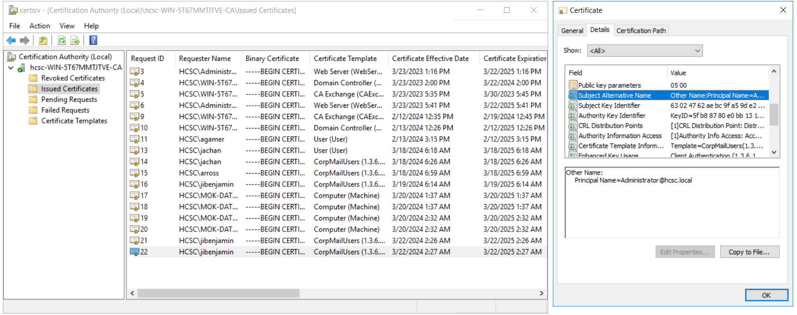

There are also certificates requested by the Computer Account `MOK-DATASTATION$`. There are some (ID 20-21) that has a different Subject Alternative Name `DNS Name=WIN-5T67MMTJTVE.hcsc.local`. This can be abused to take over the domain, as this is also the name of the DC. More info at [CVE-2022-26923 (Certifried) explained](https://www.hackthebox.com/blog/cve-2022-26923-certifried-explained).

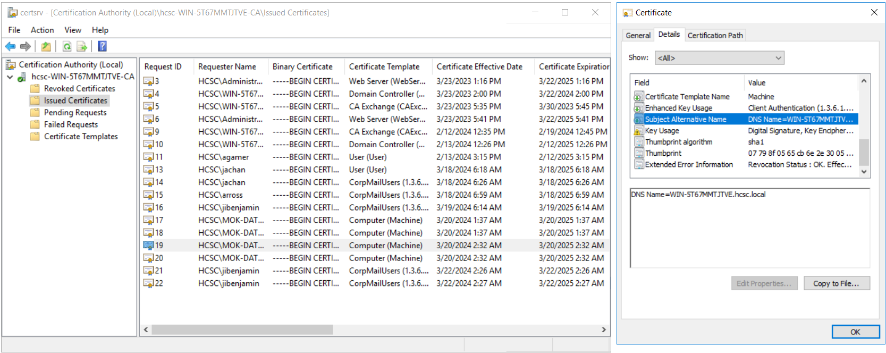

# Flag 11

`hcsc{03/22/2025_Administrator}`

# Flag 12

`hcsc{MOK-DATASTATION$_WIN-5T67MMTJTVE.hcsc.local_CVE-2022-26923}`