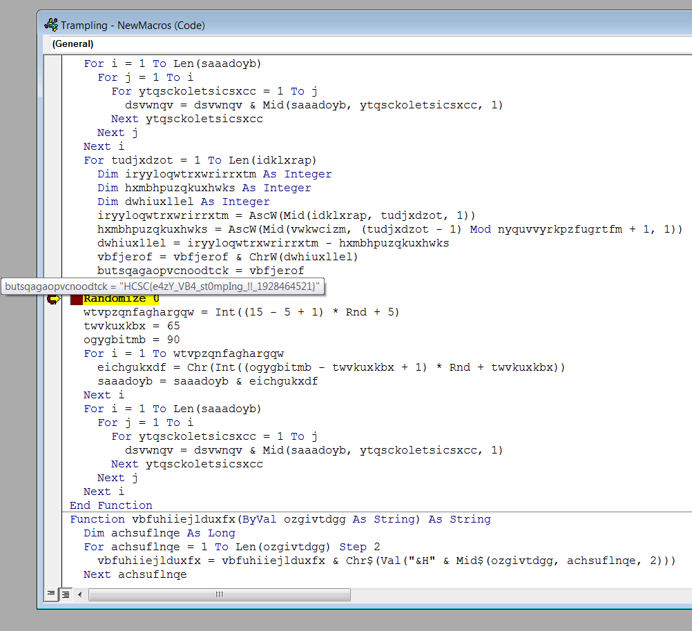

# Docm

Extracting the 7z archive has a `trampling` file inside. The `file` utility detects `Microsoft OOXML` and challenge description suggests text editor. It is probably a word document. Opening it as zip confirms it. It also has vba code, therefore docm extension sis used.

# Sandbox

Running the docm in a sandboxed word instance complains about the Project being locked when the included macro is opened.


# VBA

Extracting the VBA code with [olevba](https://github.com/decalage2/oletools/wiki/olevba) (oletools) prints the `AutoOpen` code and also warns about VBA stomping (also the challenge name suggests this).

```bash
olevba trampling
```


Decoding the code would have the flag `flag{w4snt_it_t00_34sy?}". As this is not even the flag format, it is obvious that the pcode need to be reversed.

# Pcode

The pcode can be dumped using the [pcodedmp](https://pypi.org/project/pcodedmp/) (also included in oletools).

```bash
pcodedmp trampling > pcode.txt
```

And converted to vba code using [pcode2code](https://pypi.org/project/pcode2code/).

```bash
pcode2code -o code.txt -p pcode.txt
```

Unfortunatelly there are some errors mainly in the function signatures with the tool, but they can be fixed manually in a sandbox. The fixed code is in [code_fixed.txt](workdir/code_fixed.txt). The original file should be used, as the code is using some properties of the file.

Deleting `word/vbaData.xml` and `word/vbaProject.bin` from the docm (as zip) unlocks the project. We are using our source anyways.

Breaking on the second `Randomize` has the flag in variable `butsqagaopvcnoodtck`.



The reconstructed docm file is in [trampling.docm.zip](workdir/trampling.docm.zip), password `infected`.

# Flag
`HCSC{e4zY_VB4_st0mpIng_!!_1928464521}`