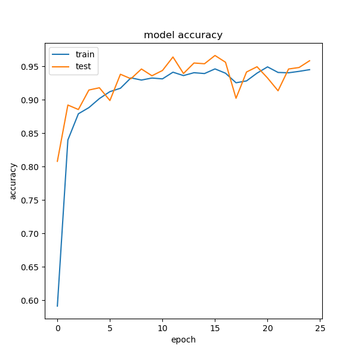

# Service discovery

[Scanning](../Scans/WRITEUP.md) the 10.10.x.11 machines reveals a HTTP server at port 53369, with the Bee Image Classification details.

# Dumping images

The `/images` endpoint responds with a bunch of base64 key value pairs, where the values are images.

A bunch of images were dumped with [dump.py](workdir/dump.py) for offline usage.

# Making the classifier

There are already classifier for the problem, for example <https://github.com/PratikUpadhyay2408/BeeRecognition> with Tensorflow.

After minor modifications (version updates and removing unnecessary things) a model was trained to classify bees. The modded version and the model can be found in [BeeRecognition.zip](workdir/BeeRecognition.zip)

While it had 95% accuracy on the set, classifying 50 images never worked. An implementation to classify the input with this model is in [solve_classify.py](workdir/solve_classify.py)

# Dataset

The classifier is using a dataset from kaggle, [The BeeImage Dataset: Annotated Honey Bee Images](https://www.kaggle.com/datasets/jenny18/honey-bee-annotated-images).

Checking the dumped images, they are exactly the same as this dataset. Using the md5 or any hash for the files can classify them with 100% accuracy. An implementation of this is in [solve.py](workdir/solve.py)

This prints the flag on success

# Flag

`HCSC24{d1d_y0u_f1nd_th3_d4t4s3t_4nd_h4shed_or_d1d_u_use_ml?}`
