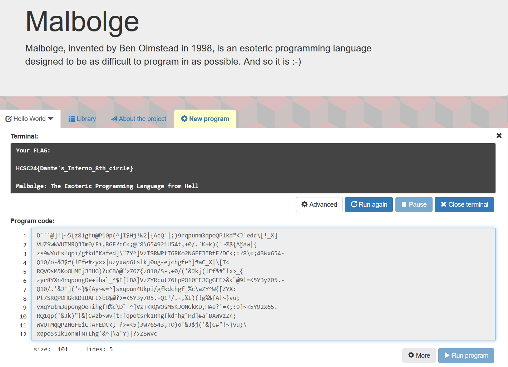

# Zip content

Extracting the zip has the following code inside.

```
D'``@]![~5{z81gfu@P10p(^]I$Hj!W2|{AcQ`|;)9rqpunm3qpoQPlkd*KJ`edc\[!_X]
VUZSwWVUTMRQJIm0/Ei,BGF?cC<;@?8\654921U54t,+0/.'K+k)('~%${A@aw|{
zs9wYutslqpi/gfkd*Kafed]\"ZY^]VzTSRWPtT6RKo2NGFEJIBfF?DC<;:?8\<;43Wx654-
Q10/o-&J$#(!Efe#zyx>|uzyxwp6tslkj0ng-ejchgfe^]#aC_X|\[T<
RQVOsM5KoOHMFjJIHG)?cCBA@">76Z{z810/S-,+0/('&Jkj(!Ef$#"!x>_{
zyr8YXn4rqpongOe+iha`_^$E[!BA]VzZYR:ut76LpPO10FEJCgGFE>&<`@9!=<5Y3y705.-
Q10/.'&J*j('~}${Ay~w=^]sxqpun4Ukpi/gfkdchgf_%c\aZY^W{[ZYX:
Pt7SRQPOHGkKDIBAFE>bB$@?>=<5Y3y705.-Q1*/.-,%I)(!g%${A!~}vu;
yxqYutm3qpongOe+ihgfH%c\D`_^]VzT<RQVOsM5KJONGkKD,HAe?'=<;:9]~<5Y92x65.
RQ1qp('&Jk)"!&}C#zb~wv{t:[qpotsrk1Rhgfkd*hg`Hd]#a`BXWVzZ<;
WVUTMqQP2NGFEiC+AFEDC<;_?>=<5{3W76543,+O)o'&J$j('&}C#"!~}vu;\
xqpo5slk1onmfN+Lhg`&^]\a`Y}]?>ZSwvc
```

# Malbolge

From the challenge/file name (esoteric), this should be an esoteric programming language. The [Esolang](https://esolangs.org/wiki/Esoteric_programming_language) wiki has a big collection.


Also from the challenge/file name (hell), a DnD reference to [Malbolge](https://forgottenrealms.fandom.com/wiki/Malbolge) could be guessed, which also shares a name with an eso language [Malbolge](https://esolangs.org/wiki/Malbolge). Alternatively searched with google with keywords like `esoteric language hell`.

Checking the details, the character set matches the input we have.

# Interpreter

There are multiple interpreters online. Running the code in one of them prints the flag.
 - <https://malbolge.doleczek.pl/>
 - <https://tio.run/#malbolge>




# Flag

`HCSC24{Dante's_Inferno_8th_circle}`