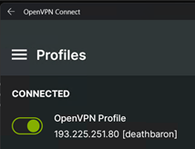
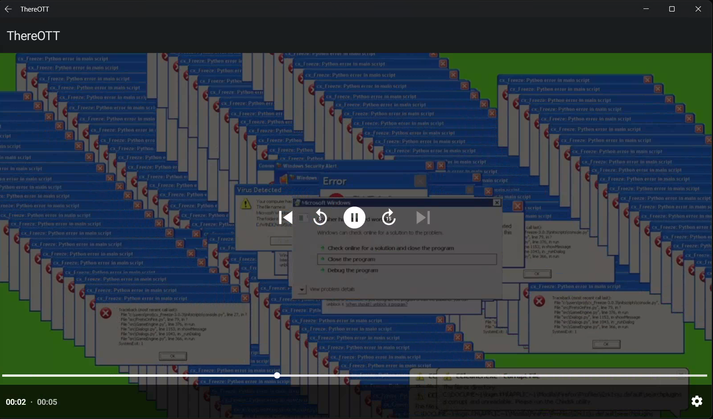
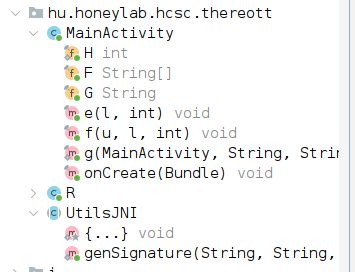
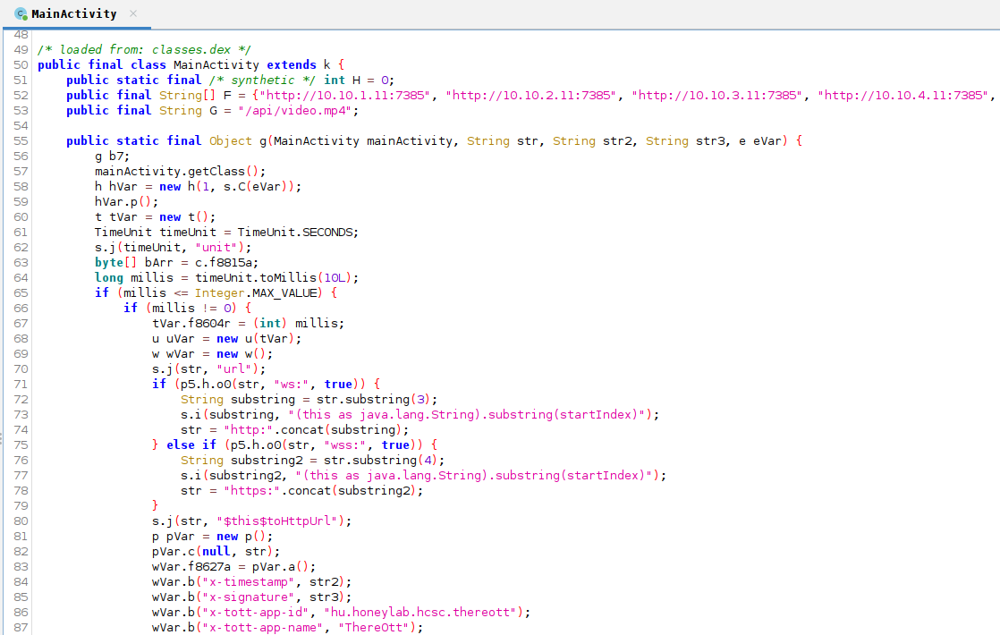
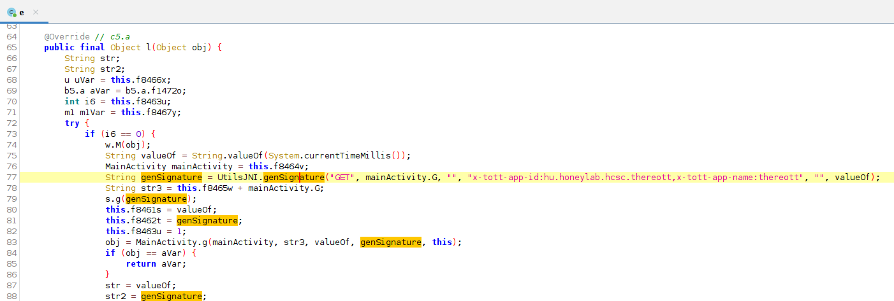
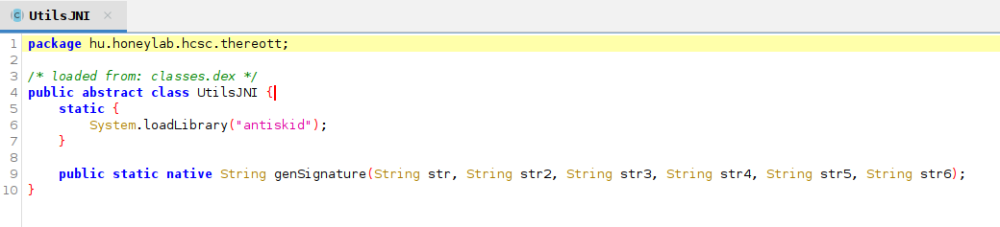
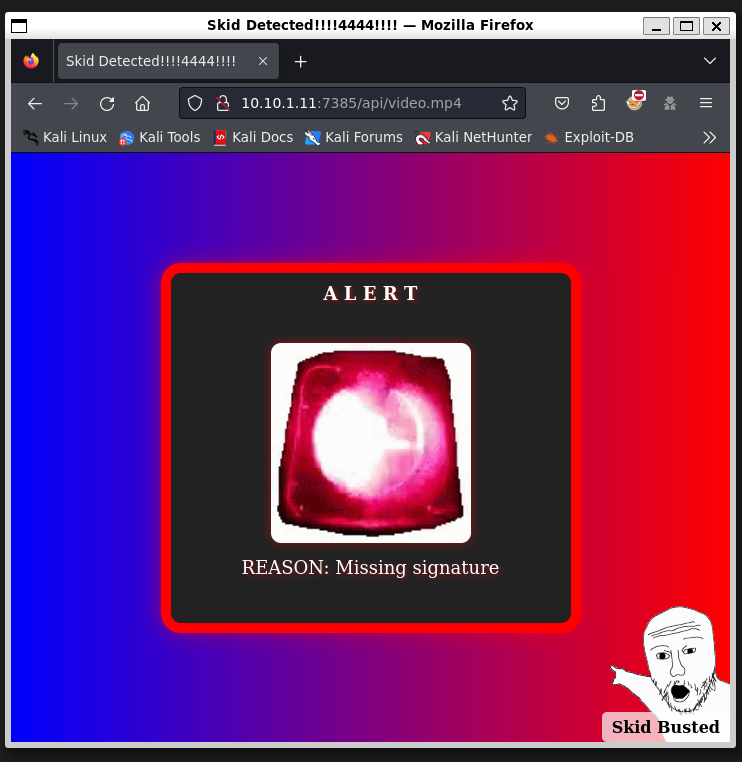
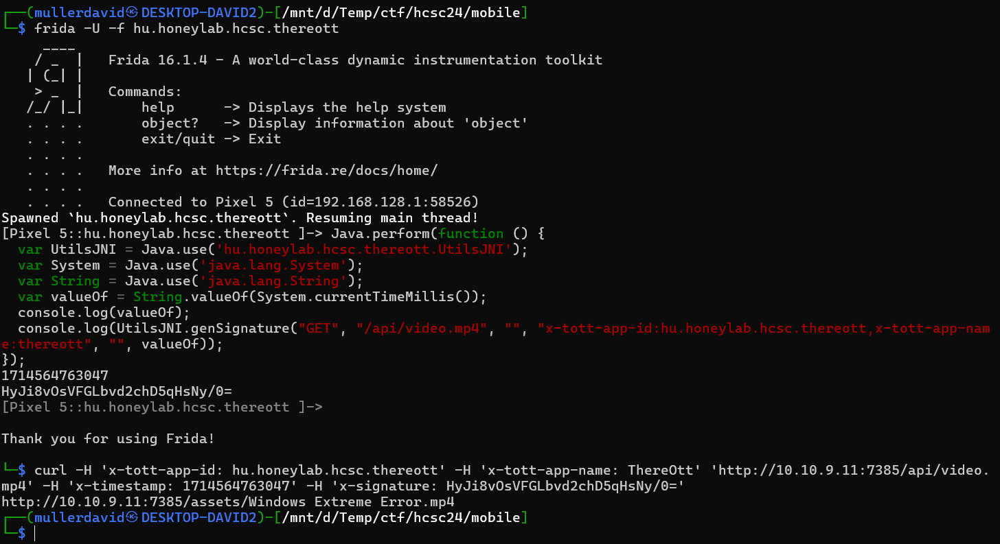
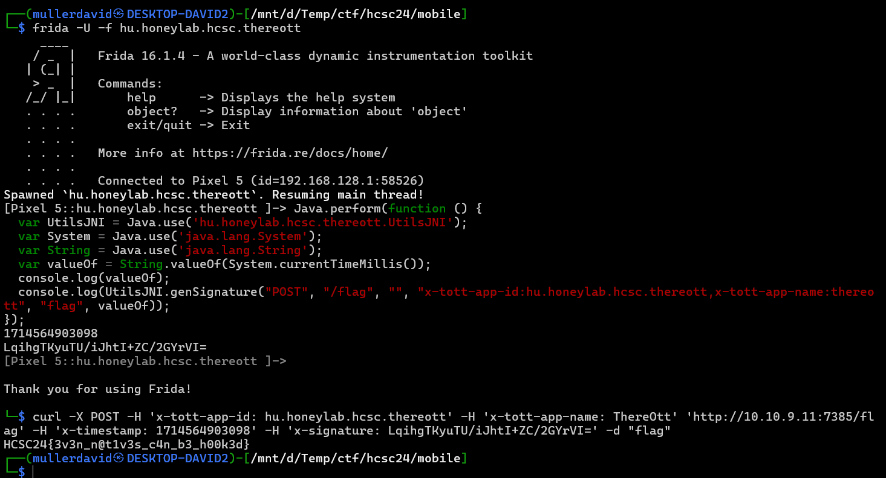

# Application

After installing and running the application, there is a random video playing. Connecting to the VPN is required for the app to work.







# Reverse

Extracting the apk and opening it in a decompiler reveals the application logic. It can be optionally decoded with apktool.

```bash
apktool d app-release.apk
jadx-gui
```

## Interesting parts

The `hu.honeylab.hcsc.thereott` has the interesting parts.



## MainActivity

The `MainActivity` has the API endpoints.



## GenSignature

The `genSignature` function is used to generate the signature. It is a native library, loading the [libantiskid.so](workdir/libantiskid.so).





Reversing this file is significantly harder than just calling it and signing our own request.

# API

Visiting the API endpoint without the correct signature triggers some anti piracy measurement.



```bash
curl -X 'GET' -H 'x-timestamp: 1714163414025' -H 'x-tott-app-id: hu.honeylab.hcsc.thereott' -H 'x-tott-app-name: ThereOtt' -H 'User-Agent: okhttp/4.9.3' 'http://10.10.9.11:7385/api/video.mp4'
```

Based on the challenge description, we need to send a valid POST request to the `/flag` endpoint with some data, with correct signature.

# Frida

Frida can be used to dynamically run code inside the application container.

```bash
frida -U -f hu.honeylab.hcsc.thereott
```

```js
Java.perform(function () {
  var UtilsJNI = Java.use('hu.honeylab.hcsc.thereott.UtilsJNI');
  var System = Java.use('java.lang.System');
  var String = Java.use('java.lang.String');
  var valueOf = String.valueOf(System.currentTimeMillis());
  console.log(valueOf);
  console.log(UtilsJNI.genSignature("GET", "/api/video.mp4", "", "x-tott-app-id:hu.honeylab.hcsc.thereott,x-tott-app-name:thereott", "", valueOf));
});
```

Checking the resulting signature works without issue. Note that the same timestamp is used in the headers as the one used for signing.

```bash
curl -H 'x-tott-app-id: hu.honeylab.hcsc.thereott' -H 'x-tott-app-name: ThereOtt' 'http://10.10.9.11:7385/api/video.mp4' -H 'x-timestamp: 1714564763047' -H 'x-signature: HyJi8vOsVFGLbvd2chD5qHsNy/0='
```



Signing the required payload is just modifying the above script. GET should be replaced with POST, the endpoint with `/flag`, the data with `flag`. After trial and error, the last parameter is the data part.

```js
Java.perform(function () {
  var UtilsJNI = Java.use('hu.honeylab.hcsc.thereott.UtilsJNI');
  var System = Java.use('java.lang.System');
  var String = Java.use('java.lang.String');
  var valueOf = String.valueOf(System.currentTimeMillis());
  console.log(valueOf);
  console.log(UtilsJNI.genSignature("POST", "/flag", "", "x-tott-app-id:hu.honeylab.hcsc.thereott,x-tott-app-name:thereott", "flag", valueOf));
});
```

```bash
curl -X POST -H 'x-tott-app-id: hu.honeylab.hcsc.thereott' -H 'x-tott-app-name: ThereOtt' 'http://10.10.9.11:7385/flag' -H 'x-timestamp: 1714564903098' -H 'x-signature: LqihgTKyuTU/iJhtI+ZC/2GYrVI=' -d "flag"
```



This reveals the flag.

# Flag
`HCSC24{3v3n_n@t1v3s_c4n_b3_h00k3d}`