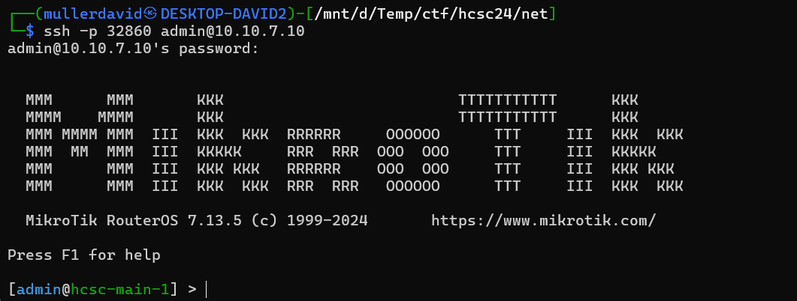
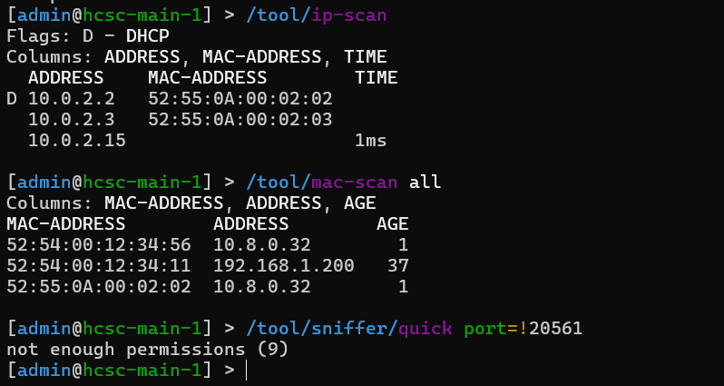
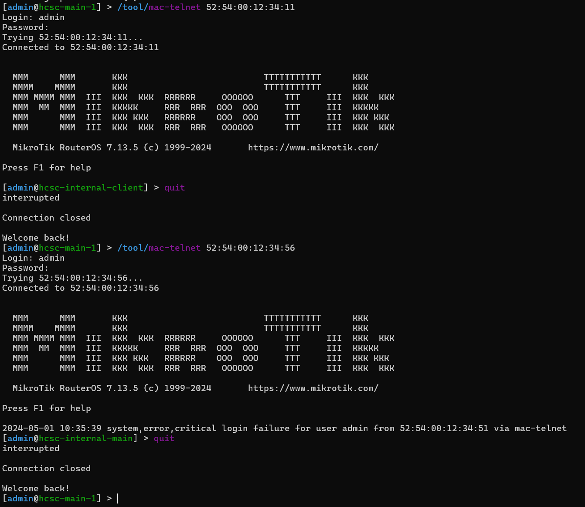
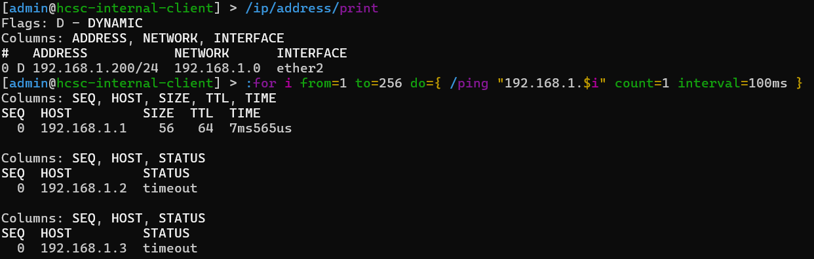
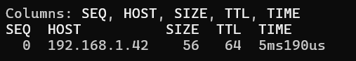
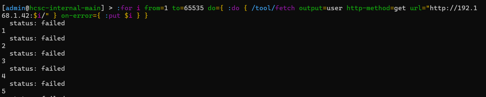
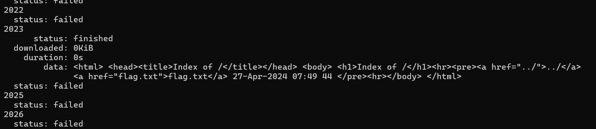
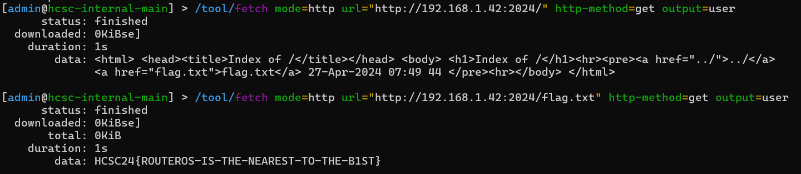

# Discovering the service

[Scanning](../Scans/WRITEUP.md) the 10.10.x.10 machines reveals an SSH port with MikroTik, which is a Lithuanian networking company.

The SSH credentials can be easily guessed, `admin:admin`. The RouterOS has it's own shell with limited tools and functionality.



# Looking around

Checking the [hcsc-main-1](workdir/main-1.txt) config doesn't show anything useful. The flag is not there.

```
/export show-sensitive verbose
```

# Passive Scanning

Scanning from the perimeter router is possible with a few builtin tools (20561 is used by the mac-telnet, see later).

```
/tool/ip-scan
/tool/mac-scan
/tool/snoffer/quick port!=20561
```



This reveals further hosts. 

# Lateral movement

Those hosts are also running RouterOS, as we can connect to them with the mac-telnet utility, with the same `admin:admin` credentials.

```
/tool/mac-telnet 52:54:00:12:34:11
/tool/mac-telnet 52:54:00:12:34:56
```



While we have little more permissions on those hosts, the sniffing doesn't reveal any new useful information. DHCP leases doesn't reveal anything.


Checking the [hcsc-internal-main](workdir/internal-main.txt) [hcsc-internal-client](workdir/internal-client.txt) configs don't show anything useful. The flag is not there either. 


# Active Scanning

## Host discovery

We know the internal DHCP address range. The shell has scripting capabilities with ping can be utlized to scan for even more hosts.

```
:for i from=1 to=256 do={ /ping "192.168.1.$i" count=1 }
```




Running it on all hosts reveals an extra host reachable from the internal machines, `192.168.1.42`.

## Port scanning

The scripting and the fetch tool can be used to scan for ports (http). Fortunatelly there is a reply on closed ports, so waiting for timeout is not required and the scan goes relatively fast.

```
:for i from=1 to=65535 do={ :do { /tool/fetch output=user http-method=get url="http://192.168.1.42:$i/" } on-error={ :put $i } }
```





This reveals that there is a webserver on port 2024, and there is a link for the flag.txt.

## Web crawling

Extracting the flag with the fetch tool is trivial afterwards.

```
/tool/fetch mode=http url="http://192.168.1.42:2024/" http-method=get output=user
/tool/fetch mode=http url="http://192.168.1.42:2024/flag.txt" http-method=get output=user
```



# Flag

`HCSC24{ROUTEROS-IS-THE-NEAREST-TO-THE-B1ST}`

# Alternative solution

Using the SSH port forwarding functionality and proxy chains can be utlised to find the flag as well.