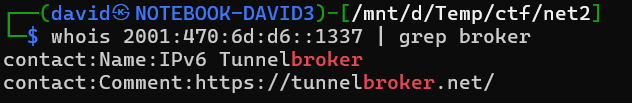
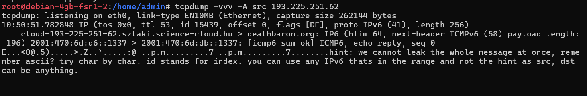
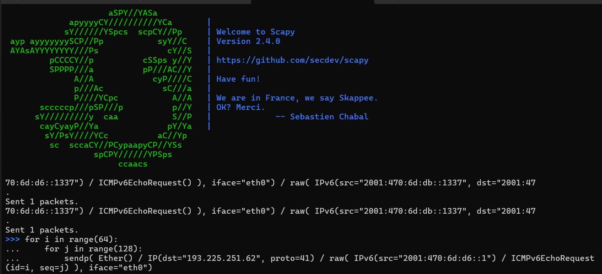
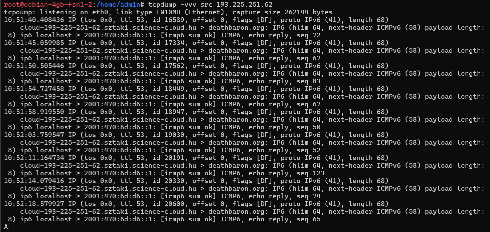
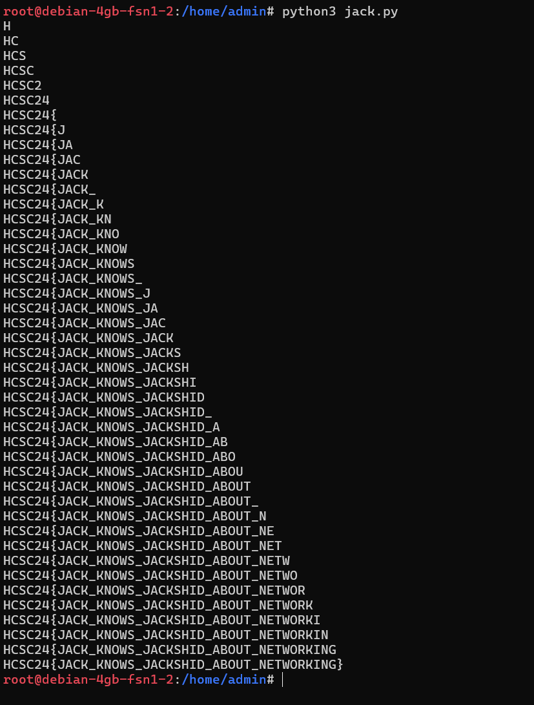

# Poking around

Sending various basic scans towards the host doesn't reveal anything. 

Based on the challenge description, it should be some IPv4 to IPv6 gateway.

There are multiple protocols that can be used to encapsulate such traffic:
<https://developers.redhat.com/blog/2019/05/17/an-introduction-to-linux-virtual-interfaces-tunnels>, <https://en.wikipedia.org/wiki/Teredo_tunneling>.

The most suitable and simplest is the SIT tunnel, simply encapsulating the IPv6 packet in an IPv4 (proto 41) packet.

## Hint

The hint on the last day confirms it. [Tunnelbroker](https://tunnelbroker.net/) is using SIT tunnels.



Early attempts failed, as my ISP filtered those packets out, as IP proto 41 is not widely used. A VPS was used later which worked perfectly.

# Testing the protocol

Using the `2001:470:6d:d6::1337` hint endpoint as target first, we can confirm that the protocol works. Scapy is used to send the crafted packets. The replies are simply checked with tcpdump running.

ICMPv6 is used based on the request/reply IDs from the challenge description.

```python
sendp( Ether() / IP(dst="193.225.251.62", proto=41) / IPv6(src="2001:470:6d:db::1337", dst="2001:470:6d:d6::1337") / ICMPv6EchoRequest(), iface="eth0")
```



```
hint: we cannot leak the whole message at once, remember ascii? try char by char. id stands for index. you can use any IPv6 thats in the range and not the hint as src, dst can be anything.
```

# Attempting communication

The received hint and the challenge description suggests that Jack only answers to correct guesses, and it can only be guessed character by character. Id is for indexing, and the data can be either in data or in sequence number. The latter returned some result successfully. Also the IPv6 src and dst is given.




This confirms the details. Jack only replies when the flag at index id has the ascii char sequence number. `72` is `H`.

# Scripting

The output of the [tcpdump](workdir/tcpdump.txt) can be used to reconstruct the flag or it can be scripted. The [jack.py](workdir/jack.py) contains an implementation.



# Flag

`HCSC24{JACK_KNOWS_JACKSHID_ABOUT_NETWORKING}`