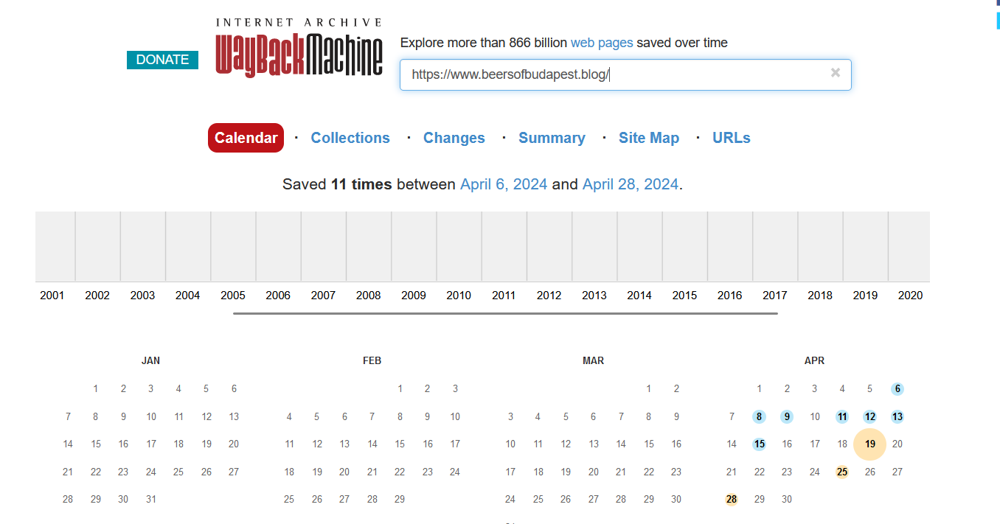
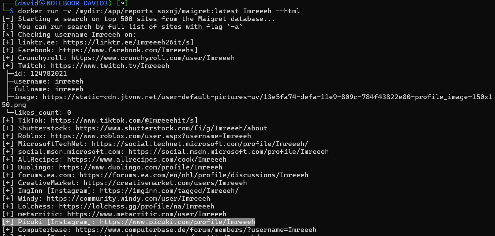
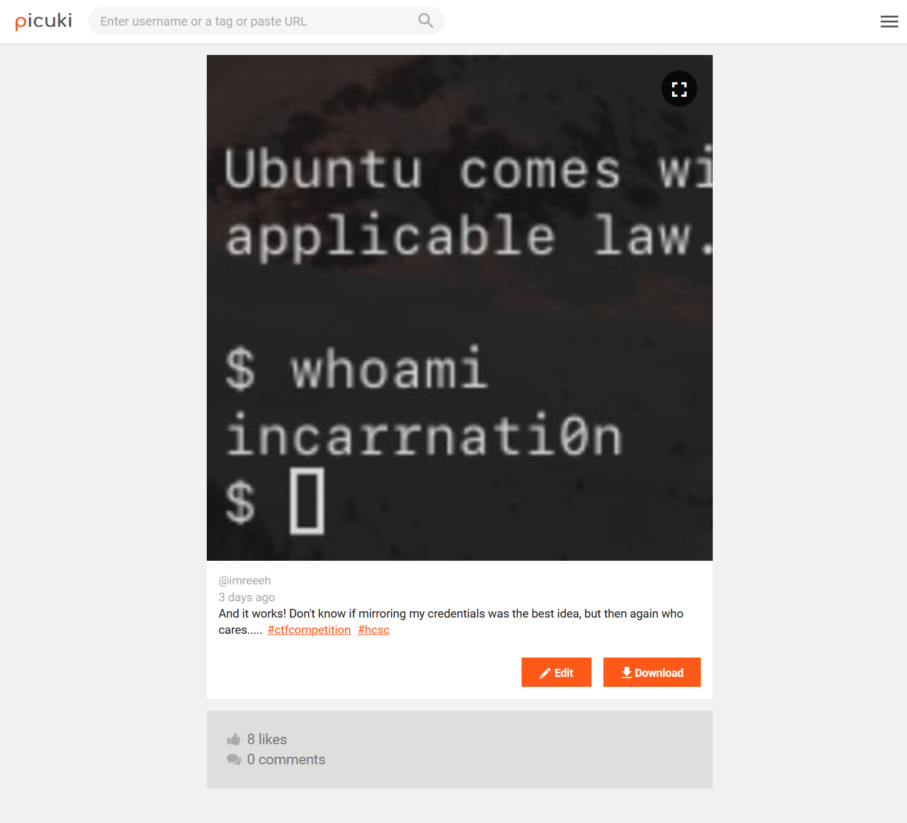
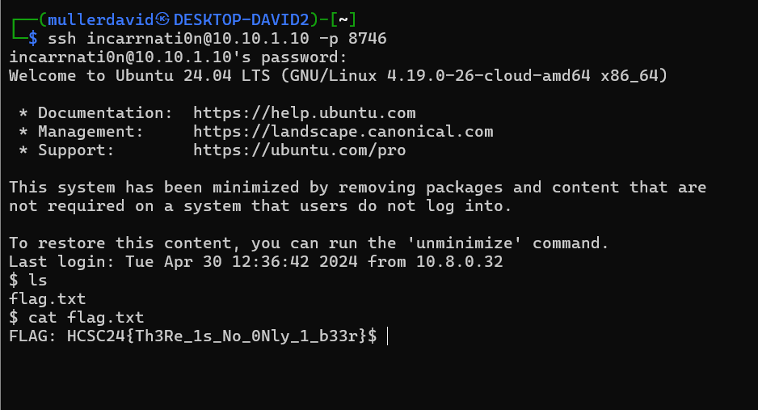

# Archive

Using the [Waback Machine](https://web.archive.org/) reveals multiple snapshots.



The snapshot on 2024.04.12. has a social media tag at the bottom, `Follow me: @Imreeeh`.

<https://web.archive.org/web/20240412161140/https://www.beersofbudapest.blog/>


# Social Media

The user can be found on Picuki with various tools, like [maigret](https://github.com/soxoj/maigret/).

```bash
docker pull soxoj/maigret
docker run -v /mydir:/app/reports soxoj/maigret:latest Imreeeh --html
```



It has a post with `#hcsc' tag, ssh login image and text.

```
And it works! Don't know if mirroring my credentials was the best idea, but then again who cares..... #ctfcompetition #hcsc
```



# SSH

[Scanning](../Scans/WRITEUP.md) the 10.10.x.10 machines reveals an SSH port with Ubuntu, which is visible on the image.

Based on the post, using the username mirrored as password let us in (`incarrnati0n:n0itanrracni`).



# Flag

`FLAG: HCSC24{Th3Re_1s_No_0Nly_1_b33r}`