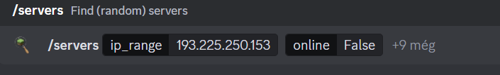

# Discord

There are discord communities with bots that has historical databases for minecraft servers. One such server can be found with the hint youtube video: [The Land of Pies](https://discord.com/invite/uUnXV8X2jw).

# Minecraft server database

These bots constantly scan the internet and you can use them to query the database. After accepting the terms, the `/servers` command can be used.

The result has 3 players that stitched together results the flag.

# Flag

`HCSC24{y0u_l34ve_tr4ces_everywhere}`