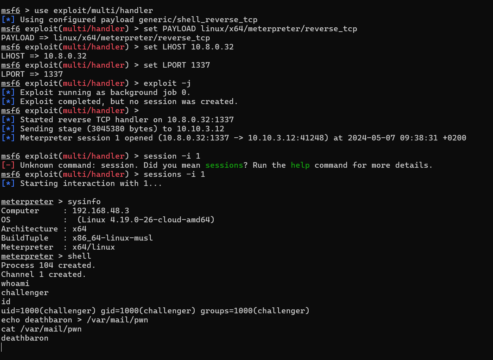

# Service discovery

[Scanning](../Scans/WRITEUP.md) the 10.10.x.12 machines reveals a TCP service at port 20882 a banner Prequel v1.0.1.

Using netcat is enough to access the service.

```bash
nc -v 10.10.1.12 20882
```

# Reverse

## Docker

Analyzing the [challenge.zip](files/challenge.zip), it is a container. It has 2 databases, `messages.db` and `messages_debug.db`, and the service binary, `prequel`

## Binary

### Protections

DEP is enabled, ASLR is not. While stack canary is present at some places, the `main` function is not protected. There is also a seccomp filter, preventing `execve` and `execveat` syscalls.

### Logic

The `main` function is reading a name in `read_name` with `gets` into a 64 big buffer, which can be abused for a stack overflow when `main` returns. 

The name read is passed to `get_messages` with a fixed query `SELECT message FROM messages WHERE name=?` and the name as second. Internally it is using the `messages.db` sqlite database with a prepared statement, binding the name to the parameter.

Analyzing the query strings in the binary, there is also an unused `print_debug_flag` function that is printing the flag from the `messages_debug.db` sqlite database, similarly with a prepared statement, `SELECT flag FROM flag LIMIT ?;`.

# Exploit

The `gets` can be abused for the stack overflow. The return address offset can be found with pwntools `cyclic` and `cyclic_find`. It is 72. The only problematic character is the newline, as `gets` stops (and only stops) at that character.

While first it looks easy to just call the debug function as the next in the exploit, unfortunately it is working on a different sqlite file and the flag is not visible in that database.

```python
payload = b"A"*offset+p64(pop_rdi) + p64(100) + p64(ELF_LOADED.symbols["print_debug_flag"])
```

The `get_messages` function should be invoked instead with the query for the flag. 

Right before returning in `main`, the `rbx` register contains an address relative to the buffer we have control over. Subtracting 360 (adding 0xFFFFFFFFFFFFFE98) gives us the beginning of the buffer on every run. Using a ROP chain of fixed size (e.g. 0x100) and appending query strings afterwards works well.


Using ropper or similar can extract the gadgets.

```bash
ropper --file ./prequels --nocolor > rop.txt
```

There are enough ROP gadgets to somehow move `rbx` into `rdi` (arg1) and add the offset to it for the arbitrary query string, also for popping a string (doesn't matter what) address into `rsi` (arg2) and calling `get_messages`.

See the [exploit.py](workdir/exploit.py) for details.


# Flag
`HCSC24{wh3n_y0ur_str1ngs_4r3_thE_M0stpr3c1ous_g4dG3t5}`

# Easier solution

It would have been easier to just use the query string from the binary, from the debug function.


It has a prepared statement with a limit, but that can also come from the binary, like the big number (date) from the compiler.


This only requires popping the 2 addresses into the registers. See [exploit_simple.py](workdir/exploit_simple.py) for details.

# Bonus code exec

This was not required to solve the challenge.

The docker is starting a shell that starts `ynetd` that is listening for connection and spawns the prequel processes. Only the prequel is protected with seccomp.

As mentioned earlier, seccomp is used to blacklist some syscalls. Those syscalls would have been crucial for a proper shell. While executing other shellcodes is possible, it is hard to rewrite your shellcode for more complex tasks. 


The seccomp part doesn't seem to be vulnerable for bypass, but `ptrace` syscall is not disabled, which can be abused for bypassing the filters. It can be abused to alter syscalls on the fly, or inject code into other processes. The latter was used.

The stage1 is a ROP chain to map some new RWE memory, then reuse the `read_name` to read into that memory and finally jump to it.

This allows sending arbitrary stage2 shellcode (as long as it has no new line because of the `gets`, but a simple encoder can solve that). This shellcode contains some logic to start `ptrace` into the first shell process (PID 1), get the registers from the remote process, inject the stage3 shellcode into the process at the current `rip` and resuming the process to execute the newly executed code.

The good thing is that this doesn't kill the `ynetd` and further exploits are possible. The bad is that if this process dies, the docker would terminate.

Stage3 can be anything, a reverse tcp meterpreter was used. See [](workdir/exploit_exec.py) for details.



