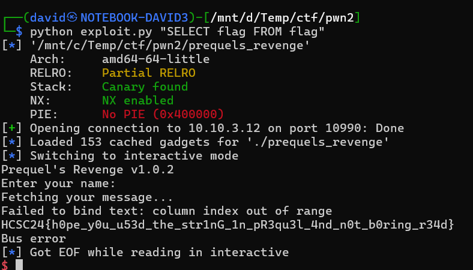

# Service discovery

[Scanning](../Scans/WRITEUP.md) the 10.10.x.12 machines reveals a TCP service at port 10990 a banner Prequel v1.0.2.

Using netcat is enough to access the service.

```bash
nc -v 10.10.1.12 10990
```

# Prequel

The binary only differs that there is no debug function and query string for the flag.

As in the [Prequel Writeup](../Pwn_Prequel/WRITEUP.md) the easy solution was missed at first, this is analogous with that solution. Check that for details.

The only minor difference in the exploit is the manual gadget addresses are different, but they can be also found in this binary. See [exploit.py](workdir/exploit.py) for details.




# Flag
`HCSC24{h0pe_y0u_u53d_the_str1nG_1n_pR3qu3l_4nd_n0t_b0ring_r34d}`