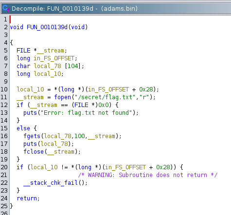
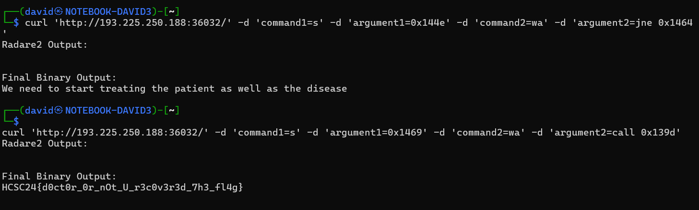

# Start Your Instance

After starting the docker instance, there is a webserver listening in the given address. It accepts 2 commands with arguments for radare.


# Source

The given [main.go](files/main.go) contains the source code for the webserver part. It is heavily filtering the command and argument parameters and runs (a copy of a) `adams` binary with `radare2`. We don't have access to the binary itself.

```go
r2Commands := []string{
			"oo+",
			"e cfg.sandbox=all", // idea from pancake
			"aaaa",
			fmt.Sprintf("%s %s", command1, argument1),
			fmt.Sprintf("%s %s", command2, argument2),
		}
```

Unfortunatelly, all the parameters are heavily filtered. Commands are maximum 4 characters and only alphanumeric. There are also blacklisted commands as well. The arguments are also limited, 16 characters max, alphanumeric plus space. 


# HTTP

Sending a request is just a simple http request.

```bash
curl 'http://193.225.250.188:36032/' -d 'command1=echo' -d 'argument1=1' -d 'command2=bs' -d 'argument2=2'
```

As the parameters are heavily filtered, payloads that run shellcode are probably not viable. Something like base64 writes would pass the filter, but not the length.

```bash
curl 'http://193.225.250.188:36032/' -d 'command1=s' -d 'argument1=0x1215' -d 'command2=w6d' -d 'argument2=npFIuC9iaW4vc2gAmVBUX1JmaC1jVF5S6AcAAAB3aG9hbWkAVldUXmo7WA8F'
```

# Dumping the binary

At the initial state, the binary is not at the very beginning of the file. It can be dumped by going to the beginning of the file (`s`) and printing hex (`px`).

```bash
curl 'http://193.225.250.188:36032/' -d 'command1=s' -d 'argument1=0x0' -d 'command2=px' -d 'argument2=0xffff'
```


The hex dump is cleaned from the header, offsets and the text part in [adams.hex](workdir/adams.hex).

This can be converted to a binary.

```bash
xxd -r -p adams.hex > adams.bin
```

# Reverse

Ghidra ([adams.c](workdir/adams.c)) and the given radare2 service can be used to trace back the program. Some attempts are in [info.txt](workdir/info.txt).

Tracing back from the `Unauthorized` string, there is a function `FUN_0010142d` with a condition (checking /etc/hostname for adams-pc) and a different function printing randomly from various other strings. This has nothing to do with the flag, but there is also `FUN_0010139d` that prints the flag, but not referenced or called anywhere.



# Patching

Seeking to some crucial point and overwriting the instructions can run the desired funcionality.

Patching the authorization check would just print a quote.

```bash
curl 'http://193.225.250.188:36032/' -d 'command1=s' -d 'argument1=0x144e' -d 'command2=wa' -d 'argument2=jne 0x1464'
```

Calling the secret printing function on the other hand hands over the flag on a silver plate.

```bash
curl 'http://193.225.250.188:36032/' -d 'command1=s' -d 'argument1=0x1469' -d 'command2=wa' -d 'argument2=call 0x139d'
```



# Flag
`HCSC24{d0ct0r_0r_nOt_U_r3c0v3r3d_7h3_fl4g}`