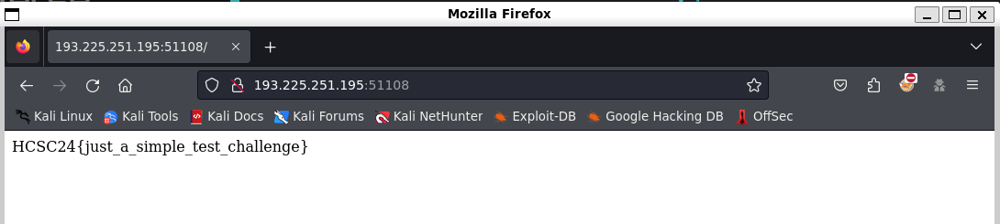

# Start Your Instance

This is just a small warmup to test the docker spawn for the other reverse challenge.

After pressing the `Start Your Instance` button, it will fire up a docker and give access at a specific IP:Port.

In the tutorial, this is a simple webserver.

# Flag
`HCSC{just_a_simple_test_challenge}`