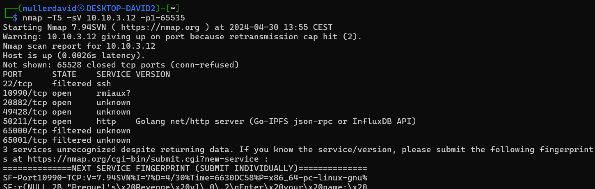

# Scan

There are 3 IP addresses given for the various challenges. Each challenge has the host, only the port/service has to be discovered. There are always 10 instances (0-9) for each machines.

Nmap can be used to find the open tcp ports, results are in [scan.txt](workdir/scan.txt). The port 22, 65000, 65001 are filtered on each machine. None of the challenges were using UDP.

# 10.10.x.10

```
Nmap scan report for 10.10.3.10
Host is up (0.0039s latency).
Not shown: 65527 closed tcp ports (conn-refused)
PORT      STATE    SERVICE VERSION
22/tcp    filtered ssh
8746/tcp  open     ssh     OpenSSH 9.6p1 Ubuntu 3ubuntu13 (Ubuntu Linux; protocol 2.0)
32860/tcp open     ssh     MikroTik RouterOS sshd (protocol 2.0)
46901/tcp open     http    nginx 1.25.5
54847/tcp open     unknown
61370/tcp open     nbd     Network Block Device (new handshake)
65000/tcp filtered unknown
65001/tcp filtered unknown
```


The port challenge mapping are the following
 - `8746` BoB (SSH: Ubuntu was on the image with ssh login)
 - `32860` Csak egy litván hálózat (SSH: MikroTik is Lithuanian)
 - `46901` Note to self (HTTP: Note To Self)
 - `54847` Handy (TCP: message to encrypt)
 - `61370` Not a bad day (NBD: acronym)

# 10.10.x.11

```
Nmap scan report for 10.10.3.11
Host is up (0.0033s latency).
Not shown: 65528 closed tcp ports (conn-refused)
PORT      STATE    SERVICE VERSION
22/tcp    filtered ssh
5028/tcp  open     http    nginx 1.25.5
5966/tcp  open     http    nginx 1.25.5
7385/tcp  open     unknown
53369/tcp open     unknown
65000/tcp filtered unknown
65001/tcp filtered unknown
```


The port challenge mapping are the following
 - `5028` Válassz egy böngészőt (HTTP: popular browsers)
 - `5966` Trekking (HTTP: Traverse through)
 - `7385` ThereOTT (HTTP: 204 No Content, leftover)
 - `53369` Handy (HTTP: Bee Image Classification)
 
# 10.10.x.12

```
Nmap scan report for 10.10.3.12
Host is up (0.0026s latency).
Not shown: 65528 closed tcp ports (conn-refused)
PORT      STATE    SERVICE VERSION
22/tcp    filtered ssh
10990/tcp open     rmiaux?
20882/tcp open     unknown
49428/tcp open     unknown
50211/tcp open     http    Golang net/http server (Go-IPFS json-rpc or InfluxDB API)
65000/tcp filtered unknown
65001/tcp filtered unknown
```



The port challenge mapping are the following
 - `10990` Prequel's revenge (TCP: Prequel v1.0.2)
 - `20882` Prequel (TCP: Prequel v1.0.1)
 - `49428` Epiclit'l' Curve (TCP: math)
 - `50211` !SeeQingeviL (HTTP: Needful Things)