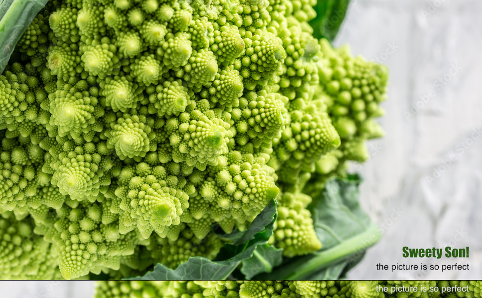
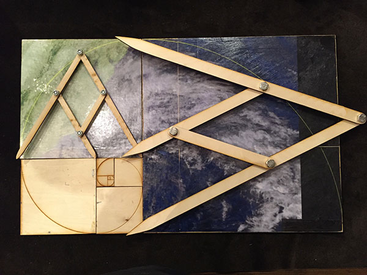
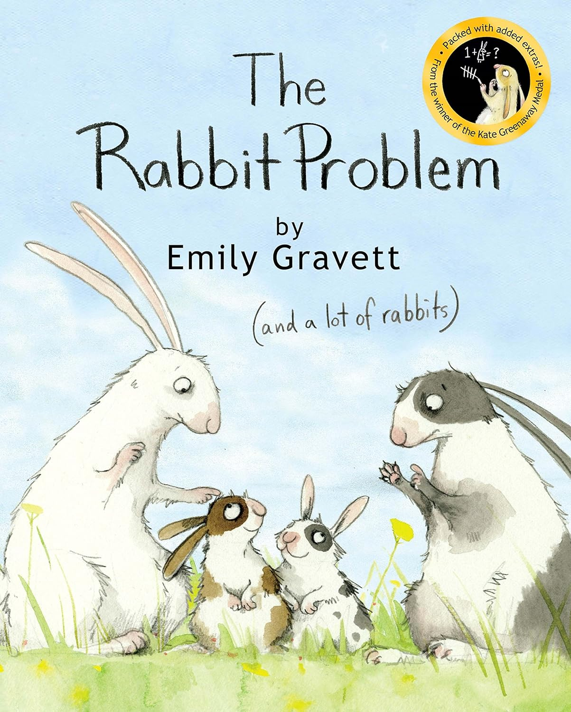
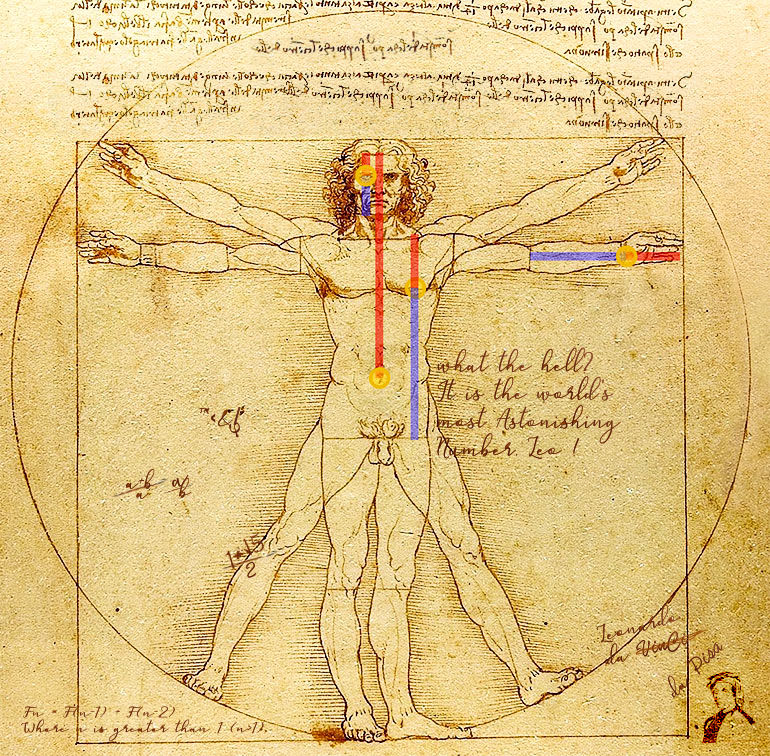
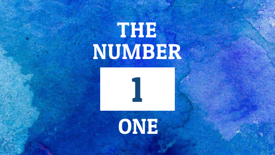
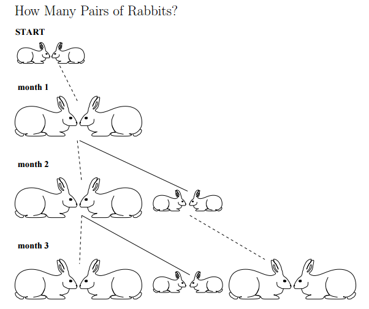
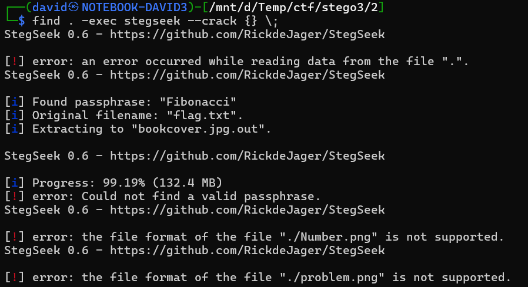

# Images

The images has a reoccurring theme. Fibonacci and golden ratio. They can be found with google reverse image search. Even some image width/height references this, phi ~= 1.618.

> Romanesco broccoli close up. The fractal vegetable is known for it's connection to the fibonacci sequence and the golden ratio. Fun food for any practical scientists that loves mathematics



> Fibonacci spiral background. generative ai


> Obviously the hurricane has a maximum and minimum size, but it does show the Golden Ratio in sequence in a compelling way.




# Zip

Variations of fibonacci and golden ratio in English or Hungarian or phi with varying digits doesn't unlock the zip. Using rsmangler or hashcat to mutate the words is not effective either.

The password should be guessed, `golden_ratio`. This can be used to extract the files. This is 4 new images, 2 jpegs, 2 pngs.

# Images (round 2)

Some more images with fibonacci series.









# Stegseek

One of the images has hidden data in it with a password. Stegseek can recover it quickly. The password `Fibonacci` is in the rockyou list.

```bash
find . -exec stegseek --crack {} \;
```



# Text

The extracted [flag.txt](workdir/flag.txt) has the following content.

```
   HCSC24{
        p H y m S o a 3 b u 4 e 
        q X x O P R v h u g B B 
        G 0 U v A j z B m e 8 R 
        T V 6 Y F B t 9 U c B t 
        J 2 8 r y F n 7 a p w S 
        1 N O e t 5 v g 5 d x 0 
        F G P V X f W S X f K A 
        X b M f c W L c 7 d M o 
        z c n v n L M 3 Y G J L 
        P m i c 8 F K G o d A K 
        1 4 I f o c R 6 v s G F 
        n 2 x D B S 3 d n b A 3 
    }

That's easy...
```

It is a 12x12 grid. With the theme fibonacci, and 12*12=144 (the 12th fibonacci number), we can try matching the positions to the fibonacci numbers, discarding the initial 0 and 1.

| 1 | 2 | 3 | 5 | 8 | 13 | 21 | 34 | 55 | 89 | 144 |
|---|---|---|---|---|----|----|----|----|----|-----|
| p | H | y | S | 3 | q  | u  | e  | n  | c  | 3   |

# Flag

`HCSC24{pHyS3quenc3}`
