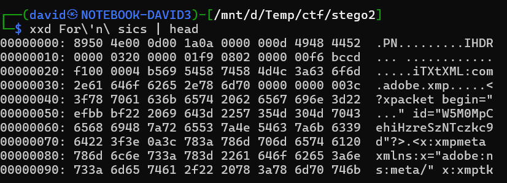
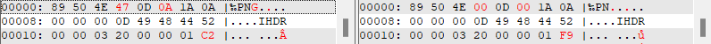

# Zip

Extracting the zip has a file [For'n sics](workdir/For'n%20sics) inside.

# PNG

Checking the file with a hex editor, it looks like a PNG header, but some bytes are corrupted/zeroed out.

Comparing the file with a random [donor.png](workdir/donor.png) reveals the differences. 

Fixing that 2 bytes would fix the file as well. Saved as [For'n sics.png](workdir/For'n%20sics.png).

The flag is visible on the restored image.

# Flag

`HCSC24{He4dAch3}`