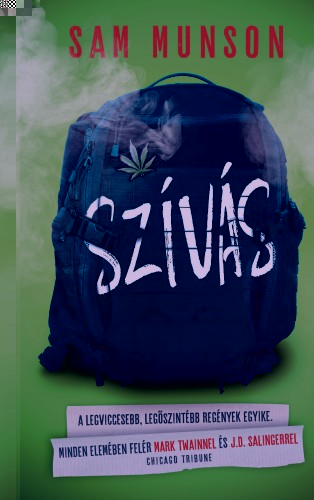
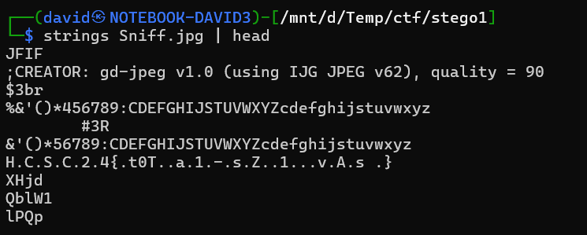

# Zip

Extracting the zip has an image [Sniff.jpg](workdir/Sniff.jpg) inside.




# Strings

Getting the strings from the image has a flag.

```bash
strings Sniff.jpg
```



# Flag

`HCSC24{t0Ta1-sZ1vAs}`