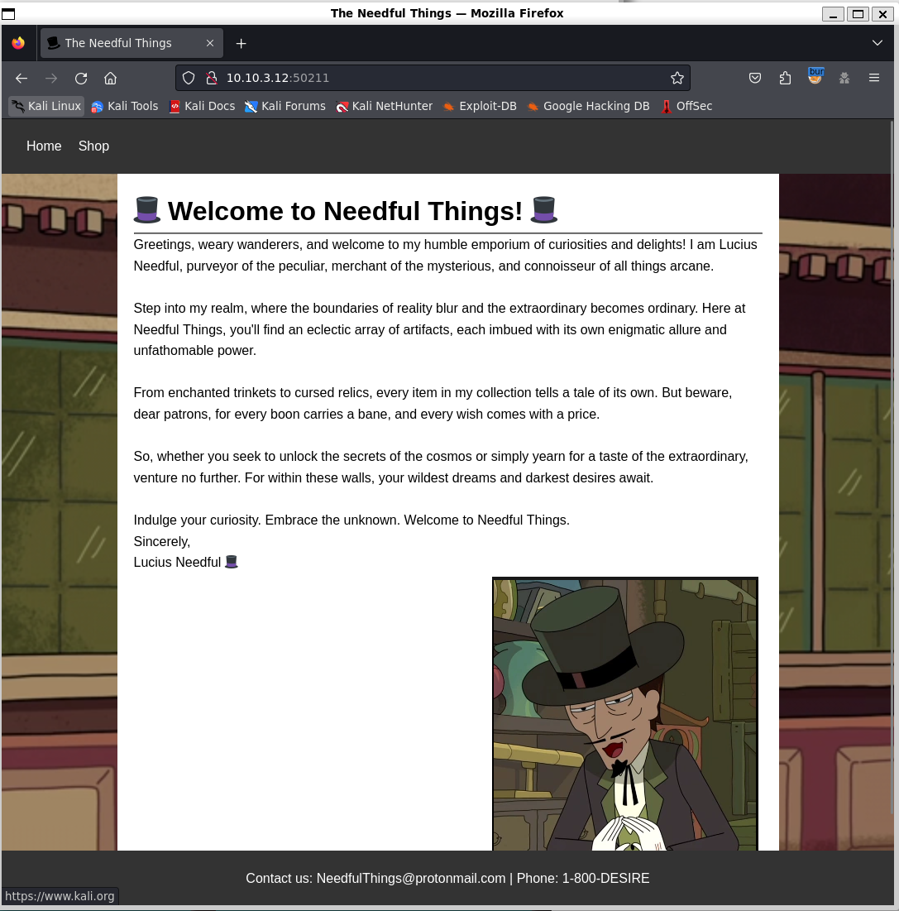
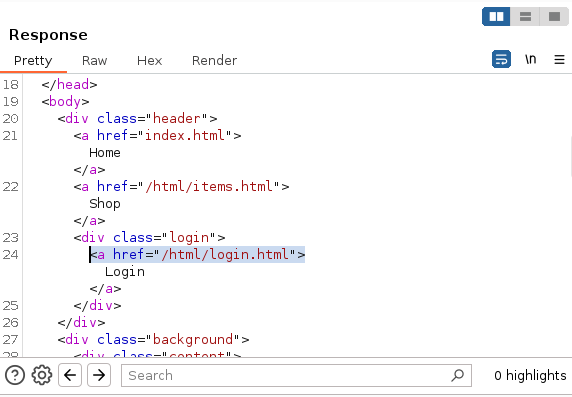
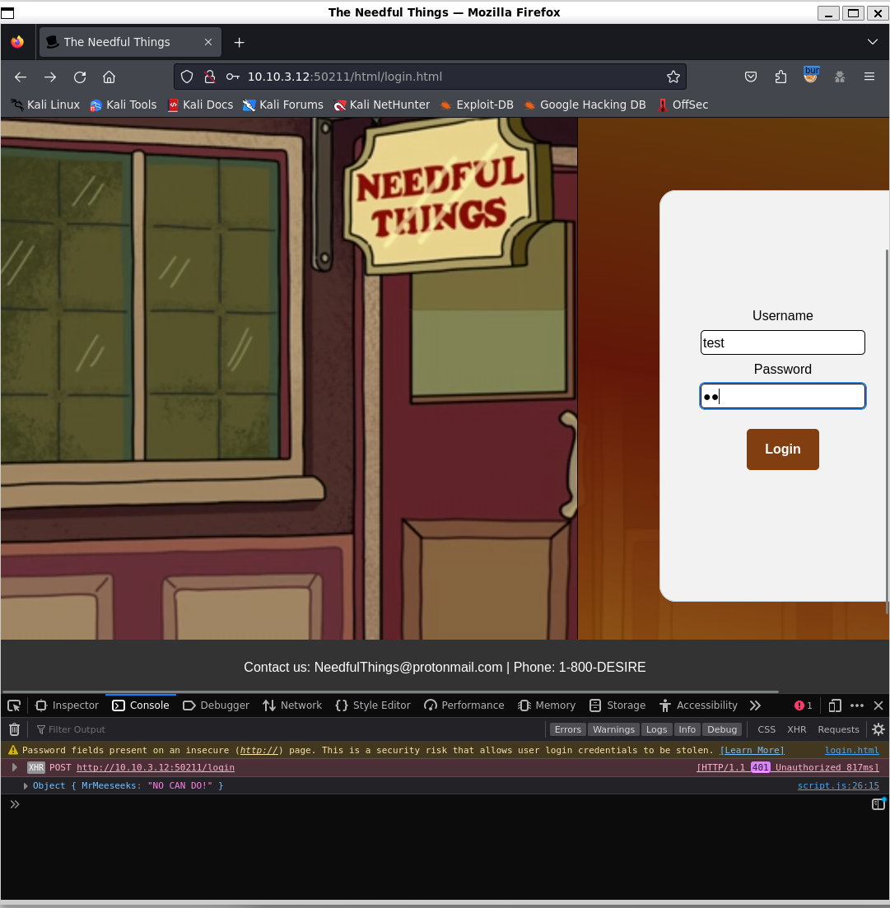
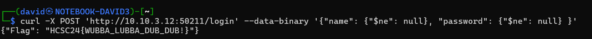

# Visiting the site

[Scanning](../Scans/WRITEUP.md) the 10.10.x.12 machines reveals an http server on port 50211. Checking it in the browser reveals `Needful Things`, which corresponds with the challenge description.



# Login page

There is a hidden link to the login page in the source (`/html/login.html`).



# Login Form

The [script.js](workdir/www/script.js) on the login page has the logic, which sends the username and password as json to the `/login` endpoint, printing the results on the console.



# SQL inject

Running SQLMap can't find any injection. Upon closer look, there is a `!` in the challenge name, which can be a reference for NoSQL, hence no find with classic relational database injection.

Injecting NoSQL operator into the json is successful, printing the flag.

```bash
curl -X POST 'http://10.10.3.12:50211/login' --data-binary '{"name": {"$ne": null}, "password": {"$ne": null} }'

```




# Flag

`HCSC24{WUBBA_LUBBA_DUB_DUB!}`