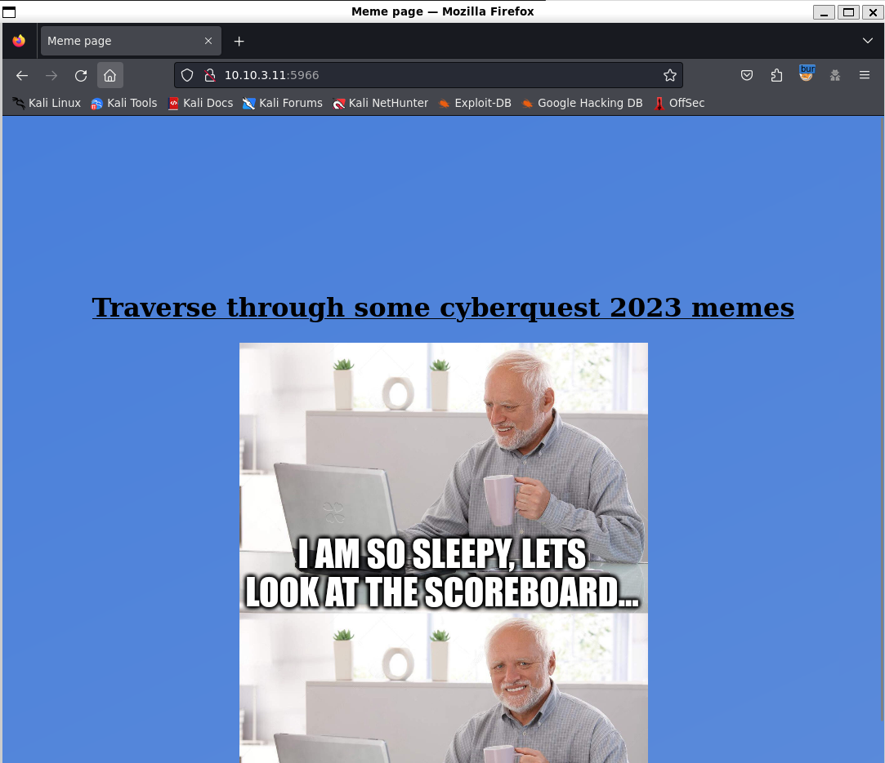

# Visiting the site

[Scanning](../Scans/WRITEUP.md) the 10.10.x.11 machines reveals multiple http servers, the most relevant with the phrase `Traverse through` is on port 5966. Checking it in the browser reveals the following meme collection.



# Dirbuster

Checking the directories reveal the `/css/` and `/images/` directories, with direcory listing.

```bash
dirb http://10.10.3.11:5966
```


# Hidden text

There is a `/css/test.html` in that directory. At first glance, the site looks empty, but it has a white `#ffffff` colored flag.


# Flag
`HCSC24{3nd0FtH3L1n3}`