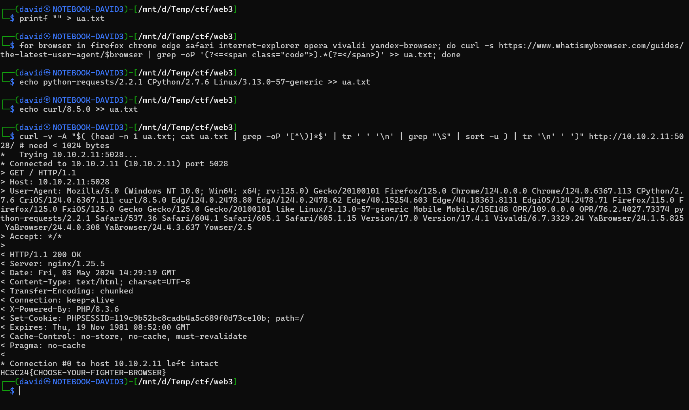

# Visiting the site

[Scanning](../Scans/WRITEUP.md) the 10.10.x.11 machines reveals multiple http servers, the most relevant with the phrase `popular browsers` is on port 5028. Checking it in the browser reveals something like an error message complaining about the browser.

```
Have you been ever tried the most popular browsers from an user and a developer aspect?
```

# User agent

## Top 10k

After attempting various user agents, top 10000 from [WhatIsMyBrowser](https://developers.whatismybrowser.com/api/features/regular-database-updates) does not change the output.

```bash
wfuzz -c --efield r --hs "Have you been ever" -H "User-Agent: FUZZ" -w whatismybrowser-user-agent-database.txt http://10.10.2.11:5028/
```

## Empty

Using no user agent reveals some error messages.

```bash
curl http://10.10.2.11:5028/ -A ""
```
```
<br />
<b>Warning</b>:  Undefined array key "HTTP_USER_AGENT" in <b>/var/www/html/index.php</b> on line <b>9</b><br />
<br />
<b>Deprecated</b>:  strpos(): Passing null to parameter #1 ($haystack) of type string is deprecated in <b>/var/www/html/index.php</b> on line <b>12</b><br />
<br />
<b>Deprecated</b>:  strpos(): Passing null to parameter #1 ($haystack) of type string is deprecated in <b>/var/www/html/index.php</b> on line <b>12</b><br />
<br />
<b>Deprecated</b>:  strpos(): Passing null to parameter #1 ($haystack) of type string is deprecated in <b>/var/www/html/index.php</b> on line <b>12</b><br />
<br />
<b>Deprecated</b>:  strpos(): Passing null to parameter #1 ($haystack) of type string is deprecated in <b>/var/www/html/index.php</b> on line <b>12</b><br />
<br />
<b>Deprecated</b>:  strpos(): Passing null to parameter #1 ($haystack) of type string is deprecated in <b>/var/www/html/index.php</b> on line <b>12</b><br />
<br />
<b>Deprecated</b>:  strpos(): Passing null to parameter #1 ($haystack) of type string is deprecated in <b>/var/www/html/index.php</b> on line <b>12</b><br />
* Connection #0 to host 10.10.2.11 left intact
Have you been ever tried the most popular browsers from an user and a developer aspect
```

This reveals that there are probably 6 substrings checked in a loop or similar manner, checking the provided user agents.

## Frankenstein

Snitching multiple user agents together can pass the checks. 

The most important part is to include all the popular browsers, both on desktop and mobile as well. 

Using the [WhatIsMyBrowser Latest Web Browser User Agents](https://www.whatismybrowser.com/guides/the-latest-user-agent/) a list of user agents can be downloaded. Also include some development user agents, python and/or curl manually.

```bash
printf "" > ua.txt
for browser in firefox chrome edge safari internet-explorer opera vivaldi yandex-browser; do curl -s https://www.whatismybrowser.com/guides/the-latest-user-agent/$browser | grep -oP '(?<=<span class="code">).*(?=</span>)' >> ua.txt; done
echo python-requests/2.2.1 CPython/2.7.6 Linux/3.13.0-57-generic >> ua.txt
echo curl/8.5.0 >> ua.txt
```

Using the `ua.txt` list, a longer user agent can be built. The platform part is only kept for the first, cut off for the rest. The specific parts are sorted and only appended once. This is to fit into 1024 characters.

```bash
curl -v -A "$( (head -n 1 ua.txt; cat ua.txt | grep -oP '[^\)]*$' | tr ' ' '\n' | grep "\S" | sort -u ) | tr '\n' ' ')" http://10.10.2.11:5028/
```

Using this monster user agent reveals the flag.



# Flag

`HCSC24{CHOOSE-YOUR-FIGHTER-BROWSER}`


# Alternative solution

As the hint with sweet tooth suggests the cookie, fixing the session cookie and running the same `ua.txt` list also unlocks the flag.

```bash
while IFS= read -r line; do curl -s -b PHPSESSID=e7298559bae28612b776c1098d24e23b -A "$line" http://10.10.2.11:5028/; done < ua.txt
```
