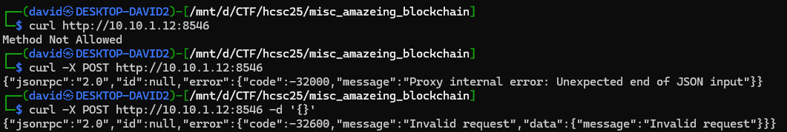
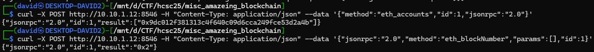
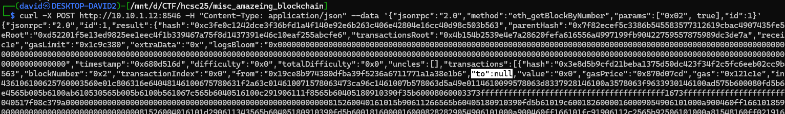
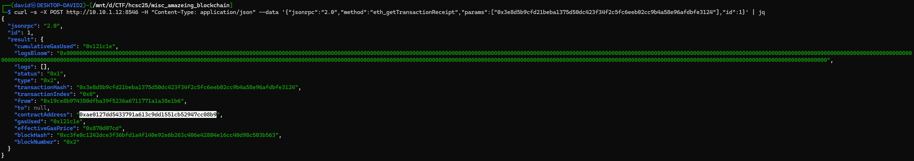
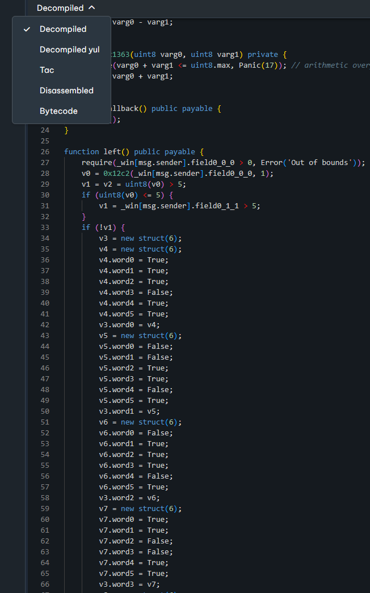
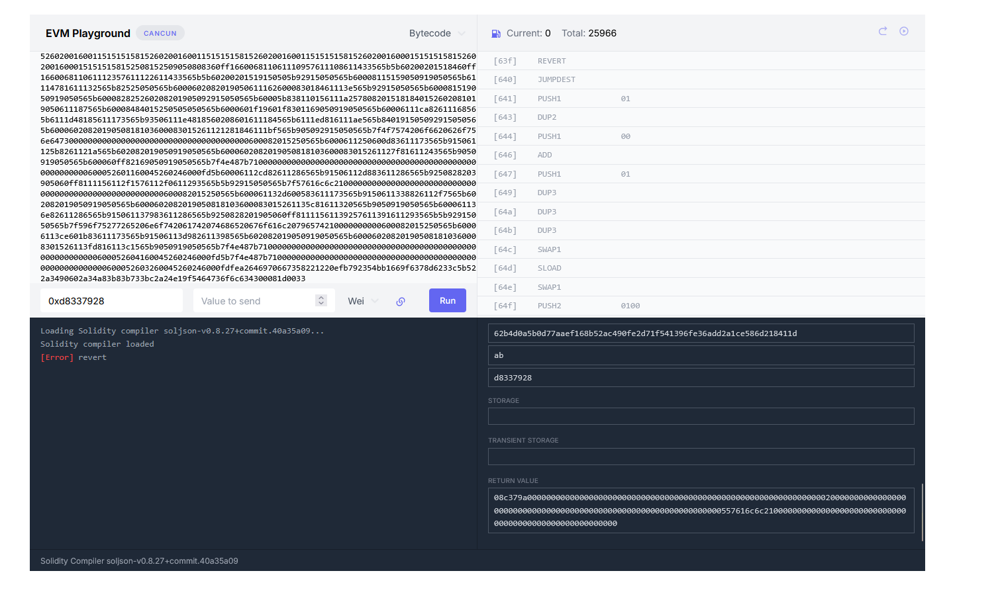
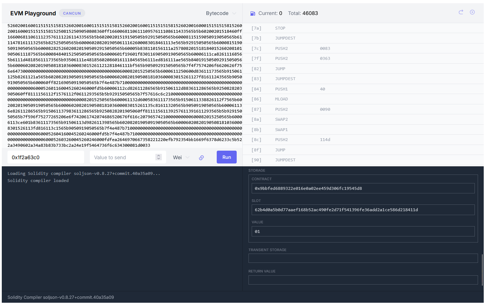
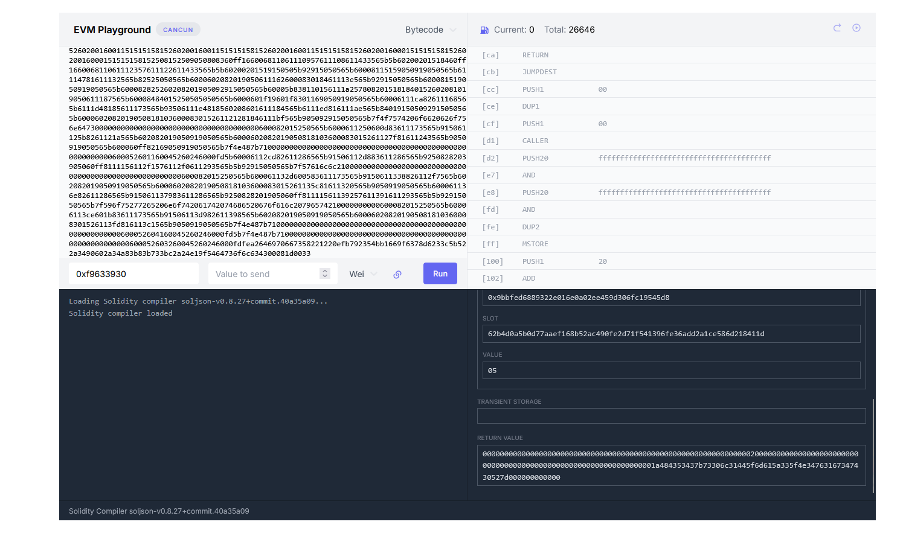

# Visiting the site

There is a webserver behind the port given, but it is not accepting the method. Based on the error messages, it can be deduced that it is an EVM RPC server ([EVM RPC Error Codes](https://www.quicknode.com/docs/ethereum/error-references#evm-rpc-error-codes)). It corresponds with that the description suggests cryptocurrency.

```bash
curl http://10.10.3.12:8546
curl -X POST http://10.10.3.12:8546
curl -X POST http://10.10.3.12:8546 -d '{}'
```



# Contract

Extracting the contract can be done in multiple ways.

Listing the accounts and the current (latest) block number.

```bash
curl -X POST http://10.10.3.12:8546 -H "Content-Type: application/json" --data '{"method":"eth_accounts","id":1,"jsonrpc":"2.0"}'
curl -X POST http://10.10.3.12:8546 -H "Content-Type: application/json" --data '{"jsonrpc":"2.0","method":"eth_blockNumber","params":[],"id":1}'
```



Then grabbing the latest block with the previously returned block `id`. The transactions with `to: null` are contracts. Stored in [blockchain.txt](workdir/blockchain.txt).

```bash
curl -X POST http://10.10.3.12:8546 -H "Content-Type: application/json" --data '{"jsonrpc":"2.0","method":"eth_getBlockByNumber","params":["0x2", true],"id":1}'
```



The transaction receipt can be queried with the `hash`, and has the contract address. 

```bash
curl -X POST http://10.10.3.12:8546 -H "Content-Type: application/json" --data '{"jsonrpc":"2.0","method":"eth_getTransactionReceipt","params":["0x3e8d5b9cfd21beba1375d50dc423f34f2c5fc6eeb02cc9b4a58e96afdbfe3124"],"id":1}'
```



Requesting that `contractAddress` has the contract bytecode (Ethereum Virtual Machine). 

```bash
curl -X POST http://10.10.3.12:8546 -H "Content-Type: application/json" --data '{"method":"eth_getCode","params":["0xae0127dd5433791a613c9dd1551cb52947cc08b9","latest"],"id":1,"jsonrpc":"2.0"}'
```

The code is stored in [code.txt](workdir/code.txt).

# Reversing

As the description suggests, no transactions are necessary. Reversing the code should be enough.

Various online tools can be used to decompile the code or interact with it. 

One example is <https://app.dedaub.com/decompile?md5=d1d7782029210ed3d420eb33ae267672>. It can be used to switch to decompiled (after login). Stored in [code_decompiled.txt](workdir/code_decompiled.txt).



The following hashes are the functions.

| hash       | function  |
|------------|-----------|
| 0x1f2a63c0 | right()   |
| 0x16e64048 | left()    |
| 0xd5a49e01 | up()      |
| 0xd8337928 | down()    |
| 0x473ca96c | win()     |
| 0xf9633930 | getFlag() |

Basically, your goal is to call the movement functions in correct order to reach the winning position, navigating a maze. 

The storage is 2 bytes (y coord, x coord).

Each function has the hardcoded struct for the maze:

|   | 0 | 1 | 2 | 3 | 4 | 5 |
|---|---|---|---|---|---|---|
| 0 | S |   |   | # |   | W |
| 1 | # | # |   |   | # |   |
| 2 | # |   |   |   | # |   |
| 3 |   |   | # | # |   |   |
| 4 |   | # | # |   |   | # |
| 5 |   |   |   |   | # | # |

Calling win after positioning on correct coordinate prints the flag.

# Emulating

Solving the maze interactively afterwards was faster than just reversing the flag function. The <https://www.evm.codes/playground> was used here. 

For each step, copy the hash of the function to calldata, press run, and press continue.

Attempting to go down from the starting position results in a revert, as we hit a wall.



Going right on the other hand is changing the stored coordinate in the storage (`0001`).



Alternatively, as the maze is small, the layout can be navigated based on this in case it was not reversed.

One solution is like this:

| hash       | function  | coord |
|------------|-----------|-------|
| 0x1f2a63c0 | right()   | 0001  |
| 0x1f2a63c0 | right()   | 0002  |
| 0xd8337928 | down()    | 0102  |
| 0xd8337928 | down()    | 0202  |
| 0x16e64048 | left()    | 0201  |
| 0xd8337928 | down()    | 0301  |
| 0x16e64048 | left()    | 0300  |
| 0xd8337928 | down()    | 0400  |
| 0xd8337928 | down()    | 0500  |
| 0x1f2a63c0 | right()   | 0501  |
| 0x1f2a63c0 | right()   | 0502  |
| 0x1f2a63c0 | right()   | 0503  |
| 0xd5a49e01 | up()      | 0403  |
| 0x1f2a63c0 | right()   | 0404  |
| 0xd5a49e01 | up()      | 0304  |
| 0x1f2a63c0 | right()   | 0305  |
| 0xd5a49e01 | up()      | 0205  |
| 0xd5a49e01 | up()      | 0105  |
| 0xd5a49e01 | up()      | 0005  |
| 0x473ca96c | win()     | 0005  |
| 0xf9633930 | getFlag() | 0005  | 


After calling `getFlag`, the flag is encoded in the return value.



```
0000000000000000000000000000000000000000000000000000000000000020000000000000000000000000000000000000000000000000000000000000001a484353437b73306c31445f6d615a335f4e34763167347430527d000000000000
```

# Flag
`HCSC{s0l1D_maZ3_N4v1g4t0R}`

# EVM Bytecode Decompiler alternative

The [sevm](https://github.com/acuarica/evm) tool can be also used.

For decompilation.

```bash
sevm sol code.hex
```

Or the control flow graph.

```bash
sevm cfg code.hex > code.dot
# After string fixups, quotes need to be fixed manually
dot -Tsvg code.dot -o code.svg
```


