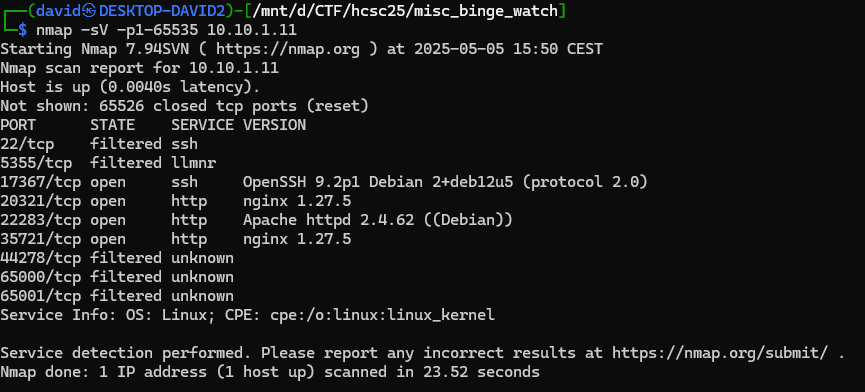
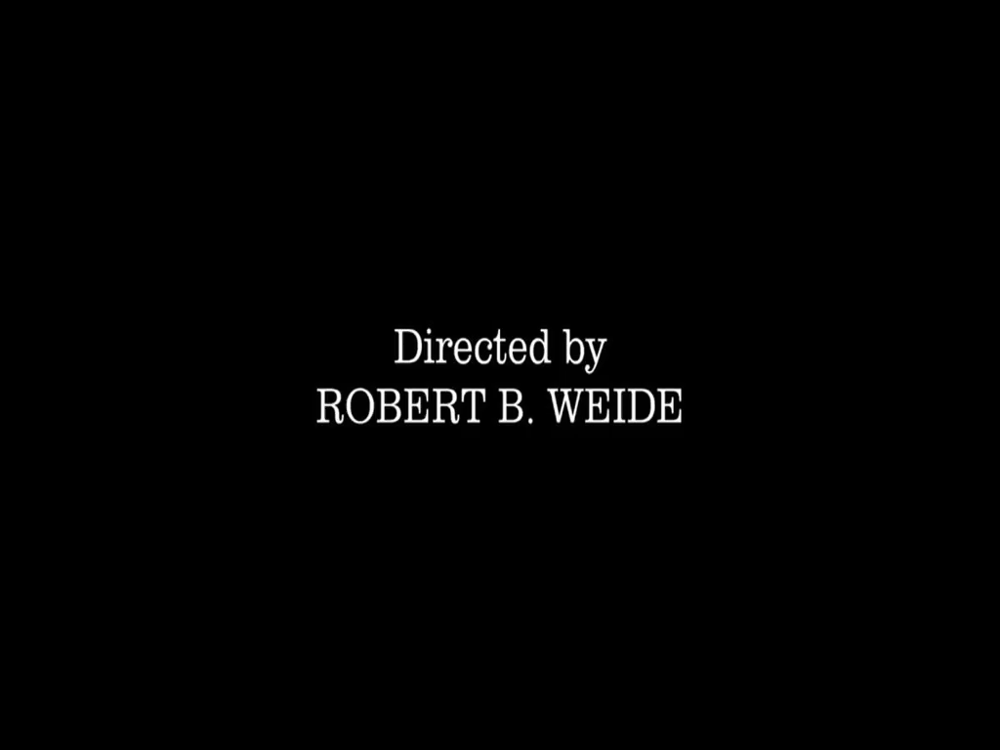

# Looking for the stream

As the description suggests, we look for `stream.mpd`. Scanning the server with nmap reveals a few new webservers.



Only `http://10.10.1.11:35721/stream.mpd` is valid, revealing an MPEG-DASH stream.


# MPEG-DASH

There are a few important things in this descriptor.
- The Representation for the location of the slices.
  - `id="video/avc1"` 
- The mediaPresentationDuration attribute for the length of the stream.
  - `PT3H3M1.440S`, meaning 3 hours, 3 minutes, 1.44 seconds (10981.44s).
- SegmentTemplate for the slices.
  - `initialization="$RepresentationID$/init.mp4"` and `media="$RepresentationID$/seg-$Number$.m4s"`
  - `timescale="1000"` and `duration="60008"`, meaning we have 1 slice every 60.008 seconds, that is 138 slices total (10981/60.008).
- ContentProtection for the DRM.
  - `cenc:default_KID="90351951-686b-5e1b-a222-439ecec1f12a"`

Reconstructing the encrypted stream is doable just downloading the files from the above locations.

```
http://10.10.1.11:35721/video/avc1/init.mp4
http://10.10.1.11:35721/video/avc1/seg-$Number$.m4s
```

Concatenating everything together into a single mp4, eg. `encrypted.mp4`.

```bash
curl http://10.10.1.11:35721/video/avc1/init.mp4 > encrypted.mp4
for i in {1..183}; do curl http://10.10.1.11:35721/video/avc1/seg-$i.m4s >> encrypted.mp4; done
```

This mp4 file is not watchable, as it is encrypted.

# DRM

The [Bento4](https://www.bento4.com/) is a toolkit for MP4 DASH (and other) media formats, including DRM.

The key is a known Widevine key for testing. This is explicitly in the Bento4 [documentation](https://www.bento4.com/developers/dash/encryption_and_drm/#widevine-drm): `90351951686b5e1ba222439ecec1f12a:0a237b0752cbf1a827e2fecfb87479a2`.

Decrypting the DRM with the known key is doable afterwards with the Bento4 toolkit. The final file is [decrypted.mp4](workdir/decrypted.mp4).

```bash
mp4decrypt --key 90351951686b5e1ba222439ecec1f12a:0a237b0752cbf1a827e2fecfb87479a2 encrypted.mp4 decrypted.mp4
```

# Watching the movie

The stream is mostly black frames. After experimenting a little with `ffmpeg`, the following inverted black frame detection works detecting the useful content.

```bash
ffmpeg -i decrypted.mp4 -vf "blackframe=amount=10:threshold=32" -f null - 2>&1 | grep -v "pblack:100" | tee blackframe.txt
```

The output [blackframe.txt](workdir/blackframe.txt) contains the frames not entirely black. Extracting the non black frames can be done based on the above log.

```bash
cat blackframe.txt | grep pblack | awk '{print substr($7,3)}' | xargs -I{} ffmpeg -ss {} -i decrypted.mp4 -frames:v 1 "nonblack.{}.png"
```

Revealing some consecutive images, in 4 groups.




# Flag
`HCSC{f0rever_4_c0ucHp0t4t0}`
