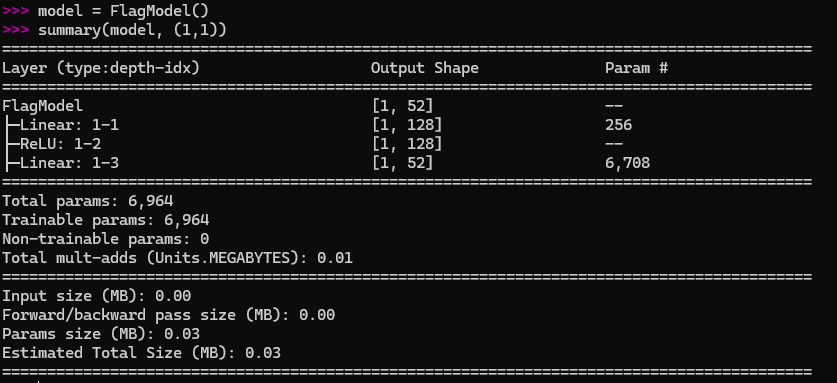
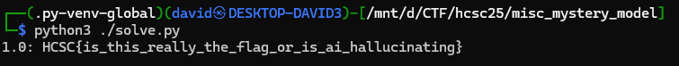

# Files

The model file [mystery_model.pt](files/challenge.zip) with `.pt` extension suggests [PyTorch](https://docs.pytorch.org/docs/stable/index.html). 

The summary looks like [torchinfo](https://pypi.org/project/torchinfo/), corresponding with the extension.

```
==========================================================================================
Layer (type:depth-idx)                   Output Shape              Param #
==========================================================================================
FlagModel                                [1, ??*]                   --
├─Linear: 1-1                            [1, 128]                  256
├─ReLU: 1-2                              [1, 128]                  --
├─Linear: 1-3                            [1, ??*]                   6,708
==========================================================================================
Total params: 6,964
Trainable params: 6,964
```

There are some info omitted to make the model reconstruction slightly harder.

```bash
pip install torch torchvision torchaudio
pip install torchinfo
```


# Model reconstruction

- FlagModel
  - Linear Layer
    - Input features: 1
    - Output features: 128
    - Parameters: 256
  - ReLU Layer
    - Parameters: 0 (activation functions don't have trainable parameters)
  - Linear Layer
    - Input features: 128
    - Output features: parameters / (input + bias) = 6708 / (128 + 1) = 52
    - Parameters: 6708

The `pytorch` representation should look similar to this.

```py
class FlagModel(nn.Module):
    def __init__(self):
        super().__init__()
        self.fc1 = nn.Linear(1, 128)
        self.relu = nn.ReLU()
        self.fc2 = nn.Linear(128, 52)
    
    def forward(self, x):
        x = self.fc1(x)
        x = self.relu(x)
        x = self.fc2(x)
        return x
```

The torchinfo summary looks similar to the summary given.



```
```

# Model evaluation

There is an input required, which was not given. Bruteforcing it with small increments (from 0.0, to 1.1, increment 0.01) can be used with the flag format to check for the output. Implemented in [solve.py](workdir/solve.py). 

The flag is printed with input `1.0`.



# Flag

`HCSC{is_this_really_the_flag_or_is_ai_hallucinating}`
