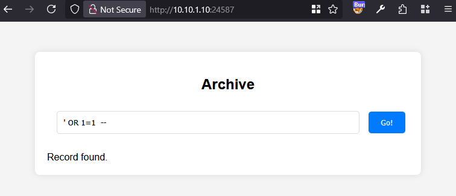
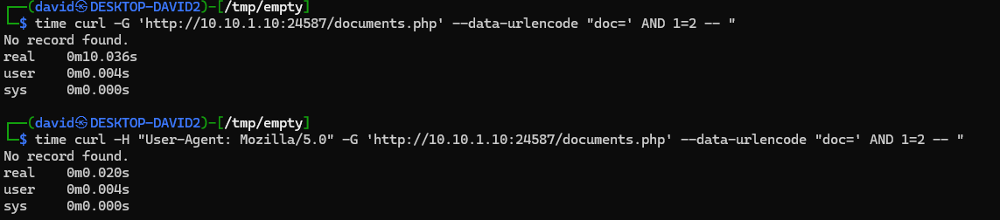
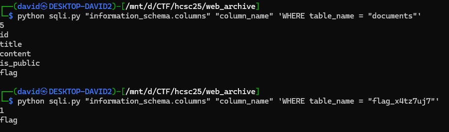
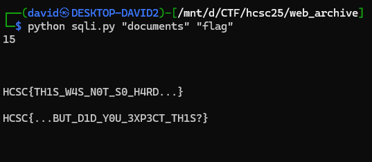
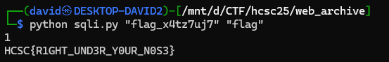
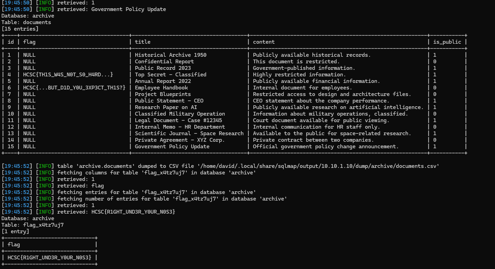

# Visiting the site

The website is a single form that can be used to search in the Archive. The result is binary, whether a record is found or not.

# SQL injection

The basic `' OR 1=1 --` payload reveals injection instantly.



# Rate limiting

The website is returning instantly in the browser, but it has issues with curl for example. Changing the user agent reveals some rate limiting for unknown browsers, throttling for 10 seconds.

# Scripting

The injection was scripted in [sqli.py](workdir/sqli.py). It is basically doing a binary search and guessing the output character by character. In the final version, the arguments are the following: table, column name, optional where clause.

Using the script can reveal anything in the database we have access to.



# Database

Querying the `information_schema` reveals the database structure.




There were 3 flags and hidden at multiple places.

The first 2 parts in the `documents` table where other records were sitting.



The last part was in the `flag_x4tz7uj7` table.



# Flag1

`HCSC{TH1S_W4S_N0T_S0_H4RD...}`

# Flag2

`HCSC{...BUT_D1D_Y0U_3XP3CT_TH1S?}`

# Flag3

`HCSC{R1GHT_UND3R_Y0UR_N0S3}`

# sqlmap

The swiss army knife for sql injection, [sqlmap](https://sqlmap.org/) can also be used with the proper user agent and options, dumping the full database.

```bash
sqlmap -A "Mozilla/5.0" -u http://10.10.1.10:24587/documents.php?doc=x -p doc --drop-set-cookie --level 5 --risk 3 --dbms=mysql --dump
```


