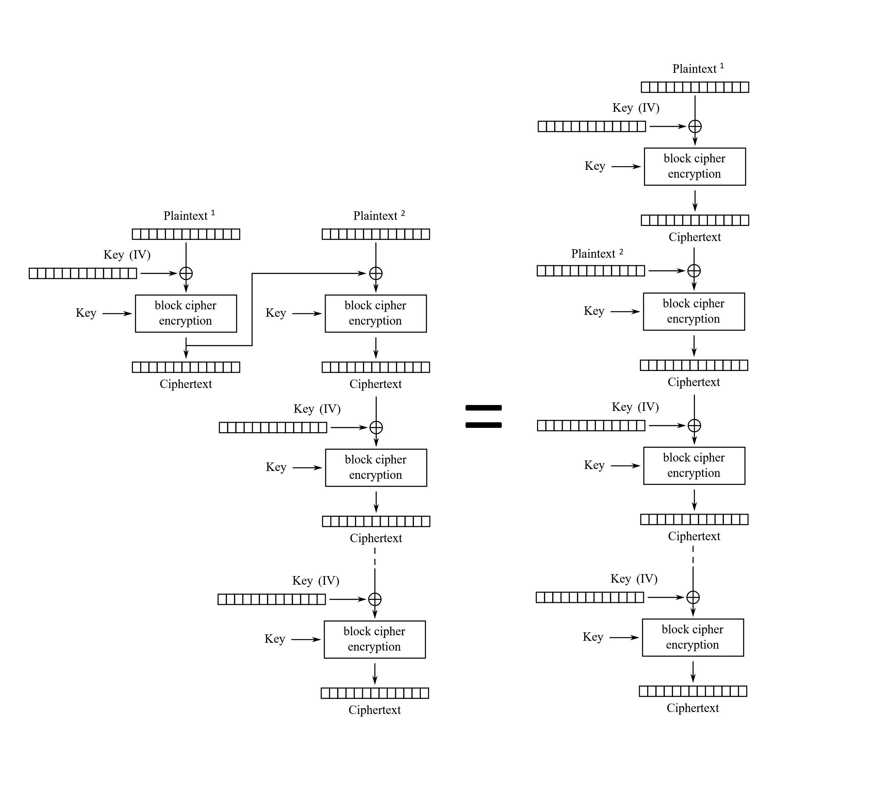

# Reversing

## Static
Binary is not stripped, function names are useful. 

Main is creating socket.

New connections are forked. Calling `execute_service()`.

The service is grabbing 1-500 random `get_current_epoch()`.
Doing authentication `cred_screen()`, creating new user if not existing with own secret.
Asking for secret print or play with `menu_screen()`. 
Calling `send_secret()` on `s`, doing the game on `p`.
The game is reading 128 moves with `read_moves()` into a 32 long buffer (`w`,`n`,`e`,`s` packed in 2 bits each). 
Using `convert_moves_to_buffer()` and `is_it_valid()` with `master_hash` to enable backdoor with `entry_screen()` and `get_user_cred()`.
The `create_forward_secure_tokens()` with `dohash()`. There are multiple passes for the hash, first with the full length of the movements (32 bytes), then only on the 16 bytes part. This generated hash need to be equal to the `master_hash`.
The `dohash()` is using AES encrypt with key and iv is hardcoded from a sha1 of a string. Only returns the last block (16 bytes).


## Dynamic

### GDB
```
set follow-fork-mode child
set detach-on-fork off
```
	
# Patching

The backdoor can be patched out, for example at `0x00401385` patching the JZ to JMP.

# Forensics

Can give idea about the exploit, eg 128 steps, dummy user, what to expect on flag. Same movement at second half.

# Exploit

Inverting the hash generation is possible, as AES can be reverted.

The master_hash is `50 43 0e d3 9b 28 da e2 5a a2 e9 8b 4b 91 07 b5`. Can be found with by following the symbol with static analysis.

The AES key/iv is `PRENEELAPPROVESMAYBE`. The AES key/iv can be found with static analysis in dohash local variables or dynamic analysis.

The first `do_hash()` round is done on 2 blocks, the rest is on only one. We can transfer the chain the way to make only single block AES encrypt/decrypt steps. The only difference is that the second execution is using the plaintext (second 16 bytes) as IV instead the key. We can do it because XOR inputs are exchangeable. See image.



We have the Ciphertext, it should equal the master_hash.

Going backwards, we have no input for the second part of the plaintext. It is actually not a problem, we can use anything there.

The [exploit_pwntools.py](workdir/exploit_pwntools.py) implements this.

# PCAP

Packets from other team's successful attack in [exploit.pcap](workdir/exploit.pcap) can be used as a hint.